----

[Home](../home.md) > [A. WorkFlow.pbix](A. WorkFlow.pbix.md)

[Information](#information) | [Model information](#model-information) | [Model relationships](#model-relationships) | [Report sections](#report-sections) | [Business objects](#business-objects) | [Measures](#measures) | [Relationships](#relationships) | [Hierarchies](#hierarchies) | [Columns](#columns) | 

----

# Information

Documentation for file **A. WorkFlow.pbix**.

# Model information

| Param  | Value  |
|---|---|
| **Analyzed pbix file name** | `A. WorkFlow.pbix` | 
| **Catalog name** | `b269c0f2-41f8-438a-9abc-fdc7ce1c2b51` | 
| **Port** | `56179`|
| **Description** | `-NaN-` | 
| **Date modified** | `2023-08-07T08:22:04` | 
| **Compatibility level** | `1567` | 

[Up](#)
# Model relationships

```mermaid
graph LR;

id12(["DimEmployeeMedicalSp..(32)[DimEmployeeMedicalSpecialization]"]) --> id634(["FactPatientregistrat..(23)[DimEmployeeMedicalSpecialization]"])
id3361(["vDimFacility[DimFacilityId]"]) --> id634(["FactPatientregistrat..(23)[DimFacilityId]"])
id3364(["vDimMedicalspecializ..(25)[DimMedicalSpecializationId]"]) --> id634(["FactPatientregistrat..(23)[DimMedicalSpecializationId]"])
id3367(["vDimPatient[DimPatientId]"]) --> id634(["FactPatientregistrat..(23)[DimPatientId]"])
id3346(["vDimActionstatus[DimActionStatusId]"]) --> id10673(["vFactActiontreatment..(26)[DimActionStatusId]"])
id3370(["vDimProcedure[DimProcedureId]"]) --> id10673(["vFactActiontreatment..(26)[DimProcedureId]"])
id3358(["vDimEmployeewf[DimEmployeeId]"]) --> id10673(["vFactActiontreatment..(26)[DimPlannedActionEmployeeId]"])
id3361(["vDimFacility[DimFacilityId]"]) --> id10673(["vFactActiontreatment..(26)[DimActionFacilityId]"])
id3352(["vDimDate[DimDateId]"]) --> id10673(["vFactActiontreatment..(26)[PlannedActionStartDate]"])
id3367(["vDimPatient[DimPatientId]"]) --> id10673(["vFactActiontreatment..(26)[DimPatientId]"])
id16126(["LocalDateTable_28289..(51)[-NaN-]"]) --> id10673(["vFactActiontreatment..(26)[PatientBirthDateDate]"])
id16486(["LocalDateTable_c44d4..(51)[-NaN-]"]) --> id10673(["vFactActiontreatment..(26)[DateofActionStart]"])
id3343(["vDimAction[DimActionId]"]) --> id23764(["vFactActiontreatment[DimActionId]"])
id3346(["vDimActionstatus[DimActionStatusId]"]) --> id23764(["vFactActiontreatment[DimActionStatusId]"])
id3352(["vDimDate[DimDateId]"]) --> id23764(["vFactActiontreatment[PlannedActionStartDate]"])
id3367(["vDimPatient[DimPatientId]"]) --> id23764(["vFactActiontreatment[DimPatientId]"])
id3358(["vDimEmployeewf[DimEmployeeId]"]) --> id23764(["vFactActiontreatment[DimPlannedActionEmployeeId]"])
id3361(["vDimFacility[DimFacilityId]"]) --> id23764(["vFactActiontreatment[DimActionFacilityId]"])
id41772(["LocalDateTable_d3664..(51)[-NaN-]"]) --> id3367(["vDimPatient[PatientDateOfBirthDate]"])
id60459(["LocalDateTable_b742b..(51)[-NaN-]"]) --> id10673(["vFactActiontreatment..(26)[PatientBirthDate]"])
id87491(["LocalDateTable_8927e..(51)[-NaN-]"]) --> id3367(["vDimPatient[Created]"])
id133508(["DIM_COMPANY[ID_ITEM]"]) --> id133523(["FACT_PC_NAVSTEVY[ID_COMPANY]"])
id133508(["DIM_COMPANY[ID_ITEM]"]) --> id133529(["FACT_PC_PP[ID_COMPANY]"])
id133508(["DIM_COMPANY[ID_ITEM]"]) --> id133526(["FACT_PC_KAPITACIE[ID_COMPANY]"])
id133514(["DIM_POISTOVNA[ID_ITEM]"]) --> id133523(["FACT_PC_NAVSTEVY[ID_POISTOVNA]"])
id133514(["DIM_POISTOVNA[ID_ITEM]"]) --> id133529(["FACT_PC_PP[ID_POISTOVNA]"])
id133511(["DIM_ODBORNOST[ID_ITEM]"]) --> id133526(["FACT_PC_KAPITACIE[ID_ODBORNOST]"])
id133514(["DIM_POISTOVNA[ID_ITEM]"]) --> id133526(["FACT_PC_KAPITACIE[ID_POISTOVNA]"])
id133520(["DIM_VYKON[ID_ITEM]"]) --> id133529(["FACT_PC_PP[ID_VYKON]"])
id3364(["vDimMedicalspecializ..(25)[MedicalSpecializationCode]"]) --> id133529(["FACT_PC_PP[OdbornostKod]"])
id3364(["vDimMedicalspecializ..(25)[MedicalSpecializationCode]"]) --> id133523(["FACT_PC_NAVSTEVY[OdbornostKod]"])
id3364(["vDimMedicalspecializ..(25)[MedicalSpecializationCode]"]) --> id133526(["FACT_PC_KAPITACIE[OdbornostKod]"])
id173633(["DoctorUniqe[-NaN-]"]) --> id172827(["vDimDoctor[DoctorCode]"])
id173633(["DoctorUniqe[-NaN-]"]) --> id133523(["FACT_PC_NAVSTEVY[LekarKod]"])
id3352(["vDimDate[DimDateId]"]) --> id133529(["FACT_PC_PP[DATE_ID]"])
id3352(["vDimDate[DimDateId]"]) --> id133523(["FACT_PC_NAVSTEVY[DATE_ID]"])
id3352(["vDimDate[DimDateId]"]) --> id133526(["FACT_PC_KAPITACIE[DATE_ID]"])
id173633(["DoctorUniqe[-NaN-]"]) --> id133529(["FACT_PC_PP[LekarKod]"])
id173633(["DoctorUniqe[-NaN-]"]) --> id133526(["FACT_PC_KAPITACIE[LekarKod]"])
id133520(["DIM_VYKON[ID_ITEM]"]) --> id319354(["FACT_JZS[ID_VYKON]"])
id133514(["DIM_POISTOVNA[ID_ITEM]"]) --> id319354(["FACT_JZS[ID_POISTOVNA]"])
id133508(["DIM_COMPANY[ID_ITEM]"]) --> id319354(["FACT_JZS[ID_COMPANY]"])
id3352(["vDimDate[DimDateId]"]) --> id319354(["FACT_JZS[DATE_ID]"])
id3364(["vDimMedicalspecializ..(25)[MedicalSpecializationCode]"]) --> id319354(["FACT_JZS[OdbornostKod]"])
id488023(["LocalDateTable_458dc..(51)[-NaN-]"]) --> id3343(["vDimAction[TECH_LOAD_DATE]"])
id488127(["LocalDateTable_85c78..(51)[-NaN-]"]) --> id23764(["vFactActiontreatment[TECH_LOAD_DATE]"])
id490325(["LocalDateTable_a3081..(51)[-NaN-]"]) --> id490322(["vDimInsurance[TECH_LOAD_DATE]"])
id490322(["vDimInsurance[DimInsuranceId]"]) --> id10673(["vFactActiontreatment..(26)[DimInsuranceId]"])
id490322(["vDimInsurance[DimInsuranceId]"]) --> id23764(["vFactActiontreatment[DimInsuranceId]"])
id491776(["_Lekar[-NaN-]"]) --> id172827(["vDimDoctor[Fullname]"])
id491776(["_Lekar[-NaN-]"]) --> id12(["DimEmployeeMedicalSp..(32)[FullName]"])
id133508(["DIM_COMPANY[Fullname]"]) --> id489479(["_Poliklinika[-NaN-]"])
id489479(["_Poliklinika[-NaN-]"]) --> id3361(["vDimFacility[FacNamePodlaOracle]"])
id3358(["vDimEmployeewf[DimEmployeeId]"]) --> id12(["DimEmployeeMedicalSp..(32)[DimEmployee]"])
id494428(["LocalDateTable_36e67..(51)[-NaN-]"]) --> id10673(["vFactActiontreatment..(26)[TECH_LOAD_DATE]"])
id499049(["DimEmployeeMedicalSp..(36)[-NaN-]"]) --> id23764(["vFactActiontreatment[DimRealActionEmployeeId]"])
id3364(["vDimMedicalspecializ..(25)[MedicalSpecializationCode]"]) --> id23764(["vFactActiontreatment[OdbornostKod]"])
id3364(["vDimMedicalspecializ..(25)[MedicalSpecializationCode]"]) --> id10673(["vFactActiontreatment..(26)[OdbornostKod]"])
id173633(["DoctorUniqe[-NaN-]"]) --> id319354(["FACT_JZS[LekarKod]"])
id819390(["_JoinLekar[-NaN-]"]) --> id23764(["vFactActiontreatment[Join]"])
id491776(["_Lekar[-NaN-]"]) --> id819390(["_JoinLekar[-NaN-]"])
id820269(["LocalDateTable_19908..(51)[-NaN-]"]) --> id3346(["vDimActionstatus[TECH_LOAD_DATE]"])
id820389(["LocalDateTable_167b9..(51)[-NaN-]"]) --> id3358(["vDimEmployeewf[TECH_LOAD_DATE]"])
id820493(["LocalDateTable_3b527..(51)[-NaN-]"]) --> id3361(["vDimFacility[TECH_LOAD_DATE]"])
id820597(["LocalDateTable_3b563..(51)[-NaN-]"]) --> id3364(["vDimMedicalspecializ..(25)[TECH_LOAD_DATE]"])
id820701(["LocalDateTable_83a30..(51)[-NaN-]"]) --> id3367(["vDimPatient[TECH_LOAD_DATE]"])
id820805(["LocalDateTable_d6003..(51)[-NaN-]"]) --> id132080(["vDimPaymentType[TECH_LOAD_DATE]"])
id820909(["LocalDateTable_ff842..(51)[-NaN-]"]) --> id3370(["vDimProcedure[TECH_LOAD_DATE]"])
id821013(["LocalDateTable_df228..(51)[-NaN-]"]) --> id172827(["vDimDoctor[TECH_LOAD_DATE]"])
id1068267(["LocalDateTable_cd966..(51)[-NaN-]"]) --> id1068264(["LastSuccesfullRunSyn..(24)[RunDate]"])
id1068836(["LocalDateTable_02605..(51)[-NaN-]"]) --> id1068264(["LastSuccesfullRunSyn..(24)[ActualDate(-1days)]"])
```

[Up](#)

# Report sections

## Legenda

| Param  | Value  |
|---|---|
| **ID** | `399406317` |
| **Name** | `ReportSection211d748af1074d74c674` |
| **Display Name** | `Legenda` |
| **Filters** | `[]` |
| **Ordinal** | `32` |
| **Visual containers number** | `2` |

[Up](#)

### Container bd84c025c93544b7ad12 

| Param  | Value  |
|---|---|
| **Name:** | `bd84c025c93544b7ad12` |
| **Type:** | `textbox` |
| **Business objects:**  | `n/a` | 
| **Attributes:**  | n/a | 

[Up](#)

### Container 88e16ddcda38cd08b89b 

| Param  | Value  |
|---|---|
| **Name:** | `88e16ddcda38cd08b89b` |
| **Type:** | `textbox` |
| **Business objects:**  | `n/a` | 
| **Attributes:**  | n/a | 

[Up](#)

## iD1

| Param  | Value  |
|---|---|
| **ID** | `399406318` |
| **Name** | `ReportSectioncba91e4c09dd0effbec7` |
| **Display Name** | `iD1` |
| **Filters** | `[]` |
| **Ordinal** | `43` |
| **Visual containers number** | `1` |

[Up](#)

### Container 6417072e0f2edb5d9f1c 

| Param  | Value  |
|---|---|
| **Name:** | `6417072e0f2edb5d9f1c` |
| **Type:** | `textbox` |
| **Business objects:**  | `n/a` | 
| **Attributes:**  | n/a | 

[Up](#)

## iD2

| Param  | Value  |
|---|---|
| **ID** | `399406319` |
| **Name** | `ReportSectionb29eb8da0db2790382e0` |
| **Display Name** | `iD2` |
| **Filters** | `[]` |
| **Ordinal** | `44` |
| **Visual containers number** | `1` |

[Up](#)

### Container e4ddf3630c8e3891d976 

| Param  | Value  |
|---|---|
| **Name:** | `e4ddf3630c8e3891d976` |
| **Type:** | `textbox` |
| **Business objects:**  | `n/a` | 
| **Attributes:**  | n/a | 

[Up](#)

## iD3

| Param  | Value  |
|---|---|
| **ID** | `399406320` |
| **Name** | `ReportSectiond49967d285bc6b85d467` |
| **Display Name** | `iD3` |
| **Filters** | `[]` |
| **Ordinal** | `45` |
| **Visual containers number** | `1` |

[Up](#)

### Container e6b8344bc8ed2621860d 

| Param  | Value  |
|---|---|
| **Name:** | `e6b8344bc8ed2621860d` |
| **Type:** | `textbox` |
| **Business objects:**  | `n/a` | 
| **Attributes:**  | n/a | 

[Up](#)

## iD4

| Param  | Value  |
|---|---|
| **ID** | `399406321` |
| **Name** | `ReportSectionaadd358bec7df67f0e91` |
| **Display Name** | `iD4` |
| **Filters** | `[]` |
| **Ordinal** | `46` |
| **Visual containers number** | `1` |

[Up](#)

### Container 8fc23c0f91069bc2513b 

| Param  | Value  |
|---|---|
| **Name:** | `8fc23c0f91069bc2513b` |
| **Type:** | `textbox` |
| **Business objects:**  | `n/a` | 
| **Attributes:**  | n/a | 

[Up](#)

## iD5

| Param  | Value  |
|---|---|
| **ID** | `399406322` |
| **Name** | `ReportSection4912732eba57d2e7df7d` |
| **Display Name** | `iD5` |
| **Filters** | `[]` |
| **Ordinal** | `47` |
| **Visual containers number** | `1` |

[Up](#)

### Container 167b81570a740a9f89e3 

| Param  | Value  |
|---|---|
| **Name:** | `167b81570a740a9f89e3` |
| **Type:** | `textbox` |
| **Business objects:**  | `n/a` | 
| **Attributes:**  | n/a | 

[Up](#)

## iD6

| Param  | Value  |
|---|---|
| **ID** | `399406323` |
| **Name** | `ReportSectionc992c03b5a63781328b8` |
| **Display Name** | `iD6` |
| **Filters** | `[]` |
| **Ordinal** | `48` |
| **Visual containers number** | `1` |

[Up](#)

### Container 52c5ae0d601812d47974 

| Param  | Value  |
|---|---|
| **Name:** | `52c5ae0d601812d47974` |
| **Type:** | `textbox` |
| **Business objects:**  | `n/a` | 
| **Attributes:**  | n/a | 

[Up](#)

## iD7

| Param  | Value  |
|---|---|
| **ID** | `399406324` |
| **Name** | `ReportSection6d8336652f69b4b4a888` |
| **Display Name** | `iD7` |
| **Filters** | `[]` |
| **Ordinal** | `49` |
| **Visual containers number** | `1` |

[Up](#)

### Container fdb0f3212393070b7dc3 

| Param  | Value  |
|---|---|
| **Name:** | `fdb0f3212393070b7dc3` |
| **Type:** | `textbox` |
| **Business objects:**  | `n/a` | 
| **Attributes:**  | n/a | 

[Up](#)

## iD8

| Param  | Value  |
|---|---|
| **ID** | `399406325` |
| **Name** | `ReportSectiona183fb92471ba61a8375` |
| **Display Name** | `iD8` |
| **Filters** | `[]` |
| **Ordinal** | `50` |
| **Visual containers number** | `1` |

[Up](#)

### Container d713cd986672c6659774 

| Param  | Value  |
|---|---|
| **Name:** | `d713cd986672c6659774` |
| **Type:** | `textbox` |
| **Business objects:**  | `n/a` | 
| **Attributes:**  | n/a | 

[Up](#)

## Legenda

| Param  | Value  |
|---|---|
| **ID** | `399406326` |
| **Name** | `ReportSectione3a7954e44887cda6594` |
| **Display Name** | `Legenda` |
| **Filters** | `[]` |
| **Ordinal** | `33` |
| **Visual containers number** | `2` |

[Up](#)

### Container 11686c110338072806d2 

| Param  | Value  |
|---|---|
| **Name:** | `11686c110338072806d2` |
| **Type:** | `textbox` |
| **Business objects:**  | `n/a` | 
| **Attributes:**  | n/a | 

[Up](#)

### Container 2d7a2e05dd1a0db11560 

| Param  | Value  |
|---|---|
| **Name:** | `2d7a2e05dd1a0db11560` |
| **Type:** | `textbox` |
| **Business objects:**  | `n/a` | 
| **Attributes:**  | n/a | 

[Up](#)

## iW1

| Param  | Value  |
|---|---|
| **ID** | `399406327` |
| **Name** | `ReportSection8fa681daa794e1368488` |
| **Display Name** | `iW1` |
| **Filters** | `[]` |
| **Ordinal** | `34` |
| **Visual containers number** | `1` |

[Up](#)

### Container 55b1f46b7786a77cad76 

| Param  | Value  |
|---|---|
| **Name:** | `55b1f46b7786a77cad76` |
| **Type:** | `textbox` |
| **Business objects:**  | `n/a` | 
| **Attributes:**  | n/a | 

[Up](#)

## iW2

| Param  | Value  |
|---|---|
| **ID** | `399406328` |
| **Name** | `ReportSection1a15d041681c2a6911ea` |
| **Display Name** | `iW2` |
| **Filters** | `[]` |
| **Ordinal** | `35` |
| **Visual containers number** | `1` |

[Up](#)

### Container d5acf60a26b80c431260 

| Param  | Value  |
|---|---|
| **Name:** | `d5acf60a26b80c431260` |
| **Type:** | `textbox` |
| **Business objects:**  | `n/a` | 
| **Attributes:**  | n/a | 

[Up](#)

## iW3

| Param  | Value  |
|---|---|
| **ID** | `399406329` |
| **Name** | `ReportSectionf00594696882cc345075` |
| **Display Name** | `iW3` |
| **Filters** | `[]` |
| **Ordinal** | `36` |
| **Visual containers number** | `1` |

[Up](#)

### Container d9e0fa49e5b670570b15 

| Param  | Value  |
|---|---|
| **Name:** | `d9e0fa49e5b670570b15` |
| **Type:** | `textbox` |
| **Business objects:**  | `n/a` | 
| **Attributes:**  | n/a | 

[Up](#)

## iW4

| Param  | Value  |
|---|---|
| **ID** | `399406330` |
| **Name** | `ReportSectionaf4ce10b86d81097a2b1` |
| **Display Name** | `iW4` |
| **Filters** | `[]` |
| **Ordinal** | `37` |
| **Visual containers number** | `1` |

[Up](#)

### Container 5ea8144b9e3102d3ae2a 

| Param  | Value  |
|---|---|
| **Name:** | `5ea8144b9e3102d3ae2a` |
| **Type:** | `textbox` |
| **Business objects:**  | `n/a` | 
| **Attributes:**  | n/a | 

[Up](#)

## iW5

| Param  | Value  |
|---|---|
| **ID** | `399406331` |
| **Name** | `ReportSectionbadff1637242eb805123` |
| **Display Name** | `iW5` |
| **Filters** | `[]` |
| **Ordinal** | `38` |
| **Visual containers number** | `1` |

[Up](#)

### Container d2d01c16b6c80a97d33d 

| Param  | Value  |
|---|---|
| **Name:** | `d2d01c16b6c80a97d33d` |
| **Type:** | `textbox` |
| **Business objects:**  | `n/a` | 
| **Attributes:**  | n/a | 

[Up](#)

## iW6

| Param  | Value  |
|---|---|
| **ID** | `399406332` |
| **Name** | `ReportSection7e6e2802d72ede68c008` |
| **Display Name** | `iW6` |
| **Filters** | `[]` |
| **Ordinal** | `39` |
| **Visual containers number** | `1` |

[Up](#)

### Container 264509390025d20200c3 

| Param  | Value  |
|---|---|
| **Name:** | `264509390025d20200c3` |
| **Type:** | `textbox` |
| **Business objects:**  | `n/a` | 
| **Attributes:**  | n/a | 

[Up](#)

## iW7

| Param  | Value  |
|---|---|
| **ID** | `399406333` |
| **Name** | `ReportSection3219082b551d4b7976cd` |
| **Display Name** | `iW7` |
| **Filters** | `[]` |
| **Ordinal** | `40` |
| **Visual containers number** | `1` |

[Up](#)

### Container 07b9af239cbc90d35739 

| Param  | Value  |
|---|---|
| **Name:** | `07b9af239cbc90d35739` |
| **Type:** | `textbox` |
| **Business objects:**  | `n/a` | 
| **Attributes:**  | n/a | 

[Up](#)

## iW8

| Param  | Value  |
|---|---|
| **ID** | `399406334` |
| **Name** | `ReportSection66cbb60eea0689a2cadb` |
| **Display Name** | `iW8` |
| **Filters** | `[]` |
| **Ordinal** | `41` |
| **Visual containers number** | `1` |

[Up](#)

### Container 509868e474a5d4b07353 

| Param  | Value  |
|---|---|
| **Name:** | `509868e474a5d4b07353` |
| **Type:** | `textbox` |
| **Business objects:**  | `n/a` | 
| **Attributes:**  | n/a | 

[Up](#)

## iW9

| Param  | Value  |
|---|---|
| **ID** | `399406335` |
| **Name** | `ReportSection293a2addc290c0c7a740` |
| **Display Name** | `iW9` |
| **Filters** | `[]` |
| **Ordinal** | `42` |
| **Visual containers number** | `1` |

[Up](#)

### Container 1e3f9de087d422069522 

| Param  | Value  |
|---|---|
| **Name:** | `1e3f9de087d422069522` |
| **Type:** | `textbox` |
| **Business objects:**  | `n/a` | 
| **Attributes:**  | n/a | 

[Up](#)

## INFO

| Param  | Value  |
|---|---|
| **ID** | `399406336` |
| **Name** | `ReportSectionf6552d60106940eeff9a` |
| **Display Name** | `INFO` |
| **Filters** | `[]` |
| **Ordinal** | `` |
| **Visual containers number** | `7` |

[Up](#)

### Container 703898794d245fe529ab 

| Param  | Value  |
|---|---|
| **Name:** | `703898794d245fe529ab` |
| **Type:** | `textbox` |
| **Business objects:**  | `n/a` | 
| **Attributes:**  | n/a | 

[Up](#)

### Container 0e92a3bba03f6c728f35 

| Param  | Value  |
|---|---|
| **Name:** | `0e92a3bba03f6c728f35` |
| **Type:** | `card` |
| **Business objects:**  | `FACT_PC_KAPITACIE` | 
| **Attributes:**  | Aggregation: Min(FACT_PC_KAPITACIE.DATEIDMY) | 

[Up](#)

### Container fb49d2c2e52fb3eee22a 

| Param  | Value  |
|---|---|
| **Name:** | `fb49d2c2e52fb3eee22a` |
| **Type:** | `actionButton` |
| **Business objects:**  | `n/a` | 
| **Attributes:**  | n/a | 

[Up](#)

### Container 3b3e279742e82f191f71 

| Param  | Value  |
|---|---|
| **Name:** | `3b3e279742e82f191f71` |
| **Type:** | `textbox` |
| **Business objects:**  | `n/a` | 
| **Attributes:**  | n/a | 

[Up](#)

### Container fb31feb770230c3cf8e5 

| Param  | Value  |
|---|---|
| **Name:** | `fb31feb770230c3cf8e5` |
| **Type:** | `textbox` |
| **Business objects:**  | `n/a` | 
| **Attributes:**  | n/a | 

[Up](#)

### Container d9af64a3b1f0e1e9c05a 

| Param  | Value  |
|---|---|
| **Name:** | `d9af64a3b1f0e1e9c05a` |
| **Type:** | `card` |
| **Business objects:**  | `LastSuccesfullRunSynapse` | 
| **Attributes:**  | Aggregation: Min(LastSuccesfullRunSynapse.ActualDate(-1days)) | 

[Up](#)

### Container e3a0705f2d7b4edacc2a 

| Param  | Value  |
|---|---|
| **Name:** | `e3a0705f2d7b4edacc2a` |
| **Type:** | `textbox` |
| **Business objects:**  | `n/a` | 
| **Attributes:**  | n/a | 

[Up](#)

## Kapitácie (porovnanie)

| Param  | Value  |
|---|---|
| **ID** | `399406337` |
| **Name** | `ReportSectionc4a153b702b475a79186` |
| **Display Name** | `Kapitácie (porovnanie)` |
| **Filters** | `[]` |
| **Ordinal** | `7` |
| **Visual containers number** | `9` |

[Up](#)

### Container 1882fb4161393d194044 

| Param  | Value  |
|---|---|
| **Name:** | `1882fb4161393d194044` |
| **Type:** | `pivotTable` |
| **Business objects:**  | `vDimMedicalspecialization, vDimDate, FactPatientregistration, DimEmployeeMedicalSpecialization` | 
| **Attributes:**  | Column: vDimMedicalspecialization.MedicalSpecializationName_2  Column: vDimDate.MonthNum  Measure: FactPatientregistration.Patient Registration Count  Column: DimEmployeeMedicalSpecialization.FullName | 

[Up](#)

### Container 964ad06e4cd556b10e62 

| Param  | Value  |
|---|---|
| **Name:** | `964ad06e4cd556b10e62` |
| **Type:** | `pivotTable` |
| **Business objects:**  | `vDimMedicalspecialization, vDimDate, _Lekar, FACT_PC_KAPITACIE` | 
| **Attributes:**  | Column: vDimDate.MonthNum  Column: _Lekar.Fullname  Measure: FACT_PC_KAPITACIE.Diff_Kapitacie  Column: vDimMedicalspecialization.MedicalSpecializationName_2 | 

[Up](#)

### Container 21c6583cdcaa8e8d6cfe 

| Param  | Value  |
|---|---|
| **Name:** | `21c6583cdcaa8e8d6cfe` |
| **Type:** | `slicer` |
| **Business objects:**  | `_Lekar` | 
| **Attributes:**  | Column: _Lekar.Fullname | 

[Up](#)

### Container 8800ca803aa73336d9cc 

| Param  | Value  |
|---|---|
| **Name:** | `8800ca803aa73336d9cc` |
| **Type:** | `slicer` |
| **Business objects:**  | `_Poliklinika` | 
| **Attributes:**  | Column: _Poliklinika.Fullname | 

[Up](#)

### Container 181098df2c214413b6c1 

| Param  | Value  |
|---|---|
| **Name:** | `181098df2c214413b6c1` |
| **Type:** | `slicer` |
| **Business objects:**  | `vDimMedicalspecialization` | 
| **Attributes:**  | Column: vDimMedicalspecialization.MedicalSpecializationName_2 | 

[Up](#)

### Container 4a63de8acc2c86f01842 

| Param  | Value  |
|---|---|
| **Name:** | `4a63de8acc2c86f01842` |
| **Type:** | `slicer` |
| **Business objects:**  | `vDimDate` | 
| **Attributes:**  | Column: vDimDate.MonthNum | 

[Up](#)

### Container 0634bde17e4a2344d150 

| Param  | Value  |
|---|---|
| **Name:** | `0634bde17e4a2344d150` |
| **Type:** | `slicer` |
| **Business objects:**  | `vDimDate` | 
| **Attributes:**  | Column: vDimDate.Year | 

[Up](#)

### Container 47542320fc16c8ceb4e1 

| Param  | Value  |
|---|---|
| **Name:** | `47542320fc16c8ceb4e1` |
| **Type:** | `textbox` |
| **Business objects:**  | `n/a` | 
| **Attributes:**  | n/a | 

[Up](#)

### Container d636b8e22c1d2b96e5cd 

| Param  | Value  |
|---|---|
| **Name:** | `d636b8e22c1d2b96e5cd` |
| **Type:** | `pivotTable` |
| **Business objects:**  | `vDimDate, vDimMedicalspecialization, FACT_PC_KAPITACIE, vDimDoctor` | 
| **Attributes:**  | Column: vDimDate.MonthNum  Measure: FACT_PC_KAPITACIE.Kapitacie  Column: vDimDoctor.Fullname  Column: vDimMedicalspecialization.MedicalSpecializationName_2 | 

[Up](#)

## detail Kapitácie

| Param  | Value  |
|---|---|
| **ID** | `399406338` |
| **Name** | `ReportSection8848070b2d7b5c8c629a` |
| **Display Name** | `detail Kapitácie` |
| **Filters** | `[{"name":"Filtera740f5b2392fb4da7d99","expression":{"Measure":{"Expression":{"SourceRef":{"Entity":"FACT_PC_KAPITACIE"}},"Property":"Kapitacie"}},"type":"Categorical","howCreated":5}]` |
| **Ordinal** | `8` |
| **Visual containers number** | `3` |

[Up](#)

### Container 8f74d62724c6498c5ecf 

| Param  | Value  |
|---|---|
| **Name:** | `8f74d62724c6498c5ecf` |
| **Type:** | `actionButton` |
| **Business objects:**  | `n/a` | 
| **Attributes:**  | n/a | 

[Up](#)

### Container 4f6215fa95d66d14a8d1 

| Param  | Value  |
|---|---|
| **Name:** | `4f6215fa95d66d14a8d1` |
| **Type:** | `textbox` |
| **Business objects:**  | `n/a` | 
| **Attributes:**  | n/a | 

[Up](#)

### Container 7da5246bfd6bcf65b5e3 

| Param  | Value  |
|---|---|
| **Name:** | `7da5246bfd6bcf65b5e3` |
| **Type:** | `tableEx` |
| **Business objects:**  | `vDimDate, vDimMedicalspecialization, DIM_POISTOVNA, DIM_COMPANY, FACT_PC_KAPITACIE, _Lekar` | 
| **Attributes:**  | Column: vDimDate.MonthYear  Column: DIM_POISTOVNA.NAZOV  Column: DIM_COMPANY.Fullname  Measure: FACT_PC_KAPITACIE.Kapitacie  Column: Sum(FACT_PC_KAPITACIE.KAP_UVAZOK)  Column: FACT_PC_KAPITACIE.KOD_PZS  Column: _Lekar.Fullname  Column: vDimMedicalspecialization.MedicalSpecializationName_2 | 

[Up](#)

## detail Kapitácie

| Param  | Value  |
|---|---|
| **ID** | `399406339` |
| **Name** | `ReportSection97a06565d858987eb4ff` |
| **Display Name** | `detail Kapitácie` |
| **Filters** | `[{"name":"Filter49b124dd4e3a43772e93","expression":{"Measure":{"Expression":{"SourceRef":{"Entity":"FactPatientregistration"}},"Property":"Patient Registration Count"}},"type":"Categorical","howCreated":5}]` |
| **Ordinal** | `9` |
| **Visual containers number** | `3` |

[Up](#)

### Container 451133da7553654f9bae 

| Param  | Value  |
|---|---|
| **Name:** | `451133da7553654f9bae` |
| **Type:** | `actionButton` |
| **Business objects:**  | `n/a` | 
| **Attributes:**  | n/a | 

[Up](#)

### Container 8358326f8f2ca717080a 

| Param  | Value  |
|---|---|
| **Name:** | `8358326f8f2ca717080a` |
| **Type:** | `textbox` |
| **Business objects:**  | `n/a` | 
| **Attributes:**  | n/a | 

[Up](#)

### Container af63af467f8dd332f16f 

| Param  | Value  |
|---|---|
| **Name:** | `af63af467f8dd332f16f` |
| **Type:** | `tableEx` |
| **Business objects:**  | `vDimDate, vDimMedicalspecialization, vDimFacility, FactPatientregistration, DimEmployeeMedicalSpecialization, _Lekar` | 
| **Attributes:**  | Column: vDimDate.MonthYear  Column: vDimFacility.FacNamePodlaOracle  Measure: FactPatientregistration.Patient Registration Count  Column: Sum(FactPatientregistration.PatientBk)  Column: DimEmployeeMedicalSpecialization.uvazek  Column: _Lekar.Fullname  Column: vDimMedicalspecialization.MedicalSpecializationName_2 | 

[Up](#)

## Prevencie (porovnanie)

| Param  | Value  |
|---|---|
| **ID** | `399406340` |
| **Name** | `ReportSectiond3e89dfc6772ded92925` |
| **Display Name** | `Prevencie (porovnanie)` |
| **Filters** | `[]` |
| **Ordinal** | `16` |
| **Visual containers number** | `9` |

[Up](#)

### Container baff24fea0376776c07a 

| Param  | Value  |
|---|---|
| **Name:** | `baff24fea0376776c07a` |
| **Type:** | `pivotTable` |
| **Business objects:**  | `vDimMedicalspecialization, vDimDate, vFactActiontreatmentdetail, _Poliklinika, _Lekar` | 
| **Attributes:**  | Column: vDimMedicalspecialization.MedicalSpecializationName_2  Column: vDimDate.MonthNum  Measure: vFactActiontreatmentdetail.Visits  Column: _Poliklinika.Fullname  Column: _Lekar.Fullname | 

[Up](#)

### Container c324cbe78744ad95a4ae 

| Param  | Value  |
|---|---|
| **Name:** | `c324cbe78744ad95a4ae` |
| **Type:** | `pivotTable` |
| **Business objects:**  | `vDimMedicalspecialization, vDimDate, FACT_PC_PP, _Poliklinika, _Lekar` | 
| **Attributes:**  | Column: vDimDate.MonthNum  Measure: FACT_PC_PP.Diff_Vykony  Column: _Poliklinika.Fullname  Column: _Lekar.Fullname  Column: vDimMedicalspecialization.MedicalSpecializationName_2 | 

[Up](#)

### Container 2300d280b341ffb912b2 

| Param  | Value  |
|---|---|
| **Name:** | `2300d280b341ffb912b2` |
| **Type:** | `slicer` |
| **Business objects:**  | `_Lekar` | 
| **Attributes:**  | Column: _Lekar.Fullname | 

[Up](#)

### Container 30488eb5c34040899cb8 

| Param  | Value  |
|---|---|
| **Name:** | `30488eb5c34040899cb8` |
| **Type:** | `slicer` |
| **Business objects:**  | `_Poliklinika` | 
| **Attributes:**  | Column: _Poliklinika.Fullname | 

[Up](#)

### Container c236d178a2666aea0702 

| Param  | Value  |
|---|---|
| **Name:** | `c236d178a2666aea0702` |
| **Type:** | `slicer` |
| **Business objects:**  | `vDimMedicalspecialization` | 
| **Attributes:**  | Column: vDimMedicalspecialization.MedicalSpecializationName_2 | 

[Up](#)

### Container 7da87c5b539e76de8f3b 

| Param  | Value  |
|---|---|
| **Name:** | `7da87c5b539e76de8f3b` |
| **Type:** | `slicer` |
| **Business objects:**  | `vDimDate` | 
| **Attributes:**  | Column: vDimDate.MonthNum | 

[Up](#)

### Container 161dbf2ef17b0d90ef38 

| Param  | Value  |
|---|---|
| **Name:** | `161dbf2ef17b0d90ef38` |
| **Type:** | `slicer` |
| **Business objects:**  | `vDimDate` | 
| **Attributes:**  | Column: vDimDate.Year | 

[Up](#)

### Container 1d768d17c1dc175fef44 

| Param  | Value  |
|---|---|
| **Name:** | `1d768d17c1dc175fef44` |
| **Type:** | `textbox` |
| **Business objects:**  | `n/a` | 
| **Attributes:**  | n/a | 

[Up](#)

### Container 12dfaa9a0ec4d4f0a157 

| Param  | Value  |
|---|---|
| **Name:** | `12dfaa9a0ec4d4f0a157` |
| **Type:** | `pivotTable` |
| **Business objects:**  | `vDimDate, vDimMedicalspecialization, FACT_PC_PP, _Poliklinika, _Lekar` | 
| **Attributes:**  | Column: vDimDate.MonthNum  Measure: FACT_PC_PP.Vykony  Column: _Poliklinika.Fullname  Column: _Lekar.Fullname  Column: vDimMedicalspecialization.MedicalSpecializationName_2 | 

[Up](#)

## detail Prevencie

| Param  | Value  |
|---|---|
| **ID** | `399406341` |
| **Name** | `ReportSection7cf87bf4c3a70a5b00ef` |
| **Display Name** | `detail Prevencie` |
| **Filters** | `[{"name":"Filter272e8b61c578c4187309","expression":{"Measure":{"Expression":{"SourceRef":{"Entity":"FACT_PC_PP"}},"Property":"Vykony"}},"type":"Categorical","howCreated":5}]` |
| **Ordinal** | `17` |
| **Visual containers number** | `3` |

[Up](#)

### Container 747b5ab1e5f083992684 

| Param  | Value  |
|---|---|
| **Name:** | `747b5ab1e5f083992684` |
| **Type:** | `actionButton` |
| **Business objects:**  | `n/a` | 
| **Attributes:**  | n/a | 

[Up](#)

### Container 60ca1391ab4a87841818 

| Param  | Value  |
|---|---|
| **Name:** | `60ca1391ab4a87841818` |
| **Type:** | `textbox` |
| **Business objects:**  | `n/a` | 
| **Attributes:**  | n/a | 

[Up](#)

### Container c8a1c6fb70a7a6b386f3 

| Param  | Value  |
|---|---|
| **Name:** | `c8a1c6fb70a7a6b386f3` |
| **Type:** | `tableEx` |
| **Business objects:**  | `vDimDate, vDimMedicalspecialization, DIM_POISTOVNA, DIM_COMPANY, FACT_PC_PP, _Lekar` | 
| **Attributes:**  | Column: vDimDate.MonthYear  Column: DIM_POISTOVNA.NAZOV  Column: DIM_COMPANY.Fullname  Measure: FACT_PC_PP.Vykony  Column: FACT_PC_PP.KOD_PZS  Column: FACT_PC_PP.VekKat  Column: _Lekar.Fullname  Column: vDimMedicalspecialization.MedicalSpecializationName_2 | 

[Up](#)

## detail Prevencie

| Param  | Value  |
|---|---|
| **ID** | `399406342` |
| **Name** | `ReportSection3fe067c958917b81a8d0` |
| **Display Name** | `detail Prevencie` |
| **Filters** | `[{"name":"Filter74b896d5be3abef659a4","expression":{"Measure":{"Expression":{"SourceRef":{"Entity":"vFactActiontreatmentdetail"}},"Property":"Visits"}},"type":"Categorical","howCreated":5}]` |
| **Ordinal** | `18` |
| **Visual containers number** | `3` |

[Up](#)

### Container 0a6e078b0ceb11befd7c 

| Param  | Value  |
|---|---|
| **Name:** | `0a6e078b0ceb11befd7c` |
| **Type:** | `actionButton` |
| **Business objects:**  | `n/a` | 
| **Attributes:**  | n/a | 

[Up](#)

### Container e93ba72ed5530ca9869c 

| Param  | Value  |
|---|---|
| **Name:** | `e93ba72ed5530ca9869c` |
| **Type:** | `textbox` |
| **Business objects:**  | `n/a` | 
| **Attributes:**  | n/a | 

[Up](#)

### Container 3e49f06c9292775c1b31 

| Param  | Value  |
|---|---|
| **Name:** | `3e49f06c9292775c1b31` |
| **Type:** | `tableEx` |
| **Business objects:**  | `vDimDate, vDimMedicalspecialization, vDimFacility, vFactActiontreatmentdetail, _Lekar` | 
| **Attributes:**  | Column: vDimDate.MonthYear  Column: vDimFacility.FacNamePodlaOracle  Measure: vFactActiontreatmentdetail.Visits  Column: Sum(vFactActiontreatmentdetail.PatientBK)  Column: vFactActiontreatmentdetail.Patient Age  Column: vFactActiontreatmentdetail.PKOD  Column: _Lekar.Fullname  Column: vDimMedicalspecialization.MedicalSpecializationName_2 | 

[Up](#)

## Špecialisti  (porovnanie)

| Param  | Value  |
|---|---|
| **ID** | `399406343` |
| **Name** | `ReportSection1acdb23c6863b92ba97e` |
| **Display Name** | `Špecialisti  (porovnanie)` |
| **Filters** | `[{"name":"Filter0a899eebe5fc59707296","expression":{"Column":{"Expression":{"SourceRef":{"Entity":"vFactActiontreatmentdetail"}},"Property":"ReportProcedureToInsuranceCompany"}},"filter":{"Version":2,"From":[{"Name":"v","Entity":"vFactActiontreatmentdetail","Type":0}],"Where":[{"Condition":{"In":{"Expressions":[{"Column":{"Expression":{"SourceRef":{"Source":"v"}},"Property":"ReportProcedureToInsuranceCompany"}}],"Values":[[{"Literal":{"Value":"'Yes'"}}]]}}}]},"type":"Categorical","howCreated":1,"objects":{}},{"name":"Filterbf893108fccde51cf11d","expression":{"Column":{"Expression":{"SourceRef":{"Entity":"vDimMedicalspecialization"}},"Property":"MedicalSpecializationName_2"}},"filter":{"Version":2,"From":[{"Name":"v","Entity":"vDimMedicalspecialization","Type":0}],"Where":[{"Condition":{"Not":{"Expression":{"In":{"Expressions":[{"Column":{"Expression":{"SourceRef":{"Source":"v"}},"Property":"MedicalSpecializationName_2"}}],"Values":[[{"Literal":{"Value":"null"}}],[{"Literal":{"Value":"'stomatológ'"}}]]}}}}}]},"type":"Categorical","howCreated":1,"objects":{"general":[{"properties":{"isInvertedSelectionMode":{"expr":{"Literal":{"Value":"true"}}}}}]}}]` |
| **Ordinal** | `21` |
| **Visual containers number** | `9` |

[Up](#)

### Container cdf6fcc4584b60c7d0d6 

| Param  | Value  |
|---|---|
| **Name:** | `cdf6fcc4584b60c7d0d6` |
| **Type:** | `pivotTable` |
| **Business objects:**  | `vDimMedicalspecialization, vDimDate, _Poliklinika, vFactActiontreatment, _JoinLekar` | 
| **Attributes:**  | Column: vDimDate.MonthNum  Column: _Poliklinika.Fullname  Measure: vFactActiontreatment.Visits Specialisti  Column: vDimMedicalspecialization.MedicalSpecializationName_2  Column: _PatientBkDateLekar.Lekar | 

[Up](#)

### Container 4e4c279f1eb98bc9d0fd 

| Param  | Value  |
|---|---|
| **Name:** | `4e4c279f1eb98bc9d0fd` |
| **Type:** | `pivotTable` |
| **Business objects:**  | `vDimMedicalspecialization, vDimDate, _Poliklinika, FACT_PC_NAVSTEVY, _Lekar` | 
| **Attributes:**  | Column: vDimDate.MonthNum  Column: _Poliklinika.Fullname  Measure: FACT_PC_NAVSTEVY.Diff_Navstevy  Column: vDimMedicalspecialization.MedicalSpecializationName_2  Column: _Lekar.Fullname | 

[Up](#)

### Container 6c9a5488006e659cf554 

| Param  | Value  |
|---|---|
| **Name:** | `6c9a5488006e659cf554` |
| **Type:** | `slicer` |
| **Business objects:**  | `_Lekar` | 
| **Attributes:**  | Column: _Lekar.Fullname | 

[Up](#)

### Container d393935fcaf7bc310e52 

| Param  | Value  |
|---|---|
| **Name:** | `d393935fcaf7bc310e52` |
| **Type:** | `slicer` |
| **Business objects:**  | `_Poliklinika` | 
| **Attributes:**  | Column: _Poliklinika.Fullname | 

[Up](#)

### Container 5818c847a13d300ba967 

| Param  | Value  |
|---|---|
| **Name:** | `5818c847a13d300ba967` |
| **Type:** | `slicer` |
| **Business objects:**  | `vDimMedicalspecialization` | 
| **Attributes:**  | Column: vDimMedicalspecialization.MedicalSpecializationName_2 | 

[Up](#)

### Container 7f66d8314e9649684f90 

| Param  | Value  |
|---|---|
| **Name:** | `7f66d8314e9649684f90` |
| **Type:** | `slicer` |
| **Business objects:**  | `vDimDate` | 
| **Attributes:**  | Column: vDimDate.MonthNum | 

[Up](#)

### Container bebf824ccb8b1606771d 

| Param  | Value  |
|---|---|
| **Name:** | `bebf824ccb8b1606771d` |
| **Type:** | `slicer` |
| **Business objects:**  | `vDimDate` | 
| **Attributes:**  | Column: vDimDate.Year | 

[Up](#)

### Container ae76559078d9db9ac58a 

| Param  | Value  |
|---|---|
| **Name:** | `ae76559078d9db9ac58a` |
| **Type:** | `textbox` |
| **Business objects:**  | `n/a` | 
| **Attributes:**  | n/a | 

[Up](#)

### Container ca7da2dd9c2573441ce5 

| Param  | Value  |
|---|---|
| **Name:** | `ca7da2dd9c2573441ce5` |
| **Type:** | `pivotTable` |
| **Business objects:**  | `vDimDate, vDimMedicalspecialization, _Poliklinika, FACT_PC_NAVSTEVY, _Lekar` | 
| **Attributes:**  | Column: vDimDate.MonthNum  Column: _Poliklinika.Fullname  Measure: FACT_PC_NAVSTEVY.Navstevy  Column: vDimMedicalspecialization.MedicalSpecializationName_2  Column: _Lekar.Fullname  Column: FACT_PC_NAVSTEVY.KOD_PZS | 

[Up](#)

## detail Špecialisti

| Param  | Value  |
|---|---|
| **ID** | `399406344` |
| **Name** | `ReportSection9c9e748da95b3f4c934c` |
| **Display Name** | `detail Špecialisti` |
| **Filters** | `[{"name":"Filter1c734e1842c715917964","expression":{"Measure":{"Expression":{"SourceRef":{"Entity":"FACT_PC_NAVSTEVY"}},"Property":"Navstevy"}},"type":"Categorical","howCreated":5}]` |
| **Ordinal** | `22` |
| **Visual containers number** | `3` |

[Up](#)

### Container 32a29b06b7dc209679d5 

| Param  | Value  |
|---|---|
| **Name:** | `32a29b06b7dc209679d5` |
| **Type:** | `actionButton` |
| **Business objects:**  | `n/a` | 
| **Attributes:**  | n/a | 

[Up](#)

### Container 34702d7b1eea6e46f14f 

| Param  | Value  |
|---|---|
| **Name:** | `34702d7b1eea6e46f14f` |
| **Type:** | `textbox` |
| **Business objects:**  | `n/a` | 
| **Attributes:**  | n/a | 

[Up](#)

### Container 3d09e55446c61f014ee8 

| Param  | Value  |
|---|---|
| **Name:** | `3d09e55446c61f014ee8` |
| **Type:** | `tableEx` |
| **Business objects:**  | `vDimDate, vDimMedicalspecialization, DIM_POISTOVNA, DIM_COMPANY, FACT_PC_NAVSTEVY, vDimDoctor` | 
| **Attributes:**  | Column: vDimDate.MonthYear  Column: DIM_POISTOVNA.NAZOV  Column: DIM_COMPANY.Fullname  Measure: FACT_PC_NAVSTEVY.Navstevy  Column: FACT_PC_NAVSTEVY.KOD_PZS  Column: vDimDoctor.Fullname  Column: vDimMedicalspecialization.MedicalSpecializationName_2 | 

[Up](#)

## detail Špecialisti

| Param  | Value  |
|---|---|
| **ID** | `399406345` |
| **Name** | `ReportSection4cb59bf58bedd2db116d` |
| **Display Name** | `detail Špecialisti` |
| **Filters** | `[{"name":"Filter7c4b7f9cf82eb1448fbb","expression":{"Measure":{"Expression":{"SourceRef":{"Entity":"vFactActiontreatment"}},"Property":"Visits Specialisti"}},"type":"Categorical","howCreated":5},{"name":"Filterc1fbc1ca0253d03aa086","expression":{"Column":{"Expression":{"SourceRef":{"Entity":"vDimAction"}},"Property":"TypeExamination"}},"filter":{"Version":2,"From":[{"Name":"v","Entity":"vDimAction","Type":0}],"Where":[{"Condition":{"In":{"Expressions":[{"Column":{"Expression":{"SourceRef":{"Source":"v"}},"Property":"TypeExamination"}}],"Values":[[{"Literal":{"Value":"'examination'"}}]]}}}]},"type":"Categorical","howCreated":1,"objects":{}},{"name":"Filter7e9ee4f68957f36d8637","expression":{"Column":{"Expression":{"SourceRef":{"Entity":"vDimActionstatus"}},"Property":"ActionStatusName"}},"filter":{"Version":2,"From":[{"Name":"v","Entity":"vDimActionstatus","Type":0}],"Where":[{"Condition":{"In":{"Expressions":[{"Column":{"Expression":{"SourceRef":{"Source":"v"}},"Property":"ActionStatusName"}}],"Values":[[{"Literal":{"Value":"'SPLNEN'"}}]]}}}]},"type":"Categorical","howCreated":1,"objects":{}}]` |
| **Ordinal** | `23` |
| **Visual containers number** | `3` |

[Up](#)

### Container d9bcfd43557fbd1463f0 

| Param  | Value  |
|---|---|
| **Name:** | `d9bcfd43557fbd1463f0` |
| **Type:** | `actionButton` |
| **Business objects:**  | `n/a` | 
| **Attributes:**  | n/a | 

[Up](#)

### Container 3904a2933a6e09a56013 

| Param  | Value  |
|---|---|
| **Name:** | `3904a2933a6e09a56013` |
| **Type:** | `textbox` |
| **Business objects:**  | `n/a` | 
| **Attributes:**  | n/a | 

[Up](#)

### Container 99244ce6796451d58c17 

| Param  | Value  |
|---|---|
| **Name:** | `99244ce6796451d58c17` |
| **Type:** | `tableEx` |
| **Business objects:**  | `vDimDate, vDimMedicalspecialization, vDimFacility, vFactActiontreatment, _Lekar, vDimInsurance` | 
| **Attributes:**  | Column: vDimDate.MonthYear  Column: vDimFacility.FacNamePodlaOracle  Column: Sum(vFactActiontreatment.PatientBK)  Column: vFactActiontreatment.PKOD  Measure: vFactActiontreatment.Visits Specialisti  Column: _Lekar.Fullname  Column: vDimInsurance.InsuranceName  Column: vDimMedicalspecialization.MedicalSpecializationName_2 | 

[Up](#)

## detail Špecialisti, Kuratíva, PZS, KP

| Param  | Value  |
|---|---|
| **ID** | `399406346` |
| **Name** | `ReportSectionc81f349df68b514b98d6` |
| **Display Name** | `detail Špecialisti, Kuratíva, PZS, KP` |
| **Filters** | `[{"name":"Filter35bad68fe613f563d4c5","expression":{"Measure":{"Expression":{"SourceRef":{"Entity":"vFactActiontreatment"}},"Property":"Visits Kurativa"}},"type":"Categorical","howCreated":5}]` |
| **Ordinal** | `26` |
| **Visual containers number** | `3` |

[Up](#)

### Container 3c8477cda145e0724835 

| Param  | Value  |
|---|---|
| **Name:** | `3c8477cda145e0724835` |
| **Type:** | `actionButton` |
| **Business objects:**  | `n/a` | 
| **Attributes:**  | n/a | 

[Up](#)

### Container e961cc50edcf67e56284 

| Param  | Value  |
|---|---|
| **Name:** | `e961cc50edcf67e56284` |
| **Type:** | `textbox` |
| **Business objects:**  | `n/a` | 
| **Attributes:**  | n/a | 

[Up](#)

### Container b90b6ae9b7b35c1dd16a 

| Param  | Value  |
|---|---|
| **Name:** | `b90b6ae9b7b35c1dd16a` |
| **Type:** | `tableEx` |
| **Business objects:**  | `vDimDate, vDimMedicalspecialization, vFactActiontreatment, vDimFacility, vDimInsurance, DimEmployeeMedicalSpecializationCalc, _Lekar` | 
| **Attributes:**  | Column: vDimDate.MonthYear  Column: vDimFacility.FacNamePodlaOracle  Column: vFactActiontreatment.PKOD  Column: vDimInsurance.InsuranceName  Column: Sum(vFactActiontreatment.PatientBK)  Column: vFactActiontreatment.vDimAction.ActionName  Measure: vFactActiontreatment.Visits Kurativa  Column: DimEmployeeMedicalSpecializationCalc.FullName  Column: _Lekar.Fullname  Column: vDimMedicalspecialization.MedicalSpecializationName_2 | 

[Up](#)

## JZS (porovnanie)

| Param  | Value  |
|---|---|
| **ID** | `399406347` |
| **Name** | `ReportSection72975d491d8a0a95008f` |
| **Display Name** | `JZS (porovnanie)` |
| **Filters** | `[{"name":"Filter5c4853db1079a60d9592","expression":{"Column":{"Expression":{"SourceRef":{"Entity":"DIM_COMPANY"}},"Property":"Fullname"}},"filter":{"Version":2,"From":[{"Name":"d","Entity":"DIM_COMPANY","Type":0}],"Where":[{"Condition":{"In":{"Expressions":[{"Column":{"Expression":{"SourceRef":{"Source":"d"}},"Property":"Fullname"}}],"Values":[[{"Literal":{"Value":"'BE - ProCare Betliarska'"}}],[{"Literal":{"Value":"'KE - ProCare Košice'"}}],[{"Literal":{"Value":"'MS - SI Medical, s.r.o.'"}}],[{"Literal":{"Value":"'PO - wesper, a.s.'"}}],[{"Literal":{"Value":"'TM - ProCare Trnavské mýto'"}}]]}}}]},"type":"Categorical","howCreated":1,"objects":{}}]` |
| **Ordinal** | `29` |
| **Visual containers number** | `9` |

[Up](#)

### Container 8d34898e329fd5477159 

| Param  | Value  |
|---|---|
| **Name:** | `8d34898e329fd5477159` |
| **Type:** | `pivotTable` |
| **Business objects:**  | `vFactActiontreatment, vDimMedicalspecialization, vDimDate, _Lekar` | 
| **Attributes:**  | Measure: vFactActiontreatment.Visits 2  Column: vDimMedicalspecialization.MedicalSpecializationName_2  Column: vDimDate.MonthNum  Column: _Lekar.Fullname | 

[Up](#)

### Container 97b7db870ca98a2cb829 

| Param  | Value  |
|---|---|
| **Name:** | `97b7db870ca98a2cb829` |
| **Type:** | `pivotTable` |
| **Business objects:**  | `FACT_JZS, vDimDate, vDimMedicalspecialization, _Lekar` | 
| **Attributes:**  | Measure: FACT_JZS.Diff  Column: vDimDate.MonthNum  Column: vDimMedicalspecialization.MedicalSpecializationName_2  Column: _Lekar.Fullname | 

[Up](#)

### Container 6bda2d33ba7421435f38 

| Param  | Value  |
|---|---|
| **Name:** | `6bda2d33ba7421435f38` |
| **Type:** | `slicer` |
| **Business objects:**  | `_Lekar` | 
| **Attributes:**  | Column: _Lekar.Fullname | 

[Up](#)

### Container b60cfd621ff06e5852dc 

| Param  | Value  |
|---|---|
| **Name:** | `b60cfd621ff06e5852dc` |
| **Type:** | `slicer` |
| **Business objects:**  | `_Poliklinika` | 
| **Attributes:**  | Column: _Poliklinika.Fullname | 

[Up](#)

### Container 7cff3e86244ec069f776 

| Param  | Value  |
|---|---|
| **Name:** | `7cff3e86244ec069f776` |
| **Type:** | `slicer` |
| **Business objects:**  | `vDimMedicalspecialization` | 
| **Attributes:**  | Column: vDimMedicalspecialization.MedicalSpecializationName_2 | 

[Up](#)

### Container 72a4f68f2dd4a7bca0bb 

| Param  | Value  |
|---|---|
| **Name:** | `72a4f68f2dd4a7bca0bb` |
| **Type:** | `slicer` |
| **Business objects:**  | `vDimDate` | 
| **Attributes:**  | Column: vDimDate.MonthNum | 

[Up](#)

### Container 2cb6c71100283d65ff12 

| Param  | Value  |
|---|---|
| **Name:** | `2cb6c71100283d65ff12` |
| **Type:** | `slicer` |
| **Business objects:**  | `vDimDate` | 
| **Attributes:**  | Column: vDimDate.Year | 

[Up](#)

### Container 70bb7afcd9dd0b689263 

| Param  | Value  |
|---|---|
| **Name:** | `70bb7afcd9dd0b689263` |
| **Type:** | `textbox` |
| **Business objects:**  | `n/a` | 
| **Attributes:**  | n/a | 

[Up](#)

### Container 7372518311e9667e787f 

| Param  | Value  |
|---|---|
| **Name:** | `7372518311e9667e787f` |
| **Type:** | `pivotTable` |
| **Business objects:**  | `FACT_JZS, vDimDate, vDimMedicalspecialization, _Lekar` | 
| **Attributes:**  | Measure: FACT_JZS.PocetVykonov  Column: vDimDate.MonthNum  Column: vDimMedicalspecialization.MedicalSpecializationName_2  Column: _Lekar.Fullname | 

[Up](#)

## detail JZS

| Param  | Value  |
|---|---|
| **ID** | `399406348` |
| **Name** | `ReportSection913ac751f8321b1dc28c` |
| **Display Name** | `detail JZS` |
| **Filters** | `[{"name":"Filter5c4853db1079a60d9592","expression":{"Column":{"Expression":{"SourceRef":{"Entity":"DIM_COMPANY"}},"Property":"Fullname"}},"filter":{"Version":2,"From":[{"Name":"d","Entity":"DIM_COMPANY","Type":0}],"Where":[{"Condition":{"In":{"Expressions":[{"Column":{"Expression":{"SourceRef":{"Source":"d"}},"Property":"Fullname"}}],"Values":[[{"Literal":{"Value":"'BE - ProCare Betliarska'"}}],[{"Literal":{"Value":"'KE - ProCare Košice'"}}],[{"Literal":{"Value":"'MS - SI Medical, s.r.o.'"}}],[{"Literal":{"Value":"'PO - wesper, a.s.'"}}],[{"Literal":{"Value":"'TM - ProCare Trnavské mýto'"}}]]}}}]},"type":"Categorical","howCreated":1,"objects":{}},{"name":"Filterf795fa5413ee2db3908e","expression":{"Measure":{"Expression":{"SourceRef":{"Entity":"FACT_JZS"}},"Property":"PocetVykonov"}},"type":"Categorical","howCreated":5}]` |
| **Ordinal** | `30` |
| **Visual containers number** | `3` |

[Up](#)

### Container 4263b95686f26e3ea042 

| Param  | Value  |
|---|---|
| **Name:** | `4263b95686f26e3ea042` |
| **Type:** | `actionButton` |
| **Business objects:**  | `n/a` | 
| **Attributes:**  | n/a | 

[Up](#)

### Container c36cd68682d087bf26a8 

| Param  | Value  |
|---|---|
| **Name:** | `c36cd68682d087bf26a8` |
| **Type:** | `textbox` |
| **Business objects:**  | `n/a` | 
| **Attributes:**  | n/a | 

[Up](#)

### Container cd050a536ac9903e9195 

| Param  | Value  |
|---|---|
| **Name:** | `cd050a536ac9903e9195` |
| **Type:** | `tableEx` |
| **Business objects:**  | `vDimDate, vDimMedicalspecialization, FACT_JZS, DIM_POISTOVNA, DIM_COMPANY, DIM_VYKON, _Lekar` | 
| **Attributes:**  | Column: vDimDate.MonthYear  Measure: FACT_JZS.PocetVykonov  Column: FACT_JZS.PZS  Column: DIM_POISTOVNA.NAZOV  Column: DIM_COMPANY.Fullname  Column: DIM_VYKON.NAZOV  Column: _Lekar.Fullname  Column: vDimMedicalspecialization.MedicalSpecializationName_2 | 

[Up](#)

## detail JZS

| Param  | Value  |
|---|---|
| **ID** | `399406349` |
| **Name** | `ReportSectionab5a76f5262c87f1cc26` |
| **Display Name** | `detail JZS` |
| **Filters** | `[{"name":"Filter5c4853db1079a60d9592","expression":{"Column":{"Expression":{"SourceRef":{"Entity":"DIM_COMPANY"}},"Property":"Fullname"}},"filter":{"Version":2,"From":[{"Name":"d","Entity":"DIM_COMPANY","Type":0}],"Where":[{"Condition":{"In":{"Expressions":[{"Column":{"Expression":{"SourceRef":{"Source":"d"}},"Property":"Fullname"}}],"Values":[[{"Literal":{"Value":"'BE - ProCare Betliarska'"}}],[{"Literal":{"Value":"'KE - ProCare Košice'"}}],[{"Literal":{"Value":"'MS - SI Medical, s.r.o.'"}}],[{"Literal":{"Value":"'PO - wesper, a.s.'"}}],[{"Literal":{"Value":"'TM - ProCare Trnavské mýto'"}}]]}}}]},"type":"Categorical","howCreated":1,"objects":{}},{"name":"Filter951939d68462729b5af2","expression":{"Measure":{"Expression":{"SourceRef":{"Entity":"vFactActiontreatment"}},"Property":"Visits 2"}},"type":"Categorical","howCreated":5}]` |
| **Ordinal** | `31` |
| **Visual containers number** | `3` |

[Up](#)

### Container e9183013a47a231b0120 

| Param  | Value  |
|---|---|
| **Name:** | `e9183013a47a231b0120` |
| **Type:** | `actionButton` |
| **Business objects:**  | `n/a` | 
| **Attributes:**  | n/a | 

[Up](#)

### Container 83b6214c6e32dd677508 

| Param  | Value  |
|---|---|
| **Name:** | `83b6214c6e32dd677508` |
| **Type:** | `textbox` |
| **Business objects:**  | `n/a` | 
| **Attributes:**  | n/a | 

[Up](#)

### Container 91f63178f45b6c5d9feb 

| Param  | Value  |
|---|---|
| **Name:** | `91f63178f45b6c5d9feb` |
| **Type:** | `tableEx` |
| **Business objects:**  | `vDimDate, vDimMedicalspecialization, vFactActiontreatment, vDimFacility, vDimInsurance, _Lekar` | 
| **Attributes:**  | Column: vDimDate.MonthYear  Measure: vFactActiontreatment.Visits 2  Column: vDimFacility.FacNamePodlaOracle  Column: vFactActiontreatment.PKOD  Column: vDimInsurance.InsuranceName  Column: Sum(vFactActiontreatment.PatientBK)  Column: _Lekar.Fullname  Column: vDimMedicalspecialization.MedicalSpecializationName_2 | 

[Up](#)

## 9. JZS

| Param  | Value  |
|---|---|
| **ID** | `399406350` |
| **Name** | `ReportSectionbede952f05e19d59dabc` |
| **Display Name** | `9. JZS` |
| **Filters** | `[{"name":"Filter444591d07bec4f9a9129","expression":{"Column":{"Expression":{"SourceRef":{"Entity":"vDimActionstatus"}},"Property":"ActionStatusName"}},"filter":{"Version":2,"From":[{"Name":"v","Entity":"vDimActionstatus","Type":0}],"Where":[{"Condition":{"In":{"Expressions":[{"Column":{"Expression":{"SourceRef":{"Source":"v"}},"Property":"ActionStatusName"}}],"Values":[[{"Literal":{"Value":"'SPLNEN'"}}]]}}}]},"type":"Categorical","howCreated":1,"objects":{}},{"name":"Filtere3eb65b6eb58baad1b8c","expression":{"Column":{"Expression":{"SourceRef":{"Entity":"vDimAction"}},"Property":"ActionType"}},"filter":{"Version":2,"From":[{"Name":"v","Entity":"vDimAction","Type":0}],"Where":[{"Condition":{"In":{"Expressions":[{"Column":{"Expression":{"SourceRef":{"Source":"v"}},"Property":"ActionType"}}],"Values":[[{"Literal":{"Value":"'jzs'"}}]]}}}]},"type":"Categorical","howCreated":1,"objects":{}}]` |
| **Ordinal** | `28` |
| **Visual containers number** | `9` |

[Up](#)

### Container dcd7a21bb7871a816794 

| Param  | Value  |
|---|---|
| **Name:** | `dcd7a21bb7871a816794` |
| **Type:** | `pivotTable` |
| **Business objects:**  | `vDimMedicalspecialization, vFactActiontreatment, vDimDate, _Lekar` | 
| **Attributes:**  | Column: vDimMedicalspecialization.MedicalSpecializationName_2  Measure: vFactActiontreatment.Visits 2  Column: vDimDate.MonthYear  Column: _Lekar.Fullname | 

[Up](#)

### Container a339eacd5023585e1b01 

| Param  | Value  |
|---|---|
| **Name:** | `a339eacd5023585e1b01` |
| **Type:** | `card` |
| **Business objects:**  | `_Info` | 
| **Attributes:**  | Aggregation: Min(_Info.Info) | 

[Up](#)

### Container 3fdd044f12bafbe52d29 

| Param  | Value  |
|---|---|
| **Name:** | `3fdd044f12bafbe52d29` |
| **Type:** | `slicer` |
| **Business objects:**  | `_Lekar` | 
| **Attributes:**  | Column: _Lekar.Fullname | 

[Up](#)

### Container 29fb0bc007f4aa0c97e6 

| Param  | Value  |
|---|---|
| **Name:** | `29fb0bc007f4aa0c97e6` |
| **Type:** | `pivotTable` |
| **Business objects:**  | `vDimMedicalspecialization, vFactActiontreatment, vDimDate, _Lekar` | 
| **Attributes:**  | Column: vDimMedicalspecialization.MedicalSpecializationName_2  Column: _Lekar.Fullname  Column: vDimDate.MonthYear LY  Measure: vFactActiontreatment.Visits 2 LY | 

[Up](#)

### Container 74f37476224fc65832d9 

| Param  | Value  |
|---|---|
| **Name:** | `74f37476224fc65832d9` |
| **Type:** | `slicer` |
| **Business objects:**  | `vDimMedicalspecialization` | 
| **Attributes:**  | Column: vDimMedicalspecialization.MedicalSpecializationName_2 | 

[Up](#)

### Container 22f9bb8a57ace5c32cbe 

| Param  | Value  |
|---|---|
| **Name:** | `22f9bb8a57ace5c32cbe` |
| **Type:** | `slicer` |
| **Business objects:**  | `vDimDate` | 
| **Attributes:**  | Column: vDimDate.MonthNum | 

[Up](#)

### Container c543288771d112765332 

| Param  | Value  |
|---|---|
| **Name:** | `c543288771d112765332` |
| **Type:** | `slicer` |
| **Business objects:**  | `vDimDate` | 
| **Attributes:**  | Column: vDimDate.Year | 

[Up](#)

### Container 4b512b8204eeace98544 

| Param  | Value  |
|---|---|
| **Name:** | `4b512b8204eeace98544` |
| **Type:** | `slicer` |
| **Business objects:**  | `vDimFacility` | 
| **Attributes:**  | Column: vDimFacility.FacNamePodlaOracle | 

[Up](#)

### Container 699eef597b0d5aecb4b2 

| Param  | Value  |
|---|---|
| **Name:** | `699eef597b0d5aecb4b2` |
| **Type:** | `textbox` |
| **Business objects:**  | `n/a` | 
| **Attributes:**  | n/a | 

[Up](#)

## 1. Kapitácie Polikliniky

| Param  | Value  |
|---|---|
| **ID** | `399406351` |
| **Name** | `ReportSection4c050bab45a0bce612e2` |
| **Display Name** | `1. Kapitácie Polikliniky` |
| **Filters** | `[{"name":"Filter6bea1fa910d01e794780","expression":{"Column":{"Expression":{"SourceRef":{"Entity":"vDimEmployeewf"}},"Property":"EmployeeLastName"}},"filter":{"Version":2,"From":[{"Name":"v","Entity":"vDimEmployeewf","Type":0}],"Where":[{"Condition":{"Not":{"Expression":{"Contains":{"Left":{"Column":{"Expression":{"SourceRef":{"Source":"v"}},"Property":"EmployeeLastName"}},"Right":{"Literal":{"Value":"'test'"}}}}}}}]},"type":"Advanced","howCreated":1}]` |
| **Ordinal** | `2` |
| **Visual containers number** | `9` |

[Up](#)

### Container 3a13a002ab997d700202 

| Param  | Value  |
|---|---|
| **Name:** | `3a13a002ab997d700202` |
| **Type:** | `card` |
| **Business objects:**  | `_Info` | 
| **Attributes:**  | Aggregation: Min(_Info.Info) | 

[Up](#)

### Container 63fc7f4200ba1c9899e9 

| Param  | Value  |
|---|---|
| **Name:** | `63fc7f4200ba1c9899e9` |
| **Type:** | `slicer` |
| **Business objects:**  | `_Lekar` | 
| **Attributes:**  | Column: _Lekar.Fullname | 

[Up](#)

### Container 11e2e93901d4e1e1a4d7 

| Param  | Value  |
|---|---|
| **Name:** | `11e2e93901d4e1e1a4d7` |
| **Type:** | `textbox` |
| **Business objects:**  | `n/a` | 
| **Attributes:**  | n/a | 

[Up](#)

### Container 4c863a0698bbb60704b4 

| Param  | Value  |
|---|---|
| **Name:** | `4c863a0698bbb60704b4` |
| **Type:** | `slicer` |
| **Business objects:**  | `vDimDate` | 
| **Attributes:**  | Column: vDimDate.Year | 

[Up](#)

### Container ab91e66fb703ed19b553 

| Param  | Value  |
|---|---|
| **Name:** | `ab91e66fb703ed19b553` |
| **Type:** | `slicer` |
| **Business objects:**  | `vDimDate` | 
| **Attributes:**  | Column: vDimDate.MonthNum | 

[Up](#)

### Container 457531ba90b5e312504e 

| Param  | Value  |
|---|---|
| **Name:** | `457531ba90b5e312504e` |
| **Type:** | `slicer` |
| **Business objects:**  | `vDimMedicalspecialization` | 
| **Attributes:**  | Column: vDimMedicalspecialization.MedicalSpecializationName_2 | 

[Up](#)

### Container fc2e779aac0502694301 

| Param  | Value  |
|---|---|
| **Name:** | `fc2e779aac0502694301` |
| **Type:** | `tableEx` |
| **Business objects:**  | `vDimDate, vDimFacility, vDimMedicalspecialization, _Lekar, FactPatientregistration` | 
| **Attributes:**  | Column: vDimDate.MonthYear  Column: vDimFacility.FacNamePodlaOracle  Column: vDimMedicalspecialization.MedicalSpecializationName_2  Column: _Lekar.Fullname  Measure: FactPatientregistration.Patient Registration Count | 

[Up](#)

### Container 808d1df705a06bb3b84a 

| Param  | Value  |
|---|---|
| **Name:** | `808d1df705a06bb3b84a` |
| **Type:** | `slicer` |
| **Business objects:**  | `vDimFacility` | 
| **Attributes:**  | Column: vDimFacility.FacNamePodlaOracle | 

[Up](#)

### Container 2b7a88611e9d9d380420 

| Param  | Value  |
|---|---|
| **Name:** | `2b7a88611e9d9d380420` |
| **Type:** | `clusteredColumnChart` |
| **Business objects:**  | `vDimDate, FactPatientregistration` | 
| **Attributes:**  | Column: vDimDate.MonthNum  Measure: FactPatientregistration.Registrations LY  Measure: FactPatientregistration.Patient Registration Count | 

[Up](#)

## 2. Kapitácie Odbornosť

| Param  | Value  |
|---|---|
| **ID** | `399406352` |
| **Name** | `ReportSectionc64e337401201820b194` |
| **Display Name** | `2. Kapitácie Odbornosť` |
| **Filters** | `[{"name":"Filter6bea1fa910d01e794780","expression":{"Column":{"Expression":{"SourceRef":{"Entity":"vDimEmployeewf"}},"Property":"EmployeeLastName"}},"filter":{"Version":2,"From":[{"Name":"v","Entity":"vDimEmployeewf","Type":0}],"Where":[{"Condition":{"Not":{"Expression":{"Contains":{"Left":{"Column":{"Expression":{"SourceRef":{"Source":"v"}},"Property":"EmployeeLastName"}},"Right":{"Literal":{"Value":"'test'"}}}}}}}]},"type":"Advanced","howCreated":1}]` |
| **Ordinal** | `4` |
| **Visual containers number** | `10` |

[Up](#)

### Container d47b920da77824020a00 

| Param  | Value  |
|---|---|
| **Name:** | `d47b920da77824020a00` |
| **Type:** | `columnChart` |
| **Business objects:**  | `vDimDate, vDimMedicalspecialization, FactPatientregistration` | 
| **Attributes:**  | Column: vDimDate.MonthNum  Column: vDimMedicalspecialization.MedicalSpecializationName_2  Measure: FactPatientregistration.Registrations LY | 

[Up](#)

### Container 45e9657467e5e0ec03d8 

| Param  | Value  |
|---|---|
| **Name:** | `45e9657467e5e0ec03d8` |
| **Type:** | `card` |
| **Business objects:**  | `_Info` | 
| **Attributes:**  | Aggregation: Min(_Info.Info) | 

[Up](#)

### Container bac2a2301350a0ec2053 

| Param  | Value  |
|---|---|
| **Name:** | `bac2a2301350a0ec2053` |
| **Type:** | `slicer` |
| **Business objects:**  | `_Lekar` | 
| **Attributes:**  | Column: _Lekar.Fullname | 

[Up](#)

### Container d361e50408d897805dc3 

| Param  | Value  |
|---|---|
| **Name:** | `d361e50408d897805dc3` |
| **Type:** | `slicer` |
| **Business objects:**  | `vDimFacility` | 
| **Attributes:**  | Column: vDimFacility.FacNamePodlaOracle | 

[Up](#)

### Container fa55da3041031776c430 

| Param  | Value  |
|---|---|
| **Name:** | `fa55da3041031776c430` |
| **Type:** | `slicer` |
| **Business objects:**  | `vDimDate` | 
| **Attributes:**  | Column: vDimDate.Year | 

[Up](#)

### Container 11ff585f9d6871c4d6e2 

| Param  | Value  |
|---|---|
| **Name:** | `11ff585f9d6871c4d6e2` |
| **Type:** | `slicer` |
| **Business objects:**  | `vDimDate` | 
| **Attributes:**  | Column: vDimDate.MonthNum | 

[Up](#)

### Container 1213d495d5e434b7dbb0 

| Param  | Value  |
|---|---|
| **Name:** | `1213d495d5e434b7dbb0` |
| **Type:** | `slicer` |
| **Business objects:**  | `vDimMedicalspecialization` | 
| **Attributes:**  | Column: vDimMedicalspecialization.MedicalSpecializationName_2 | 

[Up](#)

### Container 854128ab702c20d5a675 

| Param  | Value  |
|---|---|
| **Name:** | `854128ab702c20d5a675` |
| **Type:** | `textbox` |
| **Business objects:**  | `n/a` | 
| **Attributes:**  | n/a | 

[Up](#)

### Container 7e5b779de62a29bbc77a 

| Param  | Value  |
|---|---|
| **Name:** | `7e5b779de62a29bbc77a` |
| **Type:** | `tableEx` |
| **Business objects:**  | `vDimDate, vDimFacility, vDimMedicalspecialization, _Lekar, FactPatientregistration` | 
| **Attributes:**  | Column: vDimDate.MonthYear  Column: vDimFacility.FacNamePodlaOracle  Column: vDimMedicalspecialization.MedicalSpecializationName_2  Column: _Lekar.Fullname  Measure: FactPatientregistration.Patient Registration Count | 

[Up](#)

### Container b25ffa56d316aaacb36d 

| Param  | Value  |
|---|---|
| **Name:** | `b25ffa56d316aaacb36d` |
| **Type:** | `columnChart` |
| **Business objects:**  | `vDimDate, FactPatientregistration, vDimMedicalspecialization` | 
| **Attributes:**  | Column: vDimDate.MonthNum  Measure: FactPatientregistration.Patient Registration Count  Column: vDimMedicalspecialization.MedicalSpecializationName_2 | 

[Up](#)

## 3. Kapitácie Lekár

| Param  | Value  |
|---|---|
| **ID** | `399406353` |
| **Name** | `ReportSectiondb64d6f44809c60ea4e3` |
| **Display Name** | `3. Kapitácie Lekár` |
| **Filters** | `[{"name":"Filter6bea1fa910d01e794780","expression":{"Column":{"Expression":{"SourceRef":{"Entity":"vDimEmployeewf"}},"Property":"EmployeeLastName"}},"filter":{"Version":2,"From":[{"Name":"v","Entity":"vDimEmployeewf","Type":0}],"Where":[{"Condition":{"Not":{"Expression":{"Contains":{"Left":{"Column":{"Expression":{"SourceRef":{"Source":"v"}},"Property":"EmployeeLastName"}},"Right":{"Literal":{"Value":"'test'"}}}}}}}]},"type":"Advanced","howCreated":1}]` |
| **Ordinal** | `6` |
| **Visual containers number** | `9` |

[Up](#)

### Container bcd059effb5830c8074d 

| Param  | Value  |
|---|---|
| **Name:** | `bcd059effb5830c8074d` |
| **Type:** | `slicer` |
| **Business objects:**  | `_Lekar` | 
| **Attributes:**  | Column: _Lekar.Fullname | 

[Up](#)

### Container 6505d5b7a173602ee69b 

| Param  | Value  |
|---|---|
| **Name:** | `6505d5b7a173602ee69b` |
| **Type:** | `card` |
| **Business objects:**  | `_Info` | 
| **Attributes:**  | Aggregation: Min(_Info.Info) | 

[Up](#)

### Container 5cc4da1e16438d4200b1 

| Param  | Value  |
|---|---|
| **Name:** | `5cc4da1e16438d4200b1` |
| **Type:** | `textbox` |
| **Business objects:**  | `n/a` | 
| **Attributes:**  | n/a | 

[Up](#)

### Container 986a8d6b0bb0eaebb582 

| Param  | Value  |
|---|---|
| **Name:** | `986a8d6b0bb0eaebb582` |
| **Type:** | `slicer` |
| **Business objects:**  | `vDimFacility` | 
| **Attributes:**  | Column: vDimFacility.FacNamePodlaOracle | 

[Up](#)

### Container e9267adfc7e056e0b51e 

| Param  | Value  |
|---|---|
| **Name:** | `e9267adfc7e056e0b51e` |
| **Type:** | `slicer` |
| **Business objects:**  | `vDimDate` | 
| **Attributes:**  | Column: vDimDate.Year | 

[Up](#)

### Container 02a5c6d93bea71101076 

| Param  | Value  |
|---|---|
| **Name:** | `02a5c6d93bea71101076` |
| **Type:** | `slicer` |
| **Business objects:**  | `vDimDate` | 
| **Attributes:**  | Column: vDimDate.MonthNum | 

[Up](#)

### Container 384c1b9f9859091e2ed7 

| Param  | Value  |
|---|---|
| **Name:** | `384c1b9f9859091e2ed7` |
| **Type:** | `slicer` |
| **Business objects:**  | `vDimMedicalspecialization` | 
| **Attributes:**  | Column: vDimMedicalspecialization.MedicalSpecializationName_2 | 

[Up](#)

### Container c97f541bda1cc022ea75 

| Param  | Value  |
|---|---|
| **Name:** | `c97f541bda1cc022ea75` |
| **Type:** | `tableEx` |
| **Business objects:**  | `vDimDate, vDimMedicalspecialization, vDimFacility, DimEmployeeMedicalSpecialization, FactPatientregistration, _Lekar` | 
| **Attributes:**  | Column: vDimMedicalspecialization.MedicalSpecializationName_2  Column: DimEmployeeMedicalSpecialization.uvazek  Measure: FactPatientregistration.Patient Registration Count  Column: vDimFacility.FacNamePodlaOracle  Column: vDimDate.MonthYear  Column: _Lekar.Fullname | 

[Up](#)

### Container 6c0c42322e7c72b6094a 

| Param  | Value  |
|---|---|
| **Name:** | `6c0c42322e7c72b6094a` |
| **Type:** | `clusteredColumnChart` |
| **Business objects:**  | `vDimDate, FactPatientregistration` | 
| **Attributes:**  | Column: vDimDate.MonthNum  Measure: FactPatientregistration.Registrations LY  Measure: FactPatientregistration.Patient Registration Count | 

[Up](#)

## 4. Prevencie VAS

| Param  | Value  |
|---|---|
| **ID** | `399406354` |
| **Name** | `ReportSection314c0caa8508cc67de3a` |
| **Display Name** | `4. Prevencie VAS` |
| **Filters** | `[{"name":"Filter01f5b03370c08c438106","expression":{"Column":{"Expression":{"SourceRef":{"Entity":"vDimActionstatus"}},"Property":"ActionStatusName"}},"filter":{"Version":2,"From":[{"Name":"v","Entity":"vDimActionstatus","Type":0}],"Where":[{"Condition":{"In":{"Expressions":[{"Column":{"Expression":{"SourceRef":{"Source":"v"}},"Property":"ActionStatusName"}}],"Values":[[{"Literal":{"Value":"'SPLNEN'"}}]]}}}]},"type":"Categorical","howCreated":1,"objects":{}},{"name":"Filter1c9517a6bd047ae0261b","expression":{"Column":{"Expression":{"SourceRef":{"Entity":"vDimProcedure"}},"Property":"ProcedureCode"}},"filter":{"Version":2,"From":[{"Name":"v","Entity":"vDimProcedure","Type":0}],"Where":[{"Condition":{"In":{"Expressions":[{"Column":{"Expression":{"SourceRef":{"Source":"v"}},"Property":"ProcedureCode"}}],"Values":[[{"Literal":{"Value":"'160'"}}]]}}}]},"type":"Categorical","howCreated":1,"objects":{}}]` |
| **Ordinal** | `11` |
| **Visual containers number** | `8` |

[Up](#)

### Container 2f10a67b31b05480ad9e 

| Param  | Value  |
|---|---|
| **Name:** | `2f10a67b31b05480ad9e` |
| **Type:** | `card` |
| **Business objects:**  | `_Info` | 
| **Attributes:**  | Aggregation: Min(_Info.Info) | 

[Up](#)

### Container 374255a20c27061080b5 

| Param  | Value  |
|---|---|
| **Name:** | `374255a20c27061080b5` |
| **Type:** | `slicer` |
| **Business objects:**  | `_Lekar` | 
| **Attributes:**  | Column: _Lekar.Fullname | 

[Up](#)

### Container b90b25c227130324dd07 

| Param  | Value  |
|---|---|
| **Name:** | `b90b25c227130324dd07` |
| **Type:** | `textbox` |
| **Business objects:**  | `n/a` | 
| **Attributes:**  | n/a | 

[Up](#)

### Container 2a662c10059c1305c955 

| Param  | Value  |
|---|---|
| **Name:** | `2a662c10059c1305c955` |
| **Type:** | `slicer` |
| **Business objects:**  | `vDimFacility` | 
| **Attributes:**  | Column: vDimFacility.FacNamePodlaOracle | 

[Up](#)

### Container 6c14536e14007231696c 

| Param  | Value  |
|---|---|
| **Name:** | `6c14536e14007231696c` |
| **Type:** | `slicer` |
| **Business objects:**  | `vDimDate` | 
| **Attributes:**  | Column: vDimDate.Year | 

[Up](#)

### Container 098bf27f90927d0b47b8 

| Param  | Value  |
|---|---|
| **Name:** | `098bf27f90927d0b47b8` |
| **Type:** | `slicer` |
| **Business objects:**  | `vDimDate` | 
| **Attributes:**  | Column: vDimDate.MonthNum | 

[Up](#)

### Container 96cfe3ed586306dea966 

| Param  | Value  |
|---|---|
| **Name:** | `96cfe3ed586306dea966` |
| **Type:** | `pivotTable` |
| **Business objects:**  | `vFactActiontreatmentdetail, vDimDate, FactPatientregistration, vDimFacility, vDimMedicalspecialization, _Lekar` | 
| **Attributes:**  | Measure: vFactActiontreatmentdetail.Visits  Measure: FactPatientregistration.Patient Registration Count  Column: vDimDate.MonthYear  Column: vDimFacility.FacNamePodlaOracle  Column: vDimMedicalspecialization.MedicalSpecializationName_2  Column: _Lekar.Fullname | 

[Up](#)

### Container ad9e56be8174d8b0de0e 

| Param  | Value  |
|---|---|
| **Name:** | `ad9e56be8174d8b0de0e` |
| **Type:** | `clusteredColumnChart` |
| **Business objects:**  | `vDimDate, vFactActiontreatmentdetail` | 
| **Attributes:**  | Column: vDimDate.MonthNum  Measure: vFactActiontreatmentdetail.Visits  Measure: vFactActiontreatmentdetail.Visits LY | 

[Up](#)

## 5. Prevencie GYN

| Param  | Value  |
|---|---|
| **ID** | `399406355` |
| **Name** | `ReportSection31cc7a5b238d58a2690c` |
| **Display Name** | `5. Prevencie GYN` |
| **Filters** | `[{"name":"Filter2d251c2032025bda2c79","expression":{"Column":{"Expression":{"SourceRef":{"Entity":"FACT_PC_PP"}},"Property":"STAROSTLIVOST"}},"filter":{"Version":2,"From":[{"Name":"f","Entity":"FACT_PC_PP","Type":0}],"Where":[{"Condition":{"Comparison":{"ComparisonKind":0,"Left":{"Column":{"Expression":{"SourceRef":{"Source":"f"}},"Property":"STAROSTLIVOST"}},"Right":{"Literal":{"Value":"842L"}}}}}]},"type":"Advanced","howCreated":1},{"name":"Filter70ee0b5e112c59beed50","expression":{"Column":{"Expression":{"SourceRef":{"Entity":"DIM_VYKON"}},"Property":"SKRATKA"}},"filter":{"Version":2,"From":[{"Name":"d","Entity":"DIM_VYKON","Type":0}],"Where":[{"Condition":{"Comparison":{"ComparisonKind":0,"Left":{"Column":{"Expression":{"SourceRef":{"Source":"d"}},"Property":"SKRATKA"}},"Right":{"Literal":{"Value":"'157'"}}}}}]},"type":"Advanced","howCreated":1,"objects":{}},{"name":"Filter9a256d61063bb732a79d","expression":{"Column":{"Expression":{"SourceRef":{"Entity":"DIM_ODBORNOST"}},"Property":"NAZOV"}},"filter":{"Version":2,"From":[{"Name":"d","Entity":"DIM_ODBORNOST","Type":0}],"Where":[{"Condition":{"In":{"Expressions":[{"Column":{"Expression":{"SourceRef":{"Source":"d"}},"Property":"NAZOV"}}],"Values":[[{"Literal":{"Value":"'gynekológia a pôrodníctvo'"}}]]}}}]},"type":"Categorical","howCreated":1,"objects":{}}]` |
| **Ordinal** | `12` |
| **Visual containers number** | `9` |

[Up](#)

### Container 63c3fb00cceb7e41fb9a 

| Param  | Value  |
|---|---|
| **Name:** | `63c3fb00cceb7e41fb9a` |
| **Type:** | `card` |
| **Business objects:**  | `_Info` | 
| **Attributes:**  | Aggregation: Min(_Info.Info) | 

[Up](#)

### Container 079aea06acea818303b5 

| Param  | Value  |
|---|---|
| **Name:** | `079aea06acea818303b5` |
| **Type:** | `slicer` |
| **Business objects:**  | `_Lekar` | 
| **Attributes:**  | Column: _Lekar.Fullname | 

[Up](#)

### Container 1d0868c8058ee9b50d21 

| Param  | Value  |
|---|---|
| **Name:** | `1d0868c8058ee9b50d21` |
| **Type:** | `slicer` |
| **Business objects:**  | `vDimMedicalspecialization` | 
| **Attributes:**  | Column: vDimMedicalspecialization.MedicalSpecializationName_2 | 

[Up](#)

### Container 59d7a38fb9469804bb9c 

| Param  | Value  |
|---|---|
| **Name:** | `59d7a38fb9469804bb9c` |
| **Type:** | `slicer` |
| **Business objects:**  | `DIM_COMPANY` | 
| **Attributes:**  | Column: DIM_COMPANY.Fullname | 

[Up](#)

### Container 0beb340b007343eaa017 

| Param  | Value  |
|---|---|
| **Name:** | `0beb340b007343eaa017` |
| **Type:** | `slicer` |
| **Business objects:**  | `vDimDate` | 
| **Attributes:**  | Column: vDimDate.Year | 

[Up](#)

### Container 597bbe35b45665abacb6 

| Param  | Value  |
|---|---|
| **Name:** | `597bbe35b45665abacb6` |
| **Type:** | `slicer` |
| **Business objects:**  | `vDimDate` | 
| **Attributes:**  | Column: vDimDate.MonthNum | 

[Up](#)

### Container 4bf713ab86e7c520e78a 

| Param  | Value  |
|---|---|
| **Name:** | `4bf713ab86e7c520e78a` |
| **Type:** | `textbox` |
| **Business objects:**  | `n/a` | 
| **Attributes:**  | n/a | 

[Up](#)

### Container 94ed392993bd1210e18b 

| Param  | Value  |
|---|---|
| **Name:** | `94ed392993bd1210e18b` |
| **Type:** | `pivotTable` |
| **Business objects:**  | `FACT_PC_PP, FACT_PC_KAPITACIE, vDimDate, DIM_COMPANY, _Lekar, vDimMedicalspecialization` | 
| **Attributes:**  | Measure: FACT_PC_PP.Vykony  Measure: FACT_PC_KAPITACIE.Kapitacie  Column: vDimDate.MonthYear  Column: DIM_COMPANY.Fullname  Column: _Lekar.Fullname  Column: vDimMedicalspecialization.MedicalSpecializationName_2 | 

[Up](#)

### Container 29605a558d8e7434917c 

| Param  | Value  |
|---|---|
| **Name:** | `29605a558d8e7434917c` |
| **Type:** | `clusteredColumnChart` |
| **Business objects:**  | `FACT_PC_PP, vDimDate` | 
| **Attributes:**  | Column: vDimDate.MonthNum  Measure: FACT_PC_PP.Vykony LY  Measure: FACT_PC_PP.Vykony | 

[Up](#)

## 6. Prevencie URO

| Param  | Value  |
|---|---|
| **ID** | `399406356` |
| **Name** | `ReportSection7653a550133ed434b6b0` |
| **Display Name** | `6. Prevencie URO` |
| **Filters** | `[{"name":"Filter2d251c2032025bda2c79","expression":{"Column":{"Expression":{"SourceRef":{"Entity":"FACT_PC_PP"}},"Property":"STAROSTLIVOST"}},"filter":{"Version":2,"From":[{"Name":"f","Entity":"FACT_PC_PP","Type":0}],"Where":[{"Condition":{"Comparison":{"ComparisonKind":0,"Left":{"Column":{"Expression":{"SourceRef":{"Source":"f"}},"Property":"STAROSTLIVOST"}},"Right":{"Literal":{"Value":"845L"}}}}}]},"type":"Advanced","howCreated":1},{"name":"Filter70ee0b5e112c59beed50","expression":{"Column":{"Expression":{"SourceRef":{"Entity":"DIM_VYKON"}},"Property":"SKRATKA"}},"filter":{"Version":2,"From":[{"Name":"d","Entity":"DIM_VYKON","Type":0}],"Where":[{"Condition":{"In":{"Expressions":[{"Column":{"Expression":{"SourceRef":{"Source":"d"}},"Property":"SKRATKA"}}],"Values":[[{"Literal":{"Value":"'158'"}}],[{"Literal":{"Value":"'158A'"}}],[{"Literal":{"Value":"'158B'"}}],[{"Literal":{"Value":"'158C'"}}],[{"Literal":{"Value":"'158D'"}}],[{"Literal":{"Value":"'159c'"}}]]}}}]},"type":"Categorical","howCreated":1,"objects":{}}]` |
| **Ordinal** | `14` |
| **Visual containers number** | `9` |

[Up](#)

### Container 40d0b7315d1e3a04a288 

| Param  | Value  |
|---|---|
| **Name:** | `40d0b7315d1e3a04a288` |
| **Type:** | `card` |
| **Business objects:**  | `_Info` | 
| **Attributes:**  | Aggregation: Min(_Info.Info) | 

[Up](#)

### Container 1e9195cf720060d26c07 

| Param  | Value  |
|---|---|
| **Name:** | `1e9195cf720060d26c07` |
| **Type:** | `slicer` |
| **Business objects:**  | `_Lekar` | 
| **Attributes:**  | Column: _Lekar.Fullname | 

[Up](#)

### Container fefb03d03a406d921e74 

| Param  | Value  |
|---|---|
| **Name:** | `fefb03d03a406d921e74` |
| **Type:** | `slicer` |
| **Business objects:**  | `DIM_COMPANY` | 
| **Attributes:**  | Column: DIM_COMPANY.Fullname | 

[Up](#)

### Container cfbea401069352718eb2 

| Param  | Value  |
|---|---|
| **Name:** | `cfbea401069352718eb2` |
| **Type:** | `slicer` |
| **Business objects:**  | `vDimMedicalspecialization` | 
| **Attributes:**  | Column: vDimMedicalspecialization.MedicalSpecializationName_2 | 

[Up](#)

### Container b3389589ea1320b4594c 

| Param  | Value  |
|---|---|
| **Name:** | `b3389589ea1320b4594c` |
| **Type:** | `slicer` |
| **Business objects:**  | `vDimDate` | 
| **Attributes:**  | Column: vDimDate.Year | 

[Up](#)

### Container fca5f184957091d88414 

| Param  | Value  |
|---|---|
| **Name:** | `fca5f184957091d88414` |
| **Type:** | `slicer` |
| **Business objects:**  | `vDimDate` | 
| **Attributes:**  | Column: vDimDate.MonthNum | 

[Up](#)

### Container ac2d2230940d63aa9c2c 

| Param  | Value  |
|---|---|
| **Name:** | `ac2d2230940d63aa9c2c` |
| **Type:** | `textbox` |
| **Business objects:**  | `n/a` | 
| **Attributes:**  | n/a | 

[Up](#)

### Container c2ddcff81860e9c21e93 

| Param  | Value  |
|---|---|
| **Name:** | `c2ddcff81860e9c21e93` |
| **Type:** | `pivotTable` |
| **Business objects:**  | `FACT_PC_PP, vDimDate, DIM_COMPANY, vDimMedicalspecialization, _Lekar` | 
| **Attributes:**  | Measure: FACT_PC_PP.Vykony  Column: FACT_PC_PP.VekKat  Column: vDimDate.MonthYear  Column: DIM_COMPANY.Fullname  Column: vDimMedicalspecialization.MedicalSpecializationName_2  Column: _Lekar.Fullname | 

[Up](#)

### Container ccaf84b5d142c64b21ad 

| Param  | Value  |
|---|---|
| **Name:** | `ccaf84b5d142c64b21ad` |
| **Type:** | `clusteredColumnChart` |
| **Business objects:**  | `FACT_PC_PP, vDimDate` | 
| **Attributes:**  | Column: vDimDate.MonthNum  Measure: FACT_PC_PP.Vykony LY  Measure: FACT_PC_PP.Vykony | 

[Up](#)

## 7. Špecialisti

| Param  | Value  |
|---|---|
| **ID** | `399406357` |
| **Name** | `ReportSectionf929a983c013801008ca` |
| **Display Name** | `7. Špecialisti` |
| **Filters** | `[{"name":"Filtere9ee14f13b17dc061d50","expression":{"Column":{"Expression":{"SourceRef":{"Entity":"vDimActionstatus"}},"Property":"ActionStatusName"}},"filter":{"Version":2,"From":[{"Name":"v","Entity":"vDimActionstatus","Type":0}],"Where":[{"Condition":{"In":{"Expressions":[{"Column":{"Expression":{"SourceRef":{"Source":"v"}},"Property":"ActionStatusName"}}],"Values":[[{"Literal":{"Value":"'SPLNEN'"}}]]}}}]},"type":"Categorical","howCreated":1,"objects":{}},{"name":"Filter7a75e12905b140bb0d57","expression":{"Column":{"Expression":{"SourceRef":{"Entity":"vDimAction"}},"Property":"TypeExamination"}},"filter":{"Version":2,"From":[{"Name":"v","Entity":"vDimAction","Type":0}],"Where":[{"Condition":{"In":{"Expressions":[{"Column":{"Expression":{"SourceRef":{"Source":"v"}},"Property":"TypeExamination"}}],"Values":[[{"Literal":{"Value":"'examination'"}}]]}}}]},"type":"Categorical","howCreated":1,"objects":{"general":[{"properties":{}}]}},{"name":"Filter0538df8c5476544f814d","expression":{"Column":{"Expression":{"SourceRef":{"Entity":"vFactActiontreatmentdetail"}},"Property":"ReportProcedureToInsuranceCompany"}},"filter":{"Version":2,"From":[{"Name":"v","Entity":"vFactActiontreatmentdetail","Type":0}],"Where":[{"Condition":{"In":{"Expressions":[{"Column":{"Expression":{"SourceRef":{"Source":"v"}},"Property":"ReportProcedureToInsuranceCompany"}}],"Values":[[{"Literal":{"Value":"'Yes'"}}]]}}}]},"type":"Categorical","howCreated":1,"objects":{}},{"name":"Filterc802a4ff09d9aeada6c4","expression":{"Column":{"Expression":{"SourceRef":{"Entity":"vDimMedicalspecialization"}},"Property":"MedicalSpecializationName_2"}},"filter":{"Version":2,"From":[{"Name":"v","Entity":"vDimMedicalspecialization","Type":0}],"Where":[{"Condition":{"Not":{"Expression":{"In":{"Expressions":[{"Column":{"Expression":{"SourceRef":{"Source":"v"}},"Property":"MedicalSpecializationName_2"}}],"Values":[[{"Literal":{"Value":"null"}}],[{"Literal":{"Value":"'APS pre deti'"}}],[{"Literal":{"Value":"'APS pre dospelých'"}}],[{"Literal":{"Value":"'APS pre dospelých - výjazdová'"}}],[{"Literal":{"Value":"'APS zubné lekárstvo'"}}],[{"Literal":{"Value":"'stomatológ'"}}]]}}}}}]},"type":"Categorical","howCreated":1,"objects":{"general":[{"properties":{"isInvertedSelectionMode":{"expr":{"Literal":{"Value":"true"}}}}}]}}]` |
| **Ordinal** | `20` |
| **Visual containers number** | `8` |

[Up](#)

### Container c2aa7c6970e101475780 

| Param  | Value  |
|---|---|
| **Name:** | `c2aa7c6970e101475780` |
| **Type:** | `pivotTable` |
| **Business objects:**  | `vDimDate, vDimMedicalspecialization, vFactActiontreatment, vDimFacility` | 
| **Attributes:**  | Column: vDimMedicalspecialization.MedicalSpecializationName_2  Column: vDimDate.MonthYear  Column: vDimFacility.FacNamePodlaOracle  Measure: vFactActiontreatment.Visits Specialisti | 

[Up](#)

### Container 432a3a7e7823b8cb7c70 

| Param  | Value  |
|---|---|
| **Name:** | `432a3a7e7823b8cb7c70` |
| **Type:** | `card` |
| **Business objects:**  | `_Info` | 
| **Attributes:**  | Aggregation: Min(_Info.Info) | 

[Up](#)

### Container 914dc8d78e809ab9300c 

| Param  | Value  |
|---|---|
| **Name:** | `914dc8d78e809ab9300c` |
| **Type:** | `textbox` |
| **Business objects:**  | `n/a` | 
| **Attributes:**  | n/a | 

[Up](#)

### Container 0c8913802163d9ea2976 

| Param  | Value  |
|---|---|
| **Name:** | `0c8913802163d9ea2976` |
| **Type:** | `slicer` |
| **Business objects:**  | `vDimFacility` | 
| **Attributes:**  | Column: vDimFacility.FacNamePodlaOracle | 

[Up](#)

### Container 184c2d60062a5b10be1d 

| Param  | Value  |
|---|---|
| **Name:** | `184c2d60062a5b10be1d` |
| **Type:** | `slicer` |
| **Business objects:**  | `vDimDate` | 
| **Attributes:**  | Column: vDimDate.Year | 

[Up](#)

### Container 3a1d08c9904250b55002 

| Param  | Value  |
|---|---|
| **Name:** | `3a1d08c9904250b55002` |
| **Type:** | `slicer` |
| **Business objects:**  | `vDimDate` | 
| **Attributes:**  | Column: vDimDate.MonthNum | 

[Up](#)

### Container 80066925c0c836ed5c91 

| Param  | Value  |
|---|---|
| **Name:** | `80066925c0c836ed5c91` |
| **Type:** | `slicer` |
| **Business objects:**  | `vDimMedicalspecialization` | 
| **Attributes:**  | Column: vDimMedicalspecialization.MedicalSpecializationName_2 | 

[Up](#)

### Container 3c03fea3b58cec8c7510 

| Param  | Value  |
|---|---|
| **Name:** | `3c03fea3b58cec8c7510` |
| **Type:** | `pivotTable` |
| **Business objects:**  | `vDimDate, vDimMedicalspecialization, vFactActiontreatment, vDimFacility` | 
| **Attributes:**  | Column: vDimMedicalspecialization.MedicalSpecializationName_2  Column: vDimFacility.FacNamePodlaOracle  Measure: vFactActiontreatment.Visits Specialisti LY  Column: vDimDate.MonthYear LY | 

[Up](#)

## 8. Špecialisti, Kuratíva, PZS, KP

| Param  | Value  |
|---|---|
| **ID** | `399406358` |
| **Name** | `ReportSection52a50d80175a7e8956c3` |
| **Display Name** | `8. Špecialisti, Kuratíva, PZS, KP` |
| **Filters** | `[{"name":"Filtere9ee14f13b17dc061d50","expression":{"Column":{"Expression":{"SourceRef":{"Entity":"vDimActionstatus"}},"Property":"ActionStatusName"}},"filter":{"Version":2,"From":[{"Name":"v","Entity":"vDimActionstatus","Type":0}],"Where":[{"Condition":{"In":{"Expressions":[{"Column":{"Expression":{"SourceRef":{"Source":"v"}},"Property":"ActionStatusName"}}],"Values":[[{"Literal":{"Value":"'SPLNEN'"}}]]}}}]},"type":"Categorical","howCreated":1,"objects":{}},{"name":"Filter71c888199a28b1c174d6","expression":{"Column":{"Expression":{"SourceRef":{"Entity":"vDimAction"}},"Property":"ActionName"}},"filter":{"Version":2,"From":[{"Name":"v","Entity":"vDimAction","Type":0}],"Where":[{"Condition":{"Not":{"Expression":{"In":{"Expressions":[{"Column":{"Expression":{"SourceRef":{"Source":"v"}},"Property":"ActionName"}}],"Values":[[{"Literal":{"Value":"'PZS-Spätná oprava pokrytia rizík zamestnanca'"}}],[{"Literal":{"Value":"'PZS-Automatické spracovanie papierového posudku z XML'"}}]]}}}}}]},"type":"Categorical","howCreated":1,"objects":{"general":[{"properties":{"isInvertedSelectionMode":{"expr":{"Literal":{"Value":"true"}}}}}]}},{"name":"Filter355d71ccb7ec76335964","expression":{"Column":{"Expression":{"SourceRef":{"Entity":"vDimAction"}},"Property":"TypeExamination"}},"filter":{"Version":2,"From":[{"Name":"v","Entity":"vDimAction","Type":0}],"Where":[{"Condition":{"In":{"Expressions":[{"Column":{"Expression":{"SourceRef":{"Source":"v"}},"Property":"TypeExamination"}}],"Values":[[{"Literal":{"Value":"'examination'"}}],[{"Literal":{"Value":"'Výkon KPP'"}}],[{"Literal":{"Value":"'Výkon KPP/PZS (hybrid)'"}}],[{"Literal":{"Value":"'Výkon PZS'"}}]]}}}]},"type":"Categorical","howCreated":1,"objects":{}},{"name":"Filterbb4145ae8f3b985dd1ad","expression":{"Column":{"Expression":{"SourceRef":{"Entity":"vFactActiontreatmentdetail"}},"Property":"ReportProcedureToInsuranceCompany"}},"filter":{"Version":2,"From":[{"Name":"v","Entity":"vFactActiontreatmentdetail","Type":0}],"Where":[{"Condition":{"In":{"Expressions":[{"Column":{"Expression":{"SourceRef":{"Source":"v"}},"Property":"ReportProcedureToInsuranceCompany"}}],"Values":[[{"Literal":{"Value":"'Yes'"}}]]}}}]},"type":"Categorical","howCreated":1,"objects":{}}]` |
| **Ordinal** | `25` |
| **Visual containers number** | `9` |

[Up](#)

### Container 4668c8d9712d414b1670 

| Param  | Value  |
|---|---|
| **Name:** | `4668c8d9712d414b1670` |
| **Type:** | `pivotTable` |
| **Business objects:**  | `vDimDate, vDimMedicalspecialization, vFactActiontreatmentdetail, vFactActiontreatment, vDimFacility, _JoinLekar` | 
| **Attributes:**  | Column: vDimMedicalspecialization.MedicalSpecializationName_2  Column: vDimFacility.FacNamePodlaOracle  Column: _JoinLekar.Lekar  Measure: vFactActiontreatmentdetail.Visits Examination LY  Measure: vFactActiontreatmentdetail.Visits KP LY  Measure: vFactActiontreatmentdetail.Visits PZS LY  Measure: vFactActiontreatment.Visits Kurativa LY  Measure: vFactActiontreatmentdetail.Delta 3 LY  Measure: vFactActiontreatmentdetail.Delta 2 LY  Measure: vFactActiontreatmentdetail.Delta 1 LY  Column: vDimDate.MonthYear LY | 

[Up](#)

### Container 5e0d6f043b307c25890e 

| Param  | Value  |
|---|---|
| **Name:** | `5e0d6f043b307c25890e` |
| **Type:** | `card` |
| **Business objects:**  | `_Info` | 
| **Attributes:**  | Aggregation: Min(_Info.Info) | 

[Up](#)

### Container 687cf88aa13ebfdfe452 

| Param  | Value  |
|---|---|
| **Name:** | `687cf88aa13ebfdfe452` |
| **Type:** | `slicer` |
| **Business objects:**  | `_Lekar` | 
| **Attributes:**  | Column: _Lekar.Fullname | 

[Up](#)

### Container 4043a75d0b598d317d1a 

| Param  | Value  |
|---|---|
| **Name:** | `4043a75d0b598d317d1a` |
| **Type:** | `textbox` |
| **Business objects:**  | `n/a` | 
| **Attributes:**  | n/a | 

[Up](#)

### Container 16cd875723b0a1ec648c 

| Param  | Value  |
|---|---|
| **Name:** | `16cd875723b0a1ec648c` |
| **Type:** | `slicer` |
| **Business objects:**  | `vDimFacility` | 
| **Attributes:**  | Column: vDimFacility.FacNamePodlaOracle | 

[Up](#)

### Container c8223661374b80d29e2a 

| Param  | Value  |
|---|---|
| **Name:** | `c8223661374b80d29e2a` |
| **Type:** | `slicer` |
| **Business objects:**  | `vDimDate` | 
| **Attributes:**  | Column: vDimDate.Year | 

[Up](#)

### Container 6a055cee01ca2dc0007c 

| Param  | Value  |
|---|---|
| **Name:** | `6a055cee01ca2dc0007c` |
| **Type:** | `slicer` |
| **Business objects:**  | `vDimDate` | 
| **Attributes:**  | Column: vDimDate.MonthNum | 

[Up](#)

### Container c56a5ba8004c0e084908 

| Param  | Value  |
|---|---|
| **Name:** | `c56a5ba8004c0e084908` |
| **Type:** | `slicer` |
| **Business objects:**  | `vDimMedicalspecialization` | 
| **Attributes:**  | Column: vDimMedicalspecialization.MedicalSpecializationName_2 | 

[Up](#)

### Container e9de640d70036708dc11 

| Param  | Value  |
|---|---|
| **Name:** | `e9de640d70036708dc11` |
| **Type:** | `pivotTable` |
| **Business objects:**  | `vDimDate, vDimMedicalspecialization, vFactActiontreatmentdetail, vFactActiontreatment, vDimFacility, _JoinLekar` | 
| **Attributes:**  | Column: vDimMedicalspecialization.MedicalSpecializationName_2  Measure: FactActiontreatementdetail.Actions Examination  Measure: FactActiontreatementdetail.Actions KP  Measure: FactActiontreatementdetail.Actions PZS  Measure: FactActiontreatementdetail.Delta of All  Measure: FactActiontreatementdetail.Delta 2  Measure: FactActiontreatementdetail.Delta 3  Column: vDimDate.MonthYear  Column: vDimFacility.FacNamePodlaOracle  Measure: vFactActiontreatment.Visits Kurativa  Column: _JoinLekar.Lekar | 

[Up](#)

## 1. Kapitácie Polikliniky

| Param  | Value  |
|---|---|
| **ID** | `399406359` |
| **Name** | `ReportSection` |
| **Display Name** | `1. Kapitácie Polikliniky` |
| **Filters** | `[]` |
| **Ordinal** | `1` |
| **Visual containers number** | `9` |

[Up](#)

### Container 1685b22cfde6f768ded2 

| Param  | Value  |
|---|---|
| **Name:** | `1685b22cfde6f768ded2` |
| **Type:** | `card` |
| **Business objects:**  | `_Info` | 
| **Attributes:**  | Aggregation: Min(_Info.Info) | 

[Up](#)

### Container b2ef7f13bc9b8842b8d8 

| Param  | Value  |
|---|---|
| **Name:** | `b2ef7f13bc9b8842b8d8` |
| **Type:** | `slicer` |
| **Business objects:**  | `_Lekar` | 
| **Attributes:**  | Column: _Lekar.Fullname | 

[Up](#)

### Container 95853391f401f44781a6 

| Param  | Value  |
|---|---|
| **Name:** | `95853391f401f44781a6` |
| **Type:** | `textbox` |
| **Business objects:**  | `n/a` | 
| **Attributes:**  | n/a | 

[Up](#)

### Container d3d7ff5bd3e3f9d82ab0 

| Param  | Value  |
|---|---|
| **Name:** | `d3d7ff5bd3e3f9d82ab0` |
| **Type:** | `slicer` |
| **Business objects:**  | `vDimDate` | 
| **Attributes:**  | Column: vDimDate.Year | 

[Up](#)

### Container f06853c32d1f9860cfdb 

| Param  | Value  |
|---|---|
| **Name:** | `f06853c32d1f9860cfdb` |
| **Type:** | `slicer` |
| **Business objects:**  | `vDimDate` | 
| **Attributes:**  | Column: vDimDate.MonthNum | 

[Up](#)

### Container 0a13ce93f3fd0dbf6c11 

| Param  | Value  |
|---|---|
| **Name:** | `0a13ce93f3fd0dbf6c11` |
| **Type:** | `slicer` |
| **Business objects:**  | `vDimMedicalspecialization` | 
| **Attributes:**  | Column: vDimMedicalspecialization.MedicalSpecializationName_2 | 

[Up](#)

### Container dae5828000d6bd08ba4e 

| Param  | Value  |
|---|---|
| **Name:** | `dae5828000d6bd08ba4e` |
| **Type:** | `tableEx` |
| **Business objects:**  | `vDimDate, DIM_COMPANY, vDimMedicalspecialization, _Lekar, FACT_PC_KAPITACIE` | 
| **Attributes:**  | Column: vDimDate.MonthYear  Column: DIM_COMPANY.Fullname  Column: vDimMedicalspecialization.MedicalSpecializationName_2  Column: _Lekar.Fullname  Measure: FACT_PC_KAPITACIE.Kapitacie | 

[Up](#)

### Container 009df0ce6b7e0ad7920e 

| Param  | Value  |
|---|---|
| **Name:** | `009df0ce6b7e0ad7920e` |
| **Type:** | `slicer` |
| **Business objects:**  | `DIM_COMPANY` | 
| **Attributes:**  | Column: DIM_COMPANY.Fullname | 

[Up](#)

### Container 68e5065f24d398e08bd9 

| Param  | Value  |
|---|---|
| **Name:** | `68e5065f24d398e08bd9` |
| **Type:** | `clusteredColumnChart` |
| **Business objects:**  | `FACT_PC_KAPITACIE, vDimDate` | 
| **Attributes:**  | Column: vDimDate.MonthNum  Measure: FACT_PC_KAPITACIE.Kapitacie  Measure: FACT_PC_KAPITACIE.Kapitacie-LY | 

[Up](#)

## 2. Kapitácie Odbornosť

| Param  | Value  |
|---|---|
| **ID** | `399406360` |
| **Name** | `ReportSection67665cefdb7d95b4181a` |
| **Display Name** | `2. Kapitácie Odbornosť` |
| **Filters** | `[]` |
| **Ordinal** | `3` |
| **Visual containers number** | `10` |

[Up](#)

### Container ec77d929874f8aa97a45 

| Param  | Value  |
|---|---|
| **Name:** | `ec77d929874f8aa97a45` |
| **Type:** | `card` |
| **Business objects:**  | `_Info` | 
| **Attributes:**  | Aggregation: Min(_Info.Info) | 

[Up](#)

### Container 68c78558646b65695077 

| Param  | Value  |
|---|---|
| **Name:** | `68c78558646b65695077` |
| **Type:** | `columnChart` |
| **Business objects:**  | `DIM_COMPANY, vDimDate, vDimMedicalspecialization, FACT_PC_KAPITACIE` | 
| **Attributes:**  | Column: vDimDate.MonthNum  Column: vDimMedicalspecialization.MedicalSpecializationName_2  Measure: FACT_PC_KAPITACIE.Kapitacie-LY | 

[Up](#)

### Container 0b0d414572e3caed75c5 

| Param  | Value  |
|---|---|
| **Name:** | `0b0d414572e3caed75c5` |
| **Type:** | `slicer` |
| **Business objects:**  | `_Lekar` | 
| **Attributes:**  | Column: _Lekar.Fullname | 

[Up](#)

### Container 33cfc418106d287a7b00 

| Param  | Value  |
|---|---|
| **Name:** | `33cfc418106d287a7b00` |
| **Type:** | `tableEx` |
| **Business objects:**  | `vDimDate, DIM_COMPANY, vDimMedicalspecialization, _Lekar, FACT_PC_KAPITACIE` | 
| **Attributes:**  | Column: vDimDate.MonthYear  Column: DIM_COMPANY.Fullname  Column: vDimMedicalspecialization.MedicalSpecializationName_2  Column: _Lekar.Fullname  Measure: FACT_PC_KAPITACIE.Kapitacie | 

[Up](#)

### Container 6edfa2deac35a5407b85 

| Param  | Value  |
|---|---|
| **Name:** | `6edfa2deac35a5407b85` |
| **Type:** | `slicer` |
| **Business objects:**  | `DIM_COMPANY` | 
| **Attributes:**  | Column: DIM_COMPANY.Fullname | 

[Up](#)

### Container 20de7e98475a26976bb3 

| Param  | Value  |
|---|---|
| **Name:** | `20de7e98475a26976bb3` |
| **Type:** | `slicer` |
| **Business objects:**  | `vDimMedicalspecialization` | 
| **Attributes:**  | Column: vDimMedicalspecialization.MedicalSpecializationName_2 | 

[Up](#)

### Container ff79b85ed07060becea3 

| Param  | Value  |
|---|---|
| **Name:** | `ff79b85ed07060becea3` |
| **Type:** | `slicer` |
| **Business objects:**  | `vDimDate` | 
| **Attributes:**  | Column: vDimDate.Year | 

[Up](#)

### Container 47b0cf9b2777aa03757b 

| Param  | Value  |
|---|---|
| **Name:** | `47b0cf9b2777aa03757b` |
| **Type:** | `slicer` |
| **Business objects:**  | `vDimDate` | 
| **Attributes:**  | Column: vDimDate.MonthNum | 

[Up](#)

### Container ba7d7a695e4560830b25 

| Param  | Value  |
|---|---|
| **Name:** | `ba7d7a695e4560830b25` |
| **Type:** | `columnChart` |
| **Business objects:**  | `FACT_PC_KAPITACIE, DIM_COMPANY, vDimDate, vDimMedicalspecialization` | 
| **Attributes:**  | Measure: FACT_PC_KAPITACIE.Kapitacie  Column: vDimDate.MonthNum  Column: vDimMedicalspecialization.MedicalSpecializationName_2 | 

[Up](#)

### Container b6bc1aa446e1278a5e1a 

| Param  | Value  |
|---|---|
| **Name:** | `b6bc1aa446e1278a5e1a` |
| **Type:** | `textbox` |
| **Business objects:**  | `n/a` | 
| **Attributes:**  | n/a | 

[Up](#)

## 3. Kapitácie - Lekár

| Param  | Value  |
|---|---|
| **ID** | `399406361` |
| **Name** | `ReportSectionb90e55b83e811d774606` |
| **Display Name** | `3. Kapitácie - Lekár` |
| **Filters** | `[]` |
| **Ordinal** | `5` |
| **Visual containers number** | `9` |

[Up](#)

### Container 146017b952f21fbcd634 

| Param  | Value  |
|---|---|
| **Name:** | `146017b952f21fbcd634` |
| **Type:** | `card` |
| **Business objects:**  | `_Info` | 
| **Attributes:**  | Aggregation: Min(_Info.Info) | 

[Up](#)

### Container b5f396f91ec80090bc49 

| Param  | Value  |
|---|---|
| **Name:** | `b5f396f91ec80090bc49` |
| **Type:** | `slicer` |
| **Business objects:**  | `DIM_COMPANY` | 
| **Attributes:**  | Column: DIM_COMPANY.Fullname | 

[Up](#)

### Container 5fe01e39585e8b0c5459 

| Param  | Value  |
|---|---|
| **Name:** | `5fe01e39585e8b0c5459` |
| **Type:** | `slicer` |
| **Business objects:**  | `vDimMedicalspecialization` | 
| **Attributes:**  | Column: vDimMedicalspecialization.MedicalSpecializationName_2 | 

[Up](#)

### Container 4685711d097b6a5acc15 

| Param  | Value  |
|---|---|
| **Name:** | `4685711d097b6a5acc15` |
| **Type:** | `slicer` |
| **Business objects:**  | `vDimDate` | 
| **Attributes:**  | Column: vDimDate.Year | 

[Up](#)

### Container 38e86a000313134b4a61 

| Param  | Value  |
|---|---|
| **Name:** | `38e86a000313134b4a61` |
| **Type:** | `slicer` |
| **Business objects:**  | `vDimDate` | 
| **Attributes:**  | Column: vDimDate.MonthNum | 

[Up](#)

### Container 52e9dbea44935991d940 

| Param  | Value  |
|---|---|
| **Name:** | `52e9dbea44935991d940` |
| **Type:** | `clusteredColumnChart` |
| **Business objects:**  | `vDimDate, FACT_PC_KAPITACIE` | 
| **Attributes:**  | Column: vDimDate.MonthNum  Measure: FACT_PC_KAPITACIE.Kapitacie-LY  Measure: FACT_PC_KAPITACIE.Kapitacie | 

[Up](#)

### Container 2677fc49c030cbc803e4 

| Param  | Value  |
|---|---|
| **Name:** | `2677fc49c030cbc803e4` |
| **Type:** | `tableEx` |
| **Business objects:**  | `vDimDate, DIM_COMPANY, vDimMedicalspecialization, vDimDoctor, FACT_PC_KAPITACIE` | 
| **Attributes:**  | Column: vDimDate.MonthYear  Column: DIM_COMPANY.Fullname  Column: vDimMedicalspecialization.MedicalSpecializationName_2  Column: vDimDoctor.Fullname  Column: FACT_PC_KAPITACIE.KAP_UVAZOK  Measure: FACT_PC_KAPITACIE.Kapitacie | 

[Up](#)

### Container bf2a58082627f1741641 

| Param  | Value  |
|---|---|
| **Name:** | `bf2a58082627f1741641` |
| **Type:** | `textbox` |
| **Business objects:**  | `n/a` | 
| **Attributes:**  | n/a | 

[Up](#)

### Container 851874692dded21316ca 

| Param  | Value  |
|---|---|
| **Name:** | `851874692dded21316ca` |
| **Type:** | `slicer` |
| **Business objects:**  | `vDimDoctor` | 
| **Attributes:**  | Column: vDimDoctor.Fullname | 

[Up](#)

## 4. Prevencie VAS

| Param  | Value  |
|---|---|
| **ID** | `399406362` |
| **Name** | `ReportSectionc981838894c3bba28326` |
| **Display Name** | `4. Prevencie VAS` |
| **Filters** | `[{"name":"Filter2d251c2032025bda2c79","expression":{"Column":{"Expression":{"SourceRef":{"Entity":"FACT_PC_PP"}},"Property":"STAROSTLIVOST"}},"filter":{"Version":2,"From":[{"Name":"f","Entity":"FACT_PC_PP","Type":0}],"Where":[{"Condition":{"Comparison":{"ComparisonKind":0,"Left":{"Column":{"Expression":{"SourceRef":{"Source":"f"}},"Property":"STAROSTLIVOST"}},"Right":{"Literal":{"Value":"841L"}}}}}]},"type":"Advanced","howCreated":1},{"name":"Filter70ee0b5e112c59beed50","expression":{"Column":{"Expression":{"SourceRef":{"Entity":"DIM_VYKON"}},"Property":"SKRATKA"}},"filter":{"Version":2,"From":[{"Name":"d","Entity":"DIM_VYKON","Type":0}],"Where":[{"Condition":{"In":{"Expressions":[{"Column":{"Expression":{"SourceRef":{"Source":"d"}},"Property":"SKRATKA"}}],"Values":[[{"Literal":{"Value":"'160'"}}]]}}}]},"type":"Categorical","howCreated":1,"objects":{}},{"name":"Filter9a256d61063bb732a79d","expression":{"Column":{"Expression":{"SourceRef":{"Entity":"DIM_ODBORNOST"}},"Property":"NAZOV"}},"filter":{"Version":2,"From":[{"Name":"d","Entity":"DIM_ODBORNOST","Type":0}],"Where":[{"Condition":{"In":{"Expressions":[{"Column":{"Expression":{"SourceRef":{"Source":"d"}},"Property":"NAZOV"}}],"Values":[[{"Literal":{"Value":"'všeobecné lekárstvo'"}}]]}}}]},"type":"Categorical","howCreated":1,"objects":{}}]` |
| **Ordinal** | `10` |
| **Visual containers number** | `9` |

[Up](#)

### Container 5d6f8c71a6503d6acd8f 

| Param  | Value  |
|---|---|
| **Name:** | `5d6f8c71a6503d6acd8f` |
| **Type:** | `card` |
| **Business objects:**  | `_Info` | 
| **Attributes:**  | Aggregation: Min(_Info.Info) | 

[Up](#)

### Container 087f0010683c1c0eb8d5 

| Param  | Value  |
|---|---|
| **Name:** | `087f0010683c1c0eb8d5` |
| **Type:** | `slicer` |
| **Business objects:**  | `_Lekar` | 
| **Attributes:**  | Column: _Lekar.Fullname | 

[Up](#)

### Container 5ddfb506805d6123455c 

| Param  | Value  |
|---|---|
| **Name:** | `5ddfb506805d6123455c` |
| **Type:** | `slicer` |
| **Business objects:**  | `DIM_COMPANY` | 
| **Attributes:**  | Column: DIM_COMPANY.Fullname | 

[Up](#)

### Container 05fc8e93a30a0e9694e4 

| Param  | Value  |
|---|---|
| **Name:** | `05fc8e93a30a0e9694e4` |
| **Type:** | `slicer` |
| **Business objects:**  | `vDimMedicalspecialization` | 
| **Attributes:**  | Column: vDimMedicalspecialization.MedicalSpecializationName_2 | 

[Up](#)

### Container a599e6539c8ce0002119 

| Param  | Value  |
|---|---|
| **Name:** | `a599e6539c8ce0002119` |
| **Type:** | `slicer` |
| **Business objects:**  | `vDimDate` | 
| **Attributes:**  | Column: vDimDate.Year | 

[Up](#)

### Container e15b57343b8160009b91 

| Param  | Value  |
|---|---|
| **Name:** | `e15b57343b8160009b91` |
| **Type:** | `slicer` |
| **Business objects:**  | `vDimDate` | 
| **Attributes:**  | Column: vDimDate.MonthNum | 

[Up](#)

### Container eedf96e080ccdb5c7468 

| Param  | Value  |
|---|---|
| **Name:** | `eedf96e080ccdb5c7468` |
| **Type:** | `textbox` |
| **Business objects:**  | `n/a` | 
| **Attributes:**  | n/a | 

[Up](#)

### Container 56545a810c0ea0234250 

| Param  | Value  |
|---|---|
| **Name:** | `56545a810c0ea0234250` |
| **Type:** | `pivotTable` |
| **Business objects:**  | `FACT_PC_PP, FACT_PC_KAPITACIE, vDimDate, DIM_COMPANY, vDimMedicalspecialization, _Lekar` | 
| **Attributes:**  | Measure: FACT_PC_PP.Vykony  Measure: FACT_PC_KAPITACIE.Kapitacie  Column: DIM_COMPANY.Fullname  Column: vDimDate.MonthYear  Column: _Lekar.Fullname  Column: vDimMedicalspecialization.MedicalSpecializationName_2 | 

[Up](#)

### Container 6a233087e10638aa4a37 

| Param  | Value  |
|---|---|
| **Name:** | `6a233087e10638aa4a37` |
| **Type:** | `clusteredColumnChart` |
| **Business objects:**  | `FACT_PC_PP, vDimDate` | 
| **Attributes:**  | Column: vDimDate.MonthNum  Measure: FACT_PC_PP.VykonyRozdiel  Measure: FACT_PC_PP.Vykony LY  Measure: FACT_PC_PP.Vykony | 

[Up](#)

## 5. Prevencie GYN

| Param  | Value  |
|---|---|
| **ID** | `399406363` |
| **Name** | `ReportSection9e806717d00c82977eac` |
| **Display Name** | `5. Prevencie GYN` |
| **Filters** | `[{"name":"Filter01f5b03370c08c438106","expression":{"Column":{"Expression":{"SourceRef":{"Entity":"vDimActionstatus"}},"Property":"ActionStatusName"}},"filter":{"Version":2,"From":[{"Name":"v","Entity":"vDimActionstatus","Type":0}],"Where":[{"Condition":{"In":{"Expressions":[{"Column":{"Expression":{"SourceRef":{"Source":"v"}},"Property":"ActionStatusName"}}],"Values":[[{"Literal":{"Value":"'SPLNEN'"}}]]}}}]},"type":"Categorical","howCreated":1,"objects":{}},{"name":"Filter1c9517a6bd047ae0261b","expression":{"Column":{"Expression":{"SourceRef":{"Entity":"vDimProcedure"}},"Property":"ProcedureCode"}},"filter":{"Version":2,"From":[{"Name":"v","Entity":"vDimProcedure","Type":0}],"Where":[{"Condition":{"In":{"Expressions":[{"Column":{"Expression":{"SourceRef":{"Source":"v"}},"Property":"ProcedureCode"}}],"Values":[[{"Literal":{"Value":"'157'"}}]]}}}]},"type":"Categorical","howCreated":1,"objects":{"general":[{"properties":{}}]}}]` |
| **Ordinal** | `13` |
| **Visual containers number** | `8` |

[Up](#)

### Container ccf9ca4480bc77bc3ba8 

| Param  | Value  |
|---|---|
| **Name:** | `ccf9ca4480bc77bc3ba8` |
| **Type:** | `card` |
| **Business objects:**  | `_Info` | 
| **Attributes:**  | Aggregation: Min(_Info.Info) | 

[Up](#)

### Container 6538df002a1d7626c0d7 

| Param  | Value  |
|---|---|
| **Name:** | `6538df002a1d7626c0d7` |
| **Type:** | `slicer` |
| **Business objects:**  | `_Lekar` | 
| **Attributes:**  | Column: _Lekar.Fullname | 

[Up](#)

### Container 2cc88499c4031ea955a8 

| Param  | Value  |
|---|---|
| **Name:** | `2cc88499c4031ea955a8` |
| **Type:** | `textbox` |
| **Business objects:**  | `n/a` | 
| **Attributes:**  | n/a | 

[Up](#)

### Container 195bbba2553a34f71c8e 

| Param  | Value  |
|---|---|
| **Name:** | `195bbba2553a34f71c8e` |
| **Type:** | `slicer` |
| **Business objects:**  | `vDimFacility` | 
| **Attributes:**  | Column: vDimFacility.FacNamePodlaOracle | 

[Up](#)

### Container 7ed9a4b1af5fcf2d3cdf 

| Param  | Value  |
|---|---|
| **Name:** | `7ed9a4b1af5fcf2d3cdf` |
| **Type:** | `slicer` |
| **Business objects:**  | `vDimDate` | 
| **Attributes:**  | Column: vDimDate.Year | 

[Up](#)

### Container f4ef3c6b6dcbef9d9646 

| Param  | Value  |
|---|---|
| **Name:** | `f4ef3c6b6dcbef9d9646` |
| **Type:** | `slicer` |
| **Business objects:**  | `vDimDate` | 
| **Attributes:**  | Column: vDimDate.MonthNum | 

[Up](#)

### Container e049cf4c0818150094ba 

| Param  | Value  |
|---|---|
| **Name:** | `e049cf4c0818150094ba` |
| **Type:** | `pivotTable` |
| **Business objects:**  | `vDimDate, vFactActiontreatmentdetail, FactPatientregistration, vDimMedicalspecialization, vDimFacility, _Lekar` | 
| **Attributes:**  | Measure: vFactActiontreatmentdetail.Visits  Measure: FactPatientregistration.Patient Registration Count  Column: vDimDate.MonthYear  Column: vDimMedicalspecialization.MedicalSpecializationName_2  Column: vDimFacility.FacNamePodlaOracle  Column: _Lekar.Fullname | 

[Up](#)

### Container 350453fdd717e7986b75 

| Param  | Value  |
|---|---|
| **Name:** | `350453fdd717e7986b75` |
| **Type:** | `clusteredColumnChart` |
| **Business objects:**  | `vDimDate, vFactActiontreatmentdetail` | 
| **Attributes:**  | Column: vDimDate.MonthNum  Measure: vFactActiontreatmentdetail.Visits LY  Measure: vFactActiontreatmentdetail.Visits | 

[Up](#)

## 6. Prevencie URO

| Param  | Value  |
|---|---|
| **ID** | `399406364` |
| **Name** | `ReportSection5e0700e13e8a51a11261` |
| **Display Name** | `6. Prevencie URO` |
| **Filters** | `[{"name":"Filter01f5b03370c08c438106","expression":{"Column":{"Expression":{"SourceRef":{"Entity":"vDimActionstatus"}},"Property":"ActionStatusName"}},"filter":{"Version":2,"From":[{"Name":"v","Entity":"vDimActionstatus","Type":0}],"Where":[{"Condition":{"In":{"Expressions":[{"Column":{"Expression":{"SourceRef":{"Source":"v"}},"Property":"ActionStatusName"}}],"Values":[[{"Literal":{"Value":"'SPLNEN'"}}]]}}}]},"type":"Categorical","howCreated":1,"objects":{}},{"name":"Filter1464f392808319608307","expression":{"Column":{"Expression":{"SourceRef":{"Entity":"vDimProcedure"}},"Property":"ProcedureCode"}},"filter":{"Version":2,"From":[{"Name":"v","Entity":"vDimProcedure","Type":0}],"Where":[{"Condition":{"In":{"Expressions":[{"Column":{"Expression":{"SourceRef":{"Source":"v"}},"Property":"ProcedureCode"}}],"Values":[[{"Literal":{"Value":"'159c'"}}],[{"Literal":{"Value":"'158'"}}]]}}}]},"type":"Categorical","howCreated":1,"objects":{}}]` |
| **Ordinal** | `15` |
| **Visual containers number** | `8` |

[Up](#)

### Container f008c3a226bc80317872 

| Param  | Value  |
|---|---|
| **Name:** | `f008c3a226bc80317872` |
| **Type:** | `card` |
| **Business objects:**  | `_Info` | 
| **Attributes:**  | Aggregation: Min(_Info.Info) | 

[Up](#)

### Container 360337c6d8d6aba5a0d6 

| Param  | Value  |
|---|---|
| **Name:** | `360337c6d8d6aba5a0d6` |
| **Type:** | `slicer` |
| **Business objects:**  | `_Lekar` | 
| **Attributes:**  | Column: _Lekar.Fullname | 

[Up](#)

### Container fcc8fbc28eab78a0d63e 

| Param  | Value  |
|---|---|
| **Name:** | `fcc8fbc28eab78a0d63e` |
| **Type:** | `textbox` |
| **Business objects:**  | `n/a` | 
| **Attributes:**  | n/a | 

[Up](#)

### Container addf945e81a4de17c1f9 

| Param  | Value  |
|---|---|
| **Name:** | `addf945e81a4de17c1f9` |
| **Type:** | `slicer` |
| **Business objects:**  | `vDimFacility` | 
| **Attributes:**  | Column: vDimFacility.FacNamePodlaOracle | 

[Up](#)

### Container 35287894f1a4b2f5f655 

| Param  | Value  |
|---|---|
| **Name:** | `35287894f1a4b2f5f655` |
| **Type:** | `slicer` |
| **Business objects:**  | `vDimDate` | 
| **Attributes:**  | Column: vDimDate.Year | 

[Up](#)

### Container 23beedfeffec42f366c2 

| Param  | Value  |
|---|---|
| **Name:** | `23beedfeffec42f366c2` |
| **Type:** | `slicer` |
| **Business objects:**  | `vDimDate` | 
| **Attributes:**  | Column: vDimDate.MonthNum | 

[Up](#)

### Container 106db2c050a30e40b581 

| Param  | Value  |
|---|---|
| **Name:** | `106db2c050a30e40b581` |
| **Type:** | `pivotTable` |
| **Business objects:**  | `vDimDate, vFactActiontreatmentdetail, vDimMedicalspecialization, vDimFacility, _Lekar` | 
| **Attributes:**  | Column: FactActiontreatementdetail.Patient Age  Measure: vFactActiontreatmentdetail.Visits  Column: vDimDate.MonthYear  Column: vDimMedicalspecialization.MedicalSpecializationName_2  Column: vDimFacility.FacNamePodlaOracle  Column: _Lekar.Fullname | 

[Up](#)

### Container cb90296f1de0bb8093ed 

| Param  | Value  |
|---|---|
| **Name:** | `cb90296f1de0bb8093ed` |
| **Type:** | `clusteredColumnChart` |
| **Business objects:**  | `vDimDate, vFactActiontreatmentdetail` | 
| **Attributes:**  | Column: vDimDate.MonthNum  Measure: vFactActiontreatmentdetail.Visits  Measure: vFactActiontreatmentdetail.Visits LY | 

[Up](#)

## 7. Špecialisti

| Param  | Value  |
|---|---|
| **ID** | `399406365` |
| **Name** | `ReportSection3df1fcca1b00e2b10103` |
| **Display Name** | `7. Špecialisti` |
| **Filters** | `[{"name":"Filter9b2ee02327803545440d","expression":{"Column":{"Expression":{"SourceRef":{"Entity":"vDimMedicalspecialization"}},"Property":"MedicalSpecializationName"}},"filter":{"Version":2,"From":[{"Name":"v","Entity":"vDimMedicalspecialization","Type":0}],"Where":[{"Condition":{"Not":{"Expression":{"In":{"Expressions":[{"Column":{"Expression":{"SourceRef":{"Source":"v"}},"Property":"MedicalSpecializationName"}}],"Values":[[{"Literal":{"Value":"'gynekológ'"}}],[{"Literal":{"Value":"'všeobecný lekár pre deti a dorast'"}}],[{"Literal":{"Value":"'všeobecný lekár pre dospelých'"}}],[{"Literal":{"Value":"null"}}]]}}}}}]},"type":"Categorical","howCreated":1,"objects":{"general":[{"properties":{"isInvertedSelectionMode":{"expr":{"Literal":{"Value":"true"}}}}}]}}]` |
| **Ordinal** | `19` |
| **Visual containers number** | `8` |

[Up](#)

### Container cd19c77e985bf027a87f 

| Param  | Value  |
|---|---|
| **Name:** | `cd19c77e985bf027a87f` |
| **Type:** | `card` |
| **Business objects:**  | `_Info` | 
| **Attributes:**  | Aggregation: Min(_Info.Info) | 

[Up](#)

### Container 12ce63ea565519059978 

| Param  | Value  |
|---|---|
| **Name:** | `12ce63ea565519059978` |
| **Type:** | `pivotTable` |
| **Business objects:**  | `FACT_PC_NAVSTEVY, vDimDate, vDimMedicalspecialization, DIM_COMPANY` | 
| **Attributes:**  | Measure: FACT_PC_NAVSTEVY.Navstevy  Column: vDimDate.MonthYear  Column: DIM_COMPANY.Fullname  Column: vDimMedicalspecialization.MedicalSpecializationName_2 | 

[Up](#)

### Container 1827f9a59236741c8b68 

| Param  | Value  |
|---|---|
| **Name:** | `1827f9a59236741c8b68` |
| **Type:** | `slicer` |
| **Business objects:**  | `DIM_COMPANY` | 
| **Attributes:**  | Column: DIM_COMPANY.Fullname | 

[Up](#)

### Container ea257d9285e7713a8e11 

| Param  | Value  |
|---|---|
| **Name:** | `ea257d9285e7713a8e11` |
| **Type:** | `slicer` |
| **Business objects:**  | `vDimMedicalspecialization` | 
| **Attributes:**  | Column: vDimMedicalspecialization.MedicalSpecializationName_2 | 

[Up](#)

### Container 0deed89d9c308ee10e59 

| Param  | Value  |
|---|---|
| **Name:** | `0deed89d9c308ee10e59` |
| **Type:** | `slicer` |
| **Business objects:**  | `vDimDate` | 
| **Attributes:**  | Column: vDimDate.MonthNum | 

[Up](#)

### Container b77c0ad2a09327e00027 

| Param  | Value  |
|---|---|
| **Name:** | `b77c0ad2a09327e00027` |
| **Type:** | `slicer` |
| **Business objects:**  | `vDimDate` | 
| **Attributes:**  | Column: vDimDate.Year | 

[Up](#)

### Container cdf4ba9c9c07c0175662 

| Param  | Value  |
|---|---|
| **Name:** | `cdf4ba9c9c07c0175662` |
| **Type:** | `textbox` |
| **Business objects:**  | `n/a` | 
| **Attributes:**  | n/a | 

[Up](#)

### Container b89f055975b12597ea7c 

| Param  | Value  |
|---|---|
| **Name:** | `b89f055975b12597ea7c` |
| **Type:** | `pivotTable` |
| **Business objects:**  | `FACT_PC_NAVSTEVY, vDimDate, vDimMedicalspecialization, DIM_COMPANY` | 
| **Attributes:**  | Column: DIM_COMPANY.Fullname  Column: vDimMedicalspecialization.MedicalSpecializationName_2  Measure: FACT_PC_NAVSTEVY.Navstevy LY  Column: vDimDate.MonthYear LY | 

[Up](#)

## Kuratíva, PZS, KP (DAV)

| Param  | Value  |
|---|---|
| **ID** | `399406366` |
| **Name** | `ReportSection561fa9330d0590a7d9b2` |
| **Display Name** | `Kuratíva, PZS, KP (DAV)` |
| **Filters** | `[]` |
| **Ordinal** | `24` |
| **Visual containers number** | `6` |

[Up](#)

### Container f4c1662140568aa6c002 

| Param  | Value  |
|---|---|
| **Name:** | `f4c1662140568aa6c002` |
| **Type:** | `slicer` |
| **Business objects:**  | `DIM_COMPANY` | 
| **Attributes:**  | Column: DIM_COMPANY.Fullname | 

[Up](#)

### Container 35f8759494c318849a17 

| Param  | Value  |
|---|---|
| **Name:** | `35f8759494c318849a17` |
| **Type:** | `slicer` |
| **Business objects:**  | `vDimMedicalspecialization` | 
| **Attributes:**  | Column: vDimMedicalspecialization.MedicalSpecializationName_2 | 

[Up](#)

### Container 1216f35fad1b4d060a3a 

| Param  | Value  |
|---|---|
| **Name:** | `1216f35fad1b4d060a3a` |
| **Type:** | `slicer` |
| **Business objects:**  | `vDimDate` | 
| **Attributes:**  | Column: vDimDate.MonthNum | 

[Up](#)

### Container 8fbcc2157d192a4cd481 

| Param  | Value  |
|---|---|
| **Name:** | `8fbcc2157d192a4cd481` |
| **Type:** | `slicer` |
| **Business objects:**  | `vDimDate` | 
| **Attributes:**  | Column: vDimDate.Year | 

[Up](#)

### Container dc7e744eec9f44ee0e45 

| Param  | Value  |
|---|---|
| **Name:** | `dc7e744eec9f44ee0e45` |
| **Type:** | `textbox` |
| **Business objects:**  | `n/a` | 
| **Attributes:**  | n/a | 

[Up](#)

### Container b16ecf1a07399e85d15e 

| Param  | Value  |
|---|---|
| **Name:** | `b16ecf1a07399e85d15e` |
| **Type:** | `pivotTable` |
| **Business objects:**  | `FACT_PC_NAVSTEVY, vDimDate, vDimMedicalspecialization, DIM_COMPANY` | 
| **Attributes:**  | Measure: FACT_PC_NAVSTEVY.Navstevy  Column: vDimDate.MonthYear  Column: DIM_COMPANY.Fullname  Column: vDimMedicalspecialization.MedicalSpecializationName_2 | 

[Up](#)

##  8. JZS

| Param  | Value  |
|---|---|
| **ID** | `399406367` |
| **Name** | `ReportSection8b3fc6bdc62f828714d4` |
| **Display Name** | ` 8. JZS` |
| **Filters** | `[{"name":"Filter5c4853db1079a60d9592","expression":{"Column":{"Expression":{"SourceRef":{"Entity":"DIM_COMPANY"}},"Property":"Fullname"}},"filter":{"Version":2,"From":[{"Name":"d","Entity":"DIM_COMPANY","Type":0}],"Where":[{"Condition":{"In":{"Expressions":[{"Column":{"Expression":{"SourceRef":{"Source":"d"}},"Property":"Fullname"}}],"Values":[[{"Literal":{"Value":"'BE - ProCare Betliarska'"}}],[{"Literal":{"Value":"'KE - ProCare Košice'"}}],[{"Literal":{"Value":"'MS - SI Medical, s.r.o.'"}}],[{"Literal":{"Value":"'PO - wesper, a.s.'"}}],[{"Literal":{"Value":"'TM - ProCare Trnavské mýto'"}}]]}}}]},"type":"Categorical","howCreated":1,"objects":{}}]` |
| **Ordinal** | `27` |
| **Visual containers number** | `9` |

[Up](#)

### Container 85fca84e700374770fd4 

| Param  | Value  |
|---|---|
| **Name:** | `85fca84e700374770fd4` |
| **Type:** | `card` |
| **Business objects:**  | `_Info` | 
| **Attributes:**  | Aggregation: Min(_Info.Info) | 

[Up](#)

### Container 23730f49ca59c9c70ec0 

| Param  | Value  |
|---|---|
| **Name:** | `23730f49ca59c9c70ec0` |
| **Type:** | `pivotTable` |
| **Business objects:**  | `FACT_JZS, vDimMedicalspecialization, vDimDate, _Lekar` | 
| **Attributes:**  | Measure: FACT_JZS.PocetVykonov  Column: vDimDate.MonthYear  Column: _Lekar.Fullname  Column: vDimMedicalspecialization.MedicalSpecializationName_2 | 

[Up](#)

### Container b24f61da528c0bcfda83 

| Param  | Value  |
|---|---|
| **Name:** | `b24f61da528c0bcfda83` |
| **Type:** | `slicer` |
| **Business objects:**  | `_Lekar` | 
| **Attributes:**  | Column: _Lekar.Fullname | 

[Up](#)

### Container 46ccb65f283107a0155d 

| Param  | Value  |
|---|---|
| **Name:** | `46ccb65f283107a0155d` |
| **Type:** | `slicer` |
| **Business objects:**  | `DIM_COMPANY` | 
| **Attributes:**  | Column: DIM_COMPANY.Fullname | 

[Up](#)

### Container ebabd8205cb39e28aaa0 

| Param  | Value  |
|---|---|
| **Name:** | `ebabd8205cb39e28aaa0` |
| **Type:** | `slicer` |
| **Business objects:**  | `vDimMedicalspecialization` | 
| **Attributes:**  | Column: vDimMedicalspecialization.MedicalSpecializationName_2 | 

[Up](#)

### Container cf5fa950de9e84185d02 

| Param  | Value  |
|---|---|
| **Name:** | `cf5fa950de9e84185d02` |
| **Type:** | `slicer` |
| **Business objects:**  | `vDimDate` | 
| **Attributes:**  | Column: vDimDate.MonthNum | 

[Up](#)

### Container 539d46e50648b47c3b7e 

| Param  | Value  |
|---|---|
| **Name:** | `539d46e50648b47c3b7e` |
| **Type:** | `slicer` |
| **Business objects:**  | `vDimDate` | 
| **Attributes:**  | Column: vDimDate.Year | 

[Up](#)

### Container 1175e6f2080d35c0595a 

| Param  | Value  |
|---|---|
| **Name:** | `1175e6f2080d35c0595a` |
| **Type:** | `textbox` |
| **Business objects:**  | `n/a` | 
| **Attributes:**  | n/a | 

[Up](#)

### Container 80bdacc2304e6945ae7e 

| Param  | Value  |
|---|---|
| **Name:** | `80bdacc2304e6945ae7e` |
| **Type:** | `pivotTable` |
| **Business objects:**  | `FACT_JZS, vDimMedicalspecialization, vDimDate, _Lekar` | 
| **Attributes:**  | Column: _Lekar.Fullname  Column: vDimMedicalspecialization.MedicalSpecializationName_2  Measure: FACT_JZS.PcetVykonov LY  Column: vDimDate.MonthYear LY | 

[Up](#)

# Business objects

| ID | NAME | DESCRIPTION | 
|----|------|-------------|
| 12 | DimEmployeeMedicalSpecialization | n/a |
| 634 | FactPatientregistration | n/a |
| 3343 | vDimAction | n/a |
| 3346 | vDimActionstatus | n/a |
| 3352 | vDimDate | n/a |
| 3358 | vDimEmployeewf | n/a |
| 3361 | vDimFacility | n/a |
| 3364 | vDimMedicalspecialization | n/a |
| 3367 | vDimPatient | n/a |
| 3370 | vDimProcedure | n/a |
| 10673 | vFactActiontreatmentdetail | n/a |
| 23764 | vFactActiontreatment | n/a |
| 132080 | vDimPaymentType | n/a |
| 133508 | DIM_COMPANY | n/a |
| 133511 | DIM_ODBORNOST | n/a |
| 133514 | DIM_POISTOVNA | n/a |
| 133520 | DIM_VYKON | n/a |
| 133523 | FACT_PC_NAVSTEVY | n/a |
| 133526 | FACT_PC_KAPITACIE | n/a |
| 133529 | FACT_PC_PP | n/a |
| 172827 | vDimDoctor | n/a |
| 173633 | DoctorUniqe | n/a |
| 319354 | FACT_JZS | n/a |
| 489479 | _Poliklinika | n/a |
| 490322 | vDimInsurance | n/a |
| 491776 | _Lekar | n/a |
| 499049 | DimEmployeeMedicalSpecializationCalc | n/a |
| 819390 | _JoinLekar | n/a |
| 1064625 | _Info | n/a |
| 1068264 | LastSuccesfullRunSynapse | n/a |

[Up](#)
# Measures

| ID | TABLE | NAME | DESCRIPTION | EXPRESSION | IS_HIDDEN | STATE |
|----|-------|------|-------------|------------|-----------|-------|
| 491638 | DimEmployeeMedicalSp..(32) |  | n/a | `DimEmployeeMedicalSpecialization[EmployeeLastName]&" "&DimEmployeeMedicalSpecialization[EmployeeFirstName]` | False |  1 |  
| 19 | DateTableTemplate_c6..(54) |  | n/a | `YEAR([Date])` | True |  1 |  
| 20 | DateTableTemplate_c6..(54) |  | n/a | `MONTH([Date])` | True |  1 |  
| 21 | DateTableTemplate_c6..(54) |  | n/a | `FORMAT([Date], "MMMM")` | True |  1 |  
| 22 | DateTableTemplate_c6..(54) |  | n/a | `INT(([ČMesiaca] + 2) / 3)` | True |  1 |  
| 23 | DateTableTemplate_c6..(54) |  | n/a | `"Štvrť " & [ČŠtvrťroka]` | True |  1 |  
| 24 | DateTableTemplate_c6..(54) |  | n/a | `DAY([Date])` | True |  1 |  
| 17712 | vDimDate |  | n/a | `if(And(vDimDate[Date]>EOMONTH(today(),-13), vDimDate[Date]<=EOMONTH(today(),-1)),TRUE(),FALSE())` | False |  1 |  
| 57090 | vDimDate |  | n/a | `convert(VALUE(FORMAT(TODAY(), "YYYYMMDD")),STRING)` | False |  1 |  
| 1065517 | vDimDate |  | n/a | `IF(YEAR(TODAY())>=vDimDate[Year]*1,0,1)` | False |  1 |  
| 1067324 | vDimDate |  | n/a | `YEAR(SAMEPERIODLASTYEAR(vDimDate[Date]))&"/"&vDimDate[MonthNum]` | False |  1 |  
| 30534 | vDimEmployeewf |  | n/a | `vDimEmployeewf[EmployeeFirstName]&" "&vDimEmployeewf[EmployeeLastName]` | False |  1 |  
| 46286 | vDimFacility |  | n/a | `"("&vDimFacility[FacilityGroup]&") - "&vDimFacility[FacilityName]` | False |  1 |  
| 251552 | vDimFacility |  | n/a | `
IF(vDimFacility[FacilityGroup]="BET","BE - ProCare Betliarska",
IF(vDimFacility[FacilityGroup]="BORY","BO - ProCare Bory",
IF(vDimFacility[FacilityGroup]="CNTR","CN - ProCare Centrál",
IF(vDimFacility[FacilityGroup]="DN","DN - Euromedix Volswagen",
IF(vDimFacility[FacilityGroup]="KE","KE - ProCare Košice",
IF(vDimFacility[FacilityGroup]="SI MEDICAL","MS - SI Medical, s.r.o.",
IF(vDimFacility[FacilityGroup]="NTR","NR - ProCare Nitra",
IF(vDimFacility[FacilityGroup]="WESPER","PO - Wesper, a.s.",
IF(vDimFacility[FacilityGroup]="SRD","SD - ProCare Sereď",
IF(vDimFacility[FacilityGroup]="SNFT","SF - Priemyselné zdrav. centrum ProCare a.s.",
IF(vDimFacility[FacilityGroup]="NPH BA","TM - ProCare Trnavské mýto",
IF(vDimFacility[FacilityGroup]="ZH","ZP - ProCare Žiar",
IF(vDimFacility[FacilityGroup]="NPH ZV","ZV - ProCare Zvolen","Nezaradené")))))))))))))` | False |  1 |  
| 251816 | vDimFacility |  | n/a | `
IF(vDimFacility[FacilityGroup]="BET","BE",
IF(vDimFacility[FacilityGroup]="BORY","BO",
IF(vDimFacility[FacilityGroup]="CNTR","CN",
IF(vDimFacility[FacilityGroup]="DN","DN",
IF(vDimFacility[FacilityGroup]="KE","KE",
IF(vDimFacility[FacilityGroup]="SI MEDICAL","MS",
IF(vDimFacility[FacilityGroup]="NTR","NR",
IF(vDimFacility[FacilityGroup]="WESPER","PO",
IF(vDimFacility[FacilityGroup]="SRD","SD",
IF(vDimFacility[FacilityGroup]="SNFT","SF",
IF(vDimFacility[FacilityGroup]="NPH BA","TM",
IF(vDimFacility[FacilityGroup]="ZH","ZP",
IF(vDimFacility[FacilityGroup]="NPH ZV","ZV","Nezaradené")))))))))))))` | False |  1 |  
| 7069 | vDimMedicalspecializ..(25) |  | n/a | `IF(vDimMedicalspecialization[MedicalSpecializationCode]="007","všeobecný lekár pre deti a dorast",IF(vDimMedicalspecialization[MedicalSpecializationCode]="802","stomatológ",vDimMedicalspecialization[MedicalSpecializationName]))` | False |  1 |  
| 14666 | vFactActiontreatment..(26) |  | n/a | `RELATED(vDimPatient[PatientDateOfBirthDate].[Date])` | False |  1 |  
| 16454 | vFactActiontreatment..(26) |  | n/a | `RELATED(vDimDate[Date])` | False |  1 |  
| 16815 | vFactActiontreatment..(26) |  | n/a | `IF(ROUNDDOWN(DATEDIFF(vFactActiontreatmentdetail[PatientBirthDateDate],vFactActiontreatmentdetail[DateofActionStart],DAY)/365,0)<40,"<40",IF(ROUNDDOWN(DATEDIFF(vFactActiontreatmentdetail[PatientBirthDateDate],vFactActiontreatmentdetail[DateofActionStart],DAY)/365,0)<50,"40-49",IF(ROUNDDOWN(DATEDIFF(vFactActiontreatmentdetail[PatientBirthDateDate],vFactActiontreatmentdetail[DateofActionStart],DAY)/365,0)<60,"50-59",IF(ROUNDDOWN(DATEDIFF(vFactActiontreatmentdetail[PatientBirthDateDate],vFactActiontreatmentdetail[DateofActionStart],DAY)/365,0)<70,"60-69","70+"))))` | False |  1 |  
| 60343 | vFactActiontreatment..(26) |  | n/a | `RELATED(vDimPatient[PatientDateOfBirthDate])` | False |  1 |  
| 61041 | vFactActiontreatment..(26) |  | n/a | `left(vFactActiontreatmentdetail[PatientBirthDate],4)` | False |  1 |  
| 61263 | vFactActiontreatment..(26) |  | n/a | `mid(vFactActiontreatmentdetail[PatientBirthDate],5,2)` | False |  1 |  
| 501818 | vFactActiontreatment..(26) |  | n/a | `LEFT(RIGHT(vFactActiontreatmentdetail[PKOD],6),3)` | False |  1 |  
| 16131 | LocalDateTable_28289..(51) |  | n/a | `YEAR([Date])` | True |  1 |  
| 16132 | LocalDateTable_28289..(51) |  | n/a | `MONTH([Date])` | True |  1 |  
| 16133 | LocalDateTable_28289..(51) |  | n/a | `FORMAT([Date], "MMMM")` | True |  1 |  
| 16134 | LocalDateTable_28289..(51) |  | n/a | `INT(([ČMesiaca] + 2) / 3)` | True |  1 |  
| 16135 | LocalDateTable_28289..(51) |  | n/a | `"Štvrť " & [ČŠtvrťroka]` | True |  1 |  
| 16136 | LocalDateTable_28289..(51) |  | n/a | `DAY([Date])` | True |  1 |  
| 16491 | LocalDateTable_c44d4..(51) |  | n/a | `YEAR([Date])` | True |  1 |  
| 16492 | LocalDateTable_c44d4..(51) |  | n/a | `MONTH([Date])` | True |  1 |  
| 16493 | LocalDateTable_c44d4..(51) |  | n/a | `FORMAT([Date], "MMMM")` | True |  1 |  
| 16494 | LocalDateTable_c44d4..(51) |  | n/a | `INT(([ČMesiaca] + 2) / 3)` | True |  1 |  
| 16495 | LocalDateTable_c44d4..(51) |  | n/a | `"Štvrť " & [ČŠtvrťroka]` | True |  1 |  
| 16496 | LocalDateTable_c44d4..(51) |  | n/a | `DAY([Date])` | True |  1 |  
| 501680 | vFactActiontreatment |  | n/a | `LEFT(RIGHT(vFactActiontreatment[PKOD],6),3)` | False |  1 |  
| 817389 | vFactActiontreatment |  | n/a | `CONVERT(vFactActiontreatment[PlannedActionStartDate],STRING)&"-"&CONVERT(vFactActiontreatment[PatientBK],STRING)&"-"&CONVERT(vFactActiontreatment[Lekar],STRING)` | False |  1 |  
| 818997 | vFactActiontreatment |  | n/a | `LOOKUPVALUE(vDimDoctor[Fullname],vDimDoctor[DoctorCode],vFactActiontreatment[LekarKod])` | False |  1 |  
| 819647 | vFactActiontreatment |  | n/a | `CONVERT(vFactActiontreatment[PlannedActionStartDate],STRING)&"-"&CONVERT(vFactActiontreatment[PatientBK],STRING)&"-"&CONVERT(vFactActiontreatment[OdbornostKod],STRING)&"-"&CONVERT(vFactActiontreatment[DimActionFacilityId],STRING)&"-"&CONVERT(vFactActiontreatment[PlannedActionEmployeeCode],STRING)` | False |  1 |  
| 819998 | vFactActiontreatment |  | n/a | `IF(LEFT(vFactActiontreatment[PlannedActionEmployeeCode],1)="A",LEFT(vFactActiontreatment[PlannedActionEmployeeCode],6),vFactActiontreatment[PlannedActionEmployeeCode])` | False |  1 |  
| 41778 | LocalDateTable_d3664..(51) |  | n/a | `YEAR([Date])` | True |  1 |  
| 41779 | LocalDateTable_d3664..(51) |  | n/a | `MONTH([Date])` | True |  1 |  
| 41780 | LocalDateTable_d3664..(51) |  | n/a | `FORMAT([Date], "MMMM")` | True |  1 |  
| 41781 | LocalDateTable_d3664..(51) |  | n/a | `INT(([ČMesiaca] + 2) / 3)` | True |  1 |  
| 41782 | LocalDateTable_d3664..(51) |  | n/a | `"Štvrť " & [ČŠtvrťroka]` | True |  1 |  
| 41783 | LocalDateTable_d3664..(51) |  | n/a | `DAY([Date])` | True |  1 |  
| 60464 | LocalDateTable_b742b..(51) |  | n/a | `YEAR([Date])` | True |  1 |  
| 60465 | LocalDateTable_b742b..(51) |  | n/a | `MONTH([Date])` | True |  1 |  
| 60466 | LocalDateTable_b742b..(51) |  | n/a | `FORMAT([Date], "MMMM")` | True |  1 |  
| 60467 | LocalDateTable_b742b..(51) |  | n/a | `INT(([ČMesiaca] + 2) / 3)` | True |  1 |  
| 60468 | LocalDateTable_b742b..(51) |  | n/a | `"Štvrť " & [ČŠtvrťroka]` | True |  1 |  
| 60469 | LocalDateTable_b742b..(51) |  | n/a | `DAY([Date])` | True |  1 |  
| 87496 | LocalDateTable_8927e..(51) |  | n/a | `YEAR([Date])` | True |  1 |  
| 87497 | LocalDateTable_8927e..(51) |  | n/a | `MONTH([Date])` | True |  1 |  
| 87498 | LocalDateTable_8927e..(51) |  | n/a | `FORMAT([Date], "MMMM")` | True |  1 |  
| 87499 | LocalDateTable_8927e..(51) |  | n/a | `INT(([ČMesiaca] + 2) / 3)` | True |  1 |  
| 87500 | LocalDateTable_8927e..(51) |  | n/a | `"Štvrť " & [ČŠtvrťroka]` | True |  1 |  
| 87501 | LocalDateTable_8927e..(51) |  | n/a | `DAY([Date])` | True |  1 |  
| 142266 | DIM_COMPANY |  | n/a | `DIM_COMPANY[SKRATKA]&" - "&DIM_COMPANY[NAZOV] ` | False |  1 |  
| 166886 | FACT_PC_NAVSTEVY |  | n/a | `LEFT(FACT_PC_NAVSTEVY[LEKAR],6)` | False |  1 |  
| 167808 | FACT_PC_NAVSTEVY |  | n/a | `LEFT(RIGHT(FACT_PC_NAVSTEVY[KOD_PZS],6),3)` | False |  1 |  
| 168730 | FACT_PC_KAPITACIE |  | n/a | `LEFT(RIGHT(FACT_PC_KAPITACIE[KOD_PZS],6),3)` | False |  1 |  
| 177356 | FACT_PC_KAPITACIE |  | n/a | `LEFT(FACT_PC_KAPITACIE[KOD_LEKARA],6)` | False |  1 |  
| 1068084 | FACT_PC_KAPITACIE |  | n/a | `left(FACT_PC_KAPITACIE[DATE_ID],4)&"-"&MID(FACT_PC_KAPITACIE[DATE_ID],5,2)` | False |  1 |  
| 164144 | FACT_PC_PP |  | n/a | `IF(FACT_PC_PP[VEK_KATEGORIA]="chybny_datum","Unknown",IF(FACT_PC_PP[VEK_KATEGORIA] in {"0az9","10az19","20az29","30az39"},"<40",IF(FACT_PC_PP[VEK_KATEGORIA]="40az49","40-49",IF(FACT_PC_PP[VEK_KATEGORIA]="50az59","50-59",IF(FACT_PC_PP[VEK_KATEGORIA]="60az69","60-69","70+")))))` | False |  1 |  
| 170552 | FACT_PC_PP |  | n/a | `LEFT(RIGHT(FACT_PC_PP[KOD_PZS],6),3)` | False |  1 |  
| 177622 | FACT_PC_PP |  | n/a | `LEFT(FACT_PC_PP[LEKAR],6)` | False |  1 |  
| 177962 | vDimDoctor |  | n/a | `vDimDoctor[LastName]&" "&vDimDoctor[FirstName]` | False |  1 |  
| 341097 | FACT_JZS |  | n/a | `LEFT(RIGHT(FACT_JZS[PZS],6),3)` | False |  1 |  
| 503168 | FACT_JZS |  | n/a | `LEFT(FACT_JZS[LEKAR_KOD],6)` | False |  1 |  
| 488029 | LocalDateTable_458dc..(51) |  | n/a | `YEAR([Date])` | True |  1 |  
| 488030 | LocalDateTable_458dc..(51) |  | n/a | `MONTH([Date])` | True |  1 |  
| 488031 | LocalDateTable_458dc..(51) |  | n/a | `FORMAT([Date], "MMMM")` | True |  1 |  
| 488032 | LocalDateTable_458dc..(51) |  | n/a | `INT(([ČMesiaca] + 2) / 3)` | True |  1 |  
| 488033 | LocalDateTable_458dc..(51) |  | n/a | `"Štvrť " & [ČŠtvrťroka]` | True |  1 |  
| 488034 | LocalDateTable_458dc..(51) |  | n/a | `DAY([Date])` | True |  1 |  
| 488133 | LocalDateTable_85c78..(51) |  | n/a | `YEAR([Date])` | True |  1 |  
| 488134 | LocalDateTable_85c78..(51) |  | n/a | `MONTH([Date])` | True |  1 |  
| 488135 | LocalDateTable_85c78..(51) |  | n/a | `FORMAT([Date], "MMMM")` | True |  1 |  
| 488136 | LocalDateTable_85c78..(51) |  | n/a | `INT(([ČMesiaca] + 2) / 3)` | True |  1 |  
| 488137 | LocalDateTable_85c78..(51) |  | n/a | `"Štvrť " & [ČŠtvrťroka]` | True |  1 |  
| 488138 | LocalDateTable_85c78..(51) |  | n/a | `DAY([Date])` | True |  1 |  
| 490336 | LocalDateTable_a3081..(51) |  | n/a | `YEAR([Date])` | True |  1 |  
| 490337 | LocalDateTable_a3081..(51) |  | n/a | `MONTH([Date])` | True |  1 |  
| 490338 | LocalDateTable_a3081..(51) |  | n/a | `FORMAT([Date], "MMMM")` | True |  1 |  
| 490339 | LocalDateTable_a3081..(51) |  | n/a | `INT(([ČMesiaca] + 2) / 3)` | True |  1 |  
| 490340 | LocalDateTable_a3081..(51) |  | n/a | `"Štvrť " & [ČŠtvrťroka]` | True |  1 |  
| 490341 | LocalDateTable_a3081..(51) |  | n/a | `DAY([Date])` | True |  1 |  
| 494434 | LocalDateTable_36e67..(51) |  | n/a | `YEAR([Date])` | True |  1 |  
| 494435 | LocalDateTable_36e67..(51) |  | n/a | `MONTH([Date])` | True |  1 |  
| 494436 | LocalDateTable_36e67..(51) |  | n/a | `FORMAT([Date], "MMMM")` | True |  1 |  
| 494437 | LocalDateTable_36e67..(51) |  | n/a | `INT(([ČMesiaca] + 2) / 3)` | True |  1 |  
| 494438 | LocalDateTable_36e67..(51) |  | n/a | `"Štvrť " & [ČŠtvrťroka]` | True |  1 |  
| 494439 | LocalDateTable_36e67..(51) |  | n/a | `DAY([Date])` | True |  1 |  
| 820275 | LocalDateTable_19908..(51) |  | n/a | `YEAR([Date])` | True |  1 |  
| 820276 | LocalDateTable_19908..(51) |  | n/a | `MONTH([Date])` | True |  1 |  
| 820277 | LocalDateTable_19908..(51) |  | n/a | `FORMAT([Date], "MMMM")` | True |  1 |  
| 820278 | LocalDateTable_19908..(51) |  | n/a | `INT(([ČMesiaca] + 2) / 3)` | True |  1 |  
| 820279 | LocalDateTable_19908..(51) |  | n/a | `"Štvrť " & [ČŠtvrťroka]` | True |  1 |  
| 820280 | LocalDateTable_19908..(51) |  | n/a | `DAY([Date])` | True |  1 |  
| 820395 | LocalDateTable_167b9..(51) |  | n/a | `YEAR([Date])` | True |  1 |  
| 820396 | LocalDateTable_167b9..(51) |  | n/a | `MONTH([Date])` | True |  1 |  
| 820397 | LocalDateTable_167b9..(51) |  | n/a | `FORMAT([Date], "MMMM")` | True |  1 |  
| 820398 | LocalDateTable_167b9..(51) |  | n/a | `INT(([ČMesiaca] + 2) / 3)` | True |  1 |  
| 820399 | LocalDateTable_167b9..(51) |  | n/a | `"Štvrť " & [ČŠtvrťroka]` | True |  1 |  
| 820400 | LocalDateTable_167b9..(51) |  | n/a | `DAY([Date])` | True |  1 |  
| 820499 | LocalDateTable_3b527..(51) |  | n/a | `YEAR([Date])` | True |  1 |  
| 820500 | LocalDateTable_3b527..(51) |  | n/a | `MONTH([Date])` | True |  1 |  
| 820501 | LocalDateTable_3b527..(51) |  | n/a | `FORMAT([Date], "MMMM")` | True |  1 |  
| 820502 | LocalDateTable_3b527..(51) |  | n/a | `INT(([ČMesiaca] + 2) / 3)` | True |  1 |  
| 820503 | LocalDateTable_3b527..(51) |  | n/a | `"Štvrť " & [ČŠtvrťroka]` | True |  1 |  
| 820504 | LocalDateTable_3b527..(51) |  | n/a | `DAY([Date])` | True |  1 |  
| 820603 | LocalDateTable_3b563..(51) |  | n/a | `YEAR([Date])` | True |  1 |  
| 820604 | LocalDateTable_3b563..(51) |  | n/a | `MONTH([Date])` | True |  1 |  
| 820605 | LocalDateTable_3b563..(51) |  | n/a | `FORMAT([Date], "MMMM")` | True |  1 |  
| 820606 | LocalDateTable_3b563..(51) |  | n/a | `INT(([ČMesiaca] + 2) / 3)` | True |  1 |  
| 820607 | LocalDateTable_3b563..(51) |  | n/a | `"Štvrť " & [ČŠtvrťroka]` | True |  1 |  
| 820608 | LocalDateTable_3b563..(51) |  | n/a | `DAY([Date])` | True |  1 |  
| 820707 | LocalDateTable_83a30..(51) |  | n/a | `YEAR([Date])` | True |  1 |  
| 820708 | LocalDateTable_83a30..(51) |  | n/a | `MONTH([Date])` | True |  1 |  
| 820709 | LocalDateTable_83a30..(51) |  | n/a | `FORMAT([Date], "MMMM")` | True |  1 |  
| 820710 | LocalDateTable_83a30..(51) |  | n/a | `INT(([ČMesiaca] + 2) / 3)` | True |  1 |  
| 820711 | LocalDateTable_83a30..(51) |  | n/a | `"Štvrť " & [ČŠtvrťroka]` | True |  1 |  
| 820712 | LocalDateTable_83a30..(51) |  | n/a | `DAY([Date])` | True |  1 |  
| 820811 | LocalDateTable_d6003..(51) |  | n/a | `YEAR([Date])` | True |  1 |  
| 820812 | LocalDateTable_d6003..(51) |  | n/a | `MONTH([Date])` | True |  1 |  
| 820813 | LocalDateTable_d6003..(51) |  | n/a | `FORMAT([Date], "MMMM")` | True |  1 |  
| 820814 | LocalDateTable_d6003..(51) |  | n/a | `INT(([ČMesiaca] + 2) / 3)` | True |  1 |  
| 820815 | LocalDateTable_d6003..(51) |  | n/a | `"Štvrť " & [ČŠtvrťroka]` | True |  1 |  
| 820816 | LocalDateTable_d6003..(51) |  | n/a | `DAY([Date])` | True |  1 |  
| 820915 | LocalDateTable_ff842..(51) |  | n/a | `YEAR([Date])` | True |  1 |  
| 820916 | LocalDateTable_ff842..(51) |  | n/a | `MONTH([Date])` | True |  1 |  
| 820917 | LocalDateTable_ff842..(51) |  | n/a | `FORMAT([Date], "MMMM")` | True |  1 |  
| 820918 | LocalDateTable_ff842..(51) |  | n/a | `INT(([ČMesiaca] + 2) / 3)` | True |  1 |  
| 820919 | LocalDateTable_ff842..(51) |  | n/a | `"Štvrť " & [ČŠtvrťroka]` | True |  1 |  
| 820920 | LocalDateTable_ff842..(51) |  | n/a | `DAY([Date])` | True |  1 |  
| 821019 | LocalDateTable_df228..(51) |  | n/a | `YEAR([Date])` | True |  1 |  
| 821020 | LocalDateTable_df228..(51) |  | n/a | `MONTH([Date])` | True |  1 |  
| 821021 | LocalDateTable_df228..(51) |  | n/a | `FORMAT([Date], "MMMM")` | True |  1 |  
| 821022 | LocalDateTable_df228..(51) |  | n/a | `INT(([ČMesiaca] + 2) / 3)` | True |  1 |  
| 821023 | LocalDateTable_df228..(51) |  | n/a | `"Štvrť " & [ČŠtvrťroka]` | True |  1 |  
| 821024 | LocalDateTable_df228..(51) |  | n/a | `DAY([Date])` | True |  1 |  
| 1064784 | _Info |  | n/a | `UNICHAR(128712)` | False |  1 |  
| 1068678 | LastSuccesfullRunSyn..(24) |  | n/a | `[RunDate]-1` | False |  1 |  
| 1068273 | LocalDateTable_cd966..(51) |  | n/a | `YEAR([Date])` | True |  1 |  
| 1068274 | LocalDateTable_cd966..(51) |  | n/a | `MONTH([Date])` | True |  1 |  
| 1068275 | LocalDateTable_cd966..(51) |  | n/a | `FORMAT([Date], "MMMM")` | True |  1 |  
| 1068276 | LocalDateTable_cd966..(51) |  | n/a | `INT(([ČMesiaca] + 2) / 3)` | True |  1 |  
| 1068277 | LocalDateTable_cd966..(51) |  | n/a | `"Štvrť " & [ČŠtvrťroka]` | True |  1 |  
| 1068278 | LocalDateTable_cd966..(51) |  | n/a | `DAY([Date])` | True |  1 |  
| 1068841 | LocalDateTable_02605..(51) |  | n/a | `YEAR([Date])` | True |  1 |  
| 1068842 | LocalDateTable_02605..(51) |  | n/a | `MONTH([Date])` | True |  1 |  
| 1068843 | LocalDateTable_02605..(51) |  | n/a | `FORMAT([Date], "MMMM")` | True |  1 |  
| 1068844 | LocalDateTable_02605..(51) |  | n/a | `INT(([ČMesiaca] + 2) / 3)` | True |  1 |  
| 1068845 | LocalDateTable_02605..(51) |  | n/a | `"Štvrť " & [ČŠtvrťroka]` | True |  1 |  
| 1068846 | LocalDateTable_02605..(51) |  | n/a | `DAY([Date])` | True |  1 |  

[Up](#)
# Relationships 

| ID | FROM_TABLE | TO_TABLE | FROM:TO CARDINALITY | NAME | IS_ACTIVE  |
|----|------------|----------|---------------------|------|------------|
| 1757 | FactPatientregistrat..(23)[DimEmployeeMedicalSpecialization] | DimEmployeeMedicalSp..(32)[DimEmployeeMedicalSpecialization] | 2:1 | bc23675b-6f22-4b9e-9176-08371f4cbe5f | True |
| 6428 | FactPatientregistrat..(23)[DimFacilityId] | vDimFacility[DimFacilityId] | 2:1 | 14aa5d09-6166-46c0-838e-98e7513a12d8 | True |
| 6493 | FactPatientregistrat..(23)[DimMedicalSpecializationId] | vDimMedicalspecializ..(25)[DimMedicalSpecializationId] | 2:1 | 8cc7ae98-b283-4292-bece-7e56c1033a08 | True |
| 6989 | FactPatientregistrat..(23)[DimPatientId] | vDimPatient[DimPatientId] | 2:1 | 15f93b12-ad48-4ac7-b593-3f548b0feb87 | True |
| 12554 | vFactActiontreatment..(26)[DimActionStatusId] | vDimActionstatus[DimActionStatusId] | 2:1 | bb817d31-4386-43e5-9012-6e645369f039 | True |
| 12555 | vFactActiontreatment..(26)[DimProcedureId] | vDimProcedure[DimProcedureId] | 2:1 | fe6f0783-6864-497d-99c7-231eadbac1da | True |
| 12622 | vFactActiontreatment..(26)[DimPlannedActionEmployeeId] | vDimEmployeewf[DimEmployeeId] | 2:1 | 90fef781-1f23-41ec-baff-9ccb0dc6cab3 | True |
| 12639 | vFactActiontreatment..(26)[DimActionFacilityId] | vDimFacility[DimFacilityId] | 2:1 | c25ab252-3b20-4b95-ba4d-9e957da09666 | True |
| 13042 | vFactActiontreatment..(26)[PlannedActionStartDate] | vDimDate[DimDateId] | 2:1 | 880d627f-3cc0-453b-bf79-3e73f327488f | True |
| 14649 | vFactActiontreatment..(26)[DimPatientId] | vDimPatient[DimPatientId] | 2:1 | 0521c396-d5ac-4223-ade8-2f134cbcf08f | True |
| 16129 | vFactActiontreatment..(26)[PatientBirthDateDate] | LocalDateTable_28289..(51)[-NaN-] | 2:1 | e1ee3e01-157d-4fa0-a9ce-54a8cb4c04b4 | True |
| 16489 | vFactActiontreatment..(26)[DateofActionStart] | LocalDateTable_c44d4..(51)[-NaN-] | 2:1 | dc86c950-db17-4846-a09a-875002c4748f | True |
| 25528 | vFactActiontreatment[DimActionId] | vDimAction[DimActionId] | 2:1 | 4aace9ec-b48a-4a7b-b363-f4d19334f533 | True |
| 25529 | vFactActiontreatment[DimActionStatusId] | vDimActionstatus[DimActionStatusId] | 2:1 | c262dd30-fc36-4c40-9d77-b42c4f5171c3 | True |
| 26112 | vFactActiontreatment[PlannedActionStartDate] | vDimDate[DimDateId] | 2:1 | 97f63d11-65e9-476a-9f3b-f996a29bbbbd | True |
| 26150 | vFactActiontreatment[DimPatientId] | vDimPatient[DimPatientId] | 2:1 | d6466697-489a-4f14-8563-2e8ed03f760b | True |
| 26227 | vFactActiontreatment[DimPlannedActionEmployeeId] | vDimEmployeewf[DimEmployeeId] | 2:1 | caf5a473-9e1c-4b97-a50e-96955cb266c7 | True |
| 26265 | vFactActiontreatment[DimActionFacilityId] | vDimFacility[DimFacilityId] | 2:1 | 6181d6af-1f4f-4538-8d40-d3ff669460a5 | True |
| 41775 | vDimPatient[PatientDateOfBirthDate] | LocalDateTable_d3664..(51)[-NaN-] | 2:1 | fc78d3d3-4eda-4886-818a-099ea738bfdd | True |
| 60462 | vFactActiontreatment..(26)[PatientBirthDate] | LocalDateTable_b742b..(51)[-NaN-] | 2:1 | d48e6cce-fda8-440b-9a80-1d0bfa52b48a | True |
| 87494 | vDimPatient[Created] | LocalDateTable_8927e..(51)[-NaN-] | 2:1 | 5934a548-546d-45f1-889c-2ae3307a29f3 | True |
| 135299 | FACT_PC_NAVSTEVY[ID_COMPANY] | DIM_COMPANY[ID_ITEM] | 2:1 | 2ba25687-9e6c-4a90-87d7-639a76d03b2e | True |
| 135358 | FACT_PC_PP[ID_COMPANY] | DIM_COMPANY[ID_ITEM] | 2:1 | ec1e3e59-7f54-4bb8-857d-5ee6fb80480c | True |
| 135476 | FACT_PC_KAPITACIE[ID_COMPANY] | DIM_COMPANY[ID_ITEM] | 2:1 | f7a8d8be-b510-4e45-b287-08836127b491 | True |
| 135535 | FACT_PC_NAVSTEVY[ID_POISTOVNA] | DIM_POISTOVNA[ID_ITEM] | 2:1 | fa411c57-600b-4501-823a-69ec25721543 | True |
| 135594 | FACT_PC_PP[ID_POISTOVNA] | DIM_POISTOVNA[ID_ITEM] | 2:1 | f8da7962-187a-458b-8b26-5a088221092a | True |
| 135653 | FACT_PC_KAPITACIE[ID_ODBORNOST] | DIM_ODBORNOST[ID_ITEM] | 2:1 | 9aa388b4-a655-4ffd-83fd-2aeaba23b615 | True |
| 139782 | FACT_PC_KAPITACIE[ID_POISTOVNA] | DIM_POISTOVNA[ID_ITEM] | 2:1 | 493770cd-baa9-4289-a2d0-0c689815594b | True |
| 153127 | FACT_PC_PP[ID_VYKON] | DIM_VYKON[ID_ITEM] | 2:1 | 50c1128d-4322-4fe5-9850-1200020735a5 | True |
| 171474 | FACT_PC_PP[OdbornostKod] | vDimMedicalspecializ..(25)[MedicalSpecializationCode] | 2:1 | 80ee7070-842d-40e3-9b8f-b31a4e99b9a2 | True |
| 171925 | FACT_PC_NAVSTEVY[OdbornostKod] | vDimMedicalspecializ..(25)[MedicalSpecializationCode] | 2:1 | c452545a-ec03-4894-b5da-691f5a699981 | True |
| 172376 | FACT_PC_KAPITACIE[OdbornostKod] | vDimMedicalspecializ..(25)[MedicalSpecializationCode] | 2:1 | 0530ab2b-bcef-4766-8dc5-8ca9d54b284f | True |
| 174583 | vDimDoctor[DoctorCode] | DoctorUniqe[-NaN-] | 2:1 | 0966b9c5-8ab3-48c0-9f9a-3dc557ac5d0f | True |
| 175034 | FACT_PC_NAVSTEVY[LekarKod] | DoctorUniqe[-NaN-] | 2:1 | 0e59b624-0c0e-4bcf-ab05-28e3e553bac8 | True |
| 175485 | FACT_PC_PP[DATE_ID] | vDimDate[DimDateId] | 2:1 | 7c1faaef-98cf-4ec3-b439-9276aea6441c | True |
| 175936 | FACT_PC_NAVSTEVY[DATE_ID] | vDimDate[DimDateId] | 2:1 | 3007b2c2-2104-45d1-aaa4-72fbf2cd0ff2 | True |
| 176387 | FACT_PC_KAPITACIE[DATE_ID] | vDimDate[DimDateId] | 2:1 | b8e04d45-e370-4293-9156-7e02428b2e85 | True |
| 177844 | FACT_PC_PP[LekarKod] | DoctorUniqe[-NaN-] | 2:1 | cfe6fc00-0781-470a-92ca-030439626077 | True |
| 177903 | FACT_PC_KAPITACIE[LekarKod] | DoctorUniqe[-NaN-] | 2:1 | 87dcb3ab-78c5-4588-9103-e7d9196741fa | True |
| 319611 | FACT_JZS[ID_VYKON] | DIM_VYKON[ID_ITEM] | 2:1 | 12f361c3-b434-4d9c-a51a-c5a29becc9d8 | True |
| 319729 | FACT_JZS[ID_POISTOVNA] | DIM_POISTOVNA[ID_ITEM] | 2:1 | ad5bf187-b690-4820-81c1-3159eb507983 | True |
| 319788 | FACT_JZS[ID_COMPANY] | DIM_COMPANY[ID_ITEM] | 2:1 | f23fb3bc-8cd0-4e7e-9990-90600a76c0b6 | True |
| 319847 | FACT_JZS[DATE_ID] | vDimDate[DimDateId] | 2:1 | ad929467-35b1-47f7-9dbb-489dee7ef24b | True |
| 341477 | FACT_JZS[OdbornostKod] | vDimMedicalspecializ..(25)[MedicalSpecializationCode] | 2:1 | 544a1a19-522a-46f9-8089-dfa735f68142 | True |
| 488026 | vDimAction[TECH_LOAD_DATE] | LocalDateTable_458dc..(51)[-NaN-] | 2:1 | aa2c41fb-4865-4ae0-bcd0-5dbaa2c8b878 | True |
| 488130 | vFactActiontreatment[TECH_LOAD_DATE] | LocalDateTable_85c78..(51)[-NaN-] | 2:1 | 2c3183d8-8dda-4511-908f-4fcc3b8c22af | True |
| 490328 | vDimInsurance[TECH_LOAD_DATE] | LocalDateTable_a3081..(51)[-NaN-] | 2:1 | 725fd481-785c-4613-ae04-f8950d6f66c8 | True |
| 491431 | vFactActiontreatment..(26)[DimInsuranceId] | vDimInsurance[DimInsuranceId] | 2:1 | d343590b-6956-4379-a4fd-6ac7e160d8c1 | True |
| 491432 | vFactActiontreatment[DimInsuranceId] | vDimInsurance[DimInsuranceId] | 2:1 | 109ccaa7-cb91-4e79-8d66-0e2d89e752e2 | True |
| 491942 | vDimDoctor[Fullname] | _Lekar[-NaN-] | 2:1 | a032b427-73fd-405a-8791-6b55db8736a6 | True |
| 492001 | DimEmployeeMedicalSp..(32)[FullName] | _Lekar[-NaN-] | 2:1 | df3f736e-5020-4bd9-a46b-289117b684cd | True |
| 492280 | _Poliklinika[-NaN-] | DIM_COMPANY[Fullname] | 1:1 | 91b9e038-7716-46b2-82ea-21a6afce1b7a | True |
| 492281 | vDimFacility[FacNamePodlaOracle] | _Poliklinika[-NaN-] | 2:1 | 2ed56a77-0687-4626-ad65-2f6706127f28 | True |
| 494234 | DimEmployeeMedicalSp..(32)[DimEmployee] | vDimEmployeewf[DimEmployeeId] | 2:1 | 9adfcceb-a6ec-4662-9eb0-67e9295c747f | True |
| 494431 | vFactActiontreatment..(26)[TECH_LOAD_DATE] | LocalDateTable_36e67..(51)[-NaN-] | 2:1 | b1b4cd10-81b4-44b4-9045-cfcdcc612e0d | True |
| 500298 | vFactActiontreatment[DimRealActionEmployeeId] | DimEmployeeMedicalSp..(36)[-NaN-] | 2:1 | 44a61d5c-e102-43df-ba28-7e11ada66e3b | True |
| 502141 | vFactActiontreatment[OdbornostKod] | vDimMedicalspecializ..(25)[MedicalSpecializationCode] | 2:1 | e7d0569a-f3ca-410e-b867-b8d88482c928 | True |
| 502427 | vFactActiontreatment..(26)[OdbornostKod] | vDimMedicalspecializ..(25)[MedicalSpecializationCode] | 2:1 | 9d0dba4b-46ac-4c0a-85fb-2e31a006d5e2 | True |
| 503306 | FACT_JZS[LekarKod] | DoctorUniqe[-NaN-] | 2:1 | daad9cf5-23c2-451b-ba66-a670034e7483 | True |
| 819880 | vFactActiontreatment[Join] | _JoinLekar[-NaN-] | 2:1 | 900753c1-2777-4390-9d80-7655bb544f8e | True |
| 819939 | _JoinLekar[-NaN-] | _Lekar[-NaN-] | 2:1 | 80a0d9a8-f4ab-4776-b9a6-2ae109256161 | True |
| 820272 | vDimActionstatus[TECH_LOAD_DATE] | LocalDateTable_19908..(51)[-NaN-] | 2:1 | 7f232229-1fd2-4764-96e1-b70637122fa1 | True |
| 820392 | vDimEmployeewf[TECH_LOAD_DATE] | LocalDateTable_167b9..(51)[-NaN-] | 2:1 | 09b8e2e4-2e94-4fa3-b5df-87e3be5e2eb6 | True |
| 820496 | vDimFacility[TECH_LOAD_DATE] | LocalDateTable_3b527..(51)[-NaN-] | 2:1 | a5d87708-4b05-42ec-ba77-899dc7b71910 | True |
| 820600 | vDimMedicalspecializ..(25)[TECH_LOAD_DATE] | LocalDateTable_3b563..(51)[-NaN-] | 2:1 | 1d91c882-a75e-44c5-b331-f13b0f8030b3 | True |
| 820704 | vDimPatient[TECH_LOAD_DATE] | LocalDateTable_83a30..(51)[-NaN-] | 2:1 | a2011f5c-885a-4936-ace8-54284e97d747 | True |
| 820808 | vDimPaymentType[TECH_LOAD_DATE] | LocalDateTable_d6003..(51)[-NaN-] | 2:1 | ed2d522f-ea6c-4ec8-a8f8-d8c15ef5c86e | True |
| 820912 | vDimProcedure[TECH_LOAD_DATE] | LocalDateTable_ff842..(51)[-NaN-] | 2:1 | dee9cfba-5aab-4a56-b60d-8c7c297bf8b4 | True |
| 821016 | vDimDoctor[TECH_LOAD_DATE] | LocalDateTable_df228..(51)[-NaN-] | 2:1 | 5fc3e307-7d55-4b72-af47-de36d6475ab1 | True |
| 1068270 | LastSuccesfullRunSyn..(24)[RunDate] | LocalDateTable_cd966..(51)[-NaN-] | 2:1 | 5d04dd77-284d-41d7-980c-b52f9c722936 | True |
| 1068839 | LastSuccesfullRunSyn..(24)[ActualDate(-1days)] | LocalDateTable_02605..(51)[-NaN-] | 2:1 | 38992c94-6bc8-4b8f-abef-7d413f54b94d | True |

[Up](#)
# Hierarchies 

| ID | TABLE | NAME | DESCRIPTION  | IS_HIDDEN | 
|----|----------|------|--------------|-----------|
| 27 |DateTableTemplate_c6..(54) | Hierarchia dátumov | n/a | False | 
| 16138 |LocalDateTable_28289..(51) | Hierarchia dátumov | n/a | False | 
| 16498 |LocalDateTable_c44d4..(51) | Hierarchia dátumov | n/a | False | 
| 41785 |LocalDateTable_d3664..(51) | Hierarchia dátumov | n/a | False | 
| 60471 |LocalDateTable_b742b..(51) | Hierarchia dátumov | n/a | False | 
| 87503 |LocalDateTable_8927e..(51) | Hierarchia dátumov | n/a | False | 
| 488036 |LocalDateTable_458dc..(51) | Hierarchia dátumov | n/a | False | 
| 488140 |LocalDateTable_85c78..(51) | Hierarchia dátumov | n/a | False | 
| 490345 |LocalDateTable_a3081..(51) | Hierarchia dátumov | n/a | False | 
| 494441 |LocalDateTable_36e67..(51) | Hierarchia dátumov | n/a | False | 
| 820282 |LocalDateTable_19908..(51) | Hierarchia dátumov | n/a | False | 
| 820402 |LocalDateTable_167b9..(51) | Hierarchia dátumov | n/a | False | 
| 820506 |LocalDateTable_3b527..(51) | Hierarchia dátumov | n/a | False | 
| 820610 |LocalDateTable_3b563..(51) | Hierarchia dátumov | n/a | False | 
| 820714 |LocalDateTable_83a30..(51) | Hierarchia dátumov | n/a | False | 
| 820818 |LocalDateTable_d6003..(51) | Hierarchia dátumov | n/a | False | 
| 820922 |LocalDateTable_ff842..(51) | Hierarchia dátumov | n/a | False | 
| 821026 |LocalDateTable_df228..(51) | Hierarchia dátumov | n/a | False | 
| 1068281 |LocalDateTable_cd966..(51) | Hierarchia dátumov | n/a | False | 
| 1068848 |LocalDateTable_02605..(51) | Hierarchia dátumov | n/a | False | 

[Up](#)
# Columns 

| ID | TABLE | EXPLICIT_NAME | DESCRIPTION | IS_HIDDEN | EXPRESSION |
|----|-------|---------------|-------------|-----------|------------|
| 113 | DimEmployeeMedicalSp..(32) | DimEmployeeMedicalSp..(32) | n/a | False | n/a |
| 114 | DimEmployeeMedicalSp..(32) | Activity | n/a | False | n/a |
| 115 | DimEmployeeMedicalSp..(32) | DataSourceId | n/a | False | n/a |
| 116 | DimEmployeeMedicalSp..(32) | EmployeeBK | n/a | False | n/a |
| 117 | DimEmployeeMedicalSp..(32) | EmployeeFirstName | n/a | False | n/a |
| 118 | DimEmployeeMedicalSp..(32) | EmployeeGender | n/a | False | n/a |
| 119 | DimEmployeeMedicalSp..(32) | EmployeeLastName | n/a | False | n/a |
| 120 | DimEmployeeMedicalSp..(32) | EmployeeType | n/a | False | n/a |
| 121 | DimEmployeeMedicalSp..(32) | EmploymentType | n/a | False | n/a |
| 122 | DimEmployeeMedicalSp..(32) | uvazek | n/a | False | n/a |
| 123 | DimEmployeeMedicalSp..(32) | MedicalSpecializatio..(23) | n/a | False | n/a |
| 491638 | DimEmployeeMedicalSp..(32) | FullName | n/a | False | DimEmployeeMedicalSpecialization[EmployeeLastName]&" "&DimEmployeeMedicalSpecialization[EmployeeFirstName] |
| 493326 | DimEmployeeMedicalSp..(32) | DimEmployee | n/a | False | n/a |
| 637 | FactPatientregistrat..(23) | DimEmployeeCreatedId | n/a | False | n/a |
| 638 | FactPatientregistrat..(23) | DimEmployeeDoctorId | n/a | False | n/a |
| 639 | FactPatientregistrat..(23) | DimEmployeeReference..(23) | n/a | False | n/a |
| 640 | FactPatientregistrat..(23) | DimFacilityId | n/a | False | n/a |
| 641 | FactPatientregistrat..(23) | DimMedicalSpecializa..(26) | n/a | False | n/a |
| 642 | FactPatientregistrat..(23) | DimPatientId | n/a | False | n/a |
| 643 | FactPatientregistrat..(23) | DimEmployeeMedicalSp..(32) | n/a | False | n/a |
| 644 | FactPatientregistrat..(23) | DataSourceId | n/a | False | n/a |
| 645 | FactPatientregistrat..(23) | EmployeeCreatedBk | n/a | False | n/a |
| 646 | FactPatientregistrat..(23) | EmployeeDoctorBk | n/a | False | n/a |
| 647 | FactPatientregistrat..(23) | EmployeeReferencedBk | n/a | False | n/a |
| 648 | FactPatientregistrat..(23) | FacilityBk | n/a | False | n/a |
| 649 | FactPatientregistrat..(23) | FactPatientRegistrat..(25) | n/a | False | n/a |
| 650 | FactPatientregistrat..(23) | MedicalSpecializatio..(23) | n/a | False | n/a |
| 651 | FactPatientregistrat..(23) | PatientBk | n/a | False | n/a |
| 652 | FactPatientregistrat..(23) | RegistrationCreatedD..(23) | n/a | False | n/a |
| 654 | FactPatientregistrat..(23) | RegistrationCreatedT..(23) | n/a | False | n/a |
| 655 | FactPatientregistrat..(23) | RegistrationStatus | n/a | False | n/a |
| 656 | FactPatientregistrat..(23) | RegistrationValidFro..(25) | n/a | False | n/a |
| 658 | FactPatientregistrat..(23) | RegistrationValidFro..(25) | n/a | False | n/a |
| 659 | FactPatientregistrat..(23) | RegistrationValidToD..(23) | n/a | False | n/a |
| 661 | FactPatientregistrat..(23) | RegistrationValidToT..(23) | n/a | False | n/a |
| 662 | FactPatientregistrat..(23) | SentToInsuranceDate | n/a | False | n/a |
| 664 | FactPatientregistrat..(23) | SentToInsuranceTime | n/a | False | n/a |
| 20510 | FactPatientregistrat..(23) | Employee_LastName | n/a | False | n/a |
| 3374 | vDimAction | DimActionId | n/a | False | n/a |
| 3375 | vDimAction | ActionBk | n/a | False | n/a |
| 3376 | vDimAction | ActionName | n/a | False | n/a |
| 3377 | vDimAction | ActionType | n/a | False | n/a |
| 3378 | vDimAction | ActionTypeDescriptio..(21) | n/a | False | n/a |
| 3379 | vDimAction | DataSourceId | n/a | False | n/a |
| 14448 | vDimAction | TypeExamination | n/a | False | n/a |
| 488027 | vDimAction | TECH_LOAD_DATE | n/a | False | n/a |
| 488119 | vDimAction | TECH_DATA_SOURCE_ID | n/a | False | n/a |
| 3380 | vDimActionstatus | DimActionStatusId | n/a | False | n/a |
| 3381 | vDimActionstatus | ActionStatusBK | n/a | False | n/a |
| 3382 | vDimActionstatus | ActionStatusName | n/a | False | n/a |
| 3383 | vDimActionstatus | DataSourceId | n/a | False | n/a |
| 820273 | vDimActionstatus | TECH_LOAD_DATE | n/a | False | n/a |
| 820365 | vDimActionstatus | TECH_DATA_SOURCE_ID | n/a | False | n/a |
| 3390 | vDimDate | Date | n/a | False | n/a |
| 3398 | vDimDate | Day | n/a | False | n/a |
| 3399 | vDimDate | DayOfWeek | n/a | False | n/a |
| 3400 | vDimDate | DayOfWeekName | n/a | False | n/a |
| 3401 | vDimDate | DayOfWeekNameShort | n/a | False | n/a |
| 3402 | vDimDate | DimDateId | n/a | False | n/a |
| 3403 | vDimDate | Month | n/a | False | n/a |
| 3404 | vDimDate | MonthId | n/a | False | n/a |
| 3405 | vDimDate | MonthNameYear | n/a | False | n/a |
| 3406 | vDimDate | MonthNum | n/a | False | n/a |
| 3407 | vDimDate | MonthShort | n/a | False | n/a |
| 3408 | vDimDate | MonthYear | n/a | False | n/a |
| 3409 | vDimDate | Quarter | n/a | False | n/a |
| 3410 | vDimDate | Year | n/a | False | n/a |
| 3411 | vDimDate | YearQuarter | n/a | False | n/a |
| 17712 | vDimDate | Last Year | n/a | False | if(And(vDimDate[Date]>EOMONTH(today(),-13), vDimDate[Date]<=EOMONTH(today(),-1)),TRUE(),FALSE()) |
| 57090 | vDimDate | Today | n/a | False | convert(VALUE(FORMAT(TODAY(), "YYYYMMDD")),STRING) |
| 110576 | vDimDate | IsoWeek | n/a | False | n/a |
| 110585 | vDimDate | IsoWeekBusiness | n/a | False | n/a |
| 820373 | vDimDate | TECH_LOAD_DATE | n/a | False | n/a |
| 820381 | vDimDate | TECH_DATA_SOURCE_ID | n/a | False | n/a |
| 1065517 | vDimDate | IND | n/a | False | IF(YEAR(TODAY())>=vDimDate[Year]*1,0,1) |
| 1067324 | vDimDate | MonthYear LY | n/a | False | YEAR(SAMEPERIODLASTYEAR(vDimDate[Date]))&"/"&vDimDate[MonthNum] |
| 3412 | vDimEmployeewf | DimEmployeeId | n/a | False | n/a |
| 3413 | vDimEmployeewf | Activity | n/a | False | n/a |
| 3414 | vDimEmployeewf | DataSourceId | n/a | False | n/a |
| 3415 | vDimEmployeewf | EmployeeBK | n/a | False | n/a |
| 3416 | vDimEmployeewf | EmployeeFirstName | n/a | False | n/a |
| 3417 | vDimEmployeewf | EmployeeGender | n/a | False | n/a |
| 3418 | vDimEmployeewf | EmployeeLastName | n/a | False | n/a |
| 3419 | vDimEmployeewf | EmployeeType | n/a | False | n/a |
| 3420 | vDimEmployeewf | EmploymentType | n/a | False | n/a |
| 30534 | vDimEmployeewf | FullName | n/a | False | vDimEmployeewf[EmployeeFirstName]&" "&vDimEmployeewf[EmployeeLastName] |
| 820393 | vDimEmployeewf | TECH_LOAD_DATE | n/a | False | n/a |
| 820485 | vDimEmployeewf | TECH_DATA_SOURCE_ID | n/a | False | n/a |
| 3421 | vDimFacility | DimFacilityId | n/a | False | n/a |
| 3422 | vDimFacility | DataSourceId | n/a | False | n/a |
| 3423 | vDimFacility | FacilityActivity | n/a | False | n/a |
| 3424 | vDimFacility | FacilityBk | n/a | False | n/a |
| 3425 | vDimFacility | FacilityGroup | n/a | False | n/a |
| 3426 | vDimFacility | FacilityName | n/a | False | n/a |
| 46286 | vDimFacility | FullFacilityGroupNam..(21) | n/a | False | "("&vDimFacility[FacilityGroup]&") - "&vDimFacility[FacilityName] |
| 251552 | vDimFacility | FacNamePodlaOracle | n/a | False | 
IF(vDimFacility[FacilityGroup]="BET","BE - ProCare Betliarska",
IF(vDimFacility[FacilityGroup]="BORY","BO - ProCare Bory",
IF(vDimFacility[FacilityGroup]="CNTR","CN - ProCare Centrál",
IF(vDimFacility[FacilityGroup]="DN","DN - Euromedix Volswagen",
IF(vDimFacility[FacilityGroup]="KE","KE - ProCare Košice",
IF(vDimFacility[FacilityGroup]="SI MEDICAL","MS - SI Medical, s.r.o.",
IF(vDimFacility[FacilityGroup]="NTR","NR - ProCare Nitra",
IF(vDimFacility[FacilityGroup]="WESPER","PO - Wesper, a.s.",
IF(vDimFacility[FacilityGroup]="SRD","SD - ProCare Sereď",
IF(vDimFacility[FacilityGroup]="SNFT","SF - Priemyselné zdrav. centrum ProCare a.s.",
IF(vDimFacility[FacilityGroup]="NPH BA","TM - ProCare Trnavské mýto",
IF(vDimFacility[FacilityGroup]="ZH","ZP - ProCare Žiar",
IF(vDimFacility[FacilityGroup]="NPH ZV","ZV - ProCare Zvolen","Nezaradené"))))))))))))) |
| 251816 | vDimFacility | FacNamePodlaOracleSk..(25) | n/a | False | 
IF(vDimFacility[FacilityGroup]="BET","BE",
IF(vDimFacility[FacilityGroup]="BORY","BO",
IF(vDimFacility[FacilityGroup]="CNTR","CN",
IF(vDimFacility[FacilityGroup]="DN","DN",
IF(vDimFacility[FacilityGroup]="KE","KE",
IF(vDimFacility[FacilityGroup]="SI MEDICAL","MS",
IF(vDimFacility[FacilityGroup]="NTR","NR",
IF(vDimFacility[FacilityGroup]="WESPER","PO",
IF(vDimFacility[FacilityGroup]="SRD","SD",
IF(vDimFacility[FacilityGroup]="SNFT","SF",
IF(vDimFacility[FacilityGroup]="NPH BA","TM",
IF(vDimFacility[FacilityGroup]="ZH","ZP",
IF(vDimFacility[FacilityGroup]="NPH ZV","ZV","Nezaradené"))))))))))))) |
| 820497 | vDimFacility | TECH_LOAD_DATE | n/a | False | n/a |
| 820589 | vDimFacility | TECH_DATA_SOURCE_ID | n/a | False | n/a |
| 3427 | vDimMedicalspecializ..(25) | DimMedicalSpecializa..(26) | n/a | False | n/a |
| 3428 | vDimMedicalspecializ..(25) | DataSourceId | n/a | False | n/a |
| 3429 | vDimMedicalspecializ..(25) | MedicalSpecializatio..(23) | n/a | False | n/a |
| 3430 | vDimMedicalspecializ..(25) | MedicalSpecializatio..(25) | n/a | False | n/a |
| 3431 | vDimMedicalspecializ..(25) | MedicalSpecializatio..(25) | n/a | False | n/a |
| 7069 | vDimMedicalspecializ..(25) | MedicalSpecializatio..(27) | n/a | False | IF(vDimMedicalspecialization[MedicalSpecializationCode]="007","všeobecný lekár pre deti a dorast",IF(vDimMedicalspecialization[MedicalSpecializationCode]="802","stomatológ",vDimMedicalspecialization[MedicalSpecializationName])) |
| 820601 | vDimMedicalspecializ..(25) | TECH_LOAD_DATE | n/a | False | n/a |
| 820693 | vDimMedicalspecializ..(25) | TECH_DATA_SOURCE_ID | n/a | False | n/a |
| 3432 | vDimPatient | DimPatientId | n/a | False | n/a |
| 3433 | vDimPatient | Changed | n/a | False | n/a |
| 3434 | vDimPatient | Created | n/a | False | n/a |
| 3435 | vDimPatient | CreatedEmployeeFK | n/a | False | n/a |
| 3436 | vDimPatient | DataSourceId | n/a | False | n/a |
| 3437 | vDimPatient | Deactivation | n/a | False | n/a |
| 3438 | vDimPatient | InsuranceNumber | n/a | False | n/a |
| 3439 | vDimPatient | PatientBirthName | n/a | False | n/a |
| 3440 | vDimPatient | PatientBk | n/a | False | n/a |
| 3441 | vDimPatient | PatientContactEmail | n/a | False | n/a |
| 3442 | vDimPatient | PatientContactPhone | n/a | False | n/a |
| 3443 | vDimPatient | PatientDateOfBirth | n/a | False | n/a |
| 3444 | vDimPatient | PatientFirstName | n/a | False | n/a |
| 3445 | vDimPatient | PatientGender | n/a | False | n/a |
| 3446 | vDimPatient | PatientLastName | n/a | False | n/a |
| 3447 | vDimPatient | PatientNationalIdent..(35) | n/a | False | n/a |
| 3448 | vDimPatient | PatientNationality | n/a | False | n/a |
| 3449 | vDimPatient | PatientNationality2 | n/a | False | n/a |
| 3450 | vDimPatient | PatientPlaceOfBirth | n/a | False | n/a |
| 3451 | vDimPatient | PatientPortalConnect..(22) | n/a | False | n/a |
| 3452 | vDimPatient | PatientPortalPatient..(22) | n/a | False | n/a |
| 3453 | vDimPatient | PatientPortalRegistr..(30) | n/a | False | n/a |
| 3454 | vDimPatient | PatientStatus | n/a | False | n/a |
| 41776 | vDimPatient | PatientDateOfBirthDa..(22) | n/a | False | n/a |
| 94134 | vDimPatient | DateCreation | n/a | False | n/a |
| 110593 | vDimPatient | PatientPortalActivat..(27) | n/a | False | n/a |
| 110601 | vDimPatient | PatientPortalActivat..(27) | n/a | False | n/a |
| 820705 | vDimPatient | TECH_LOAD_DATE | n/a | False | n/a |
| 820797 | vDimPatient | TECH_DATA_SOURCE_ID | n/a | False | n/a |
| 3455 | vDimProcedure | DimProcedureId | n/a | False | n/a |
| 3456 | vDimProcedure | DataSourceId | n/a | False | n/a |
| 3457 | vDimProcedure | Legislature | n/a | False | n/a |
| 3458 | vDimProcedure | ProcedureBK | n/a | False | n/a |
| 3459 | vDimProcedure | ProcedureCategory | n/a | False | n/a |
| 3460 | vDimProcedure | ProcedureCode | n/a | False | n/a |
| 3461 | vDimProcedure | ProcedureName | n/a | False | n/a |
| 3462 | vDimProcedure | ProcedurePK | n/a | False | n/a |
| 3463 | vDimProcedure | ValidFrom | n/a | False | n/a |
| 3464 | vDimProcedure | ValidTo | n/a | False | n/a |
| 820913 | vDimProcedure | TECH_LOAD_DATE | n/a | False | n/a |
| 821005 | vDimProcedure | TECH_DATA_SOURCE_ID | n/a | False | n/a |
| 10677 | vFactActiontreatment..(26) | DimActionFacilityId | n/a | False | n/a |
| 10679 | vFactActiontreatment..(26) | DimActionStatusId | n/a | False | n/a |
| 10683 | vFactActiontreatment..(26) | DimInsuranceId | n/a | False | n/a |
| 10685 | vFactActiontreatment..(26) | DimPatientId | n/a | False | n/a |
| 10686 | vFactActiontreatment..(26) | DimPlannedActionEmpl..(26) | n/a | False | n/a |
| 10687 | vFactActiontreatment..(26) | DimPlannedActionMedi..(39) | n/a | False | n/a |
| 10690 | vFactActiontreatment..(26) | DimProcedureId | n/a | False | n/a |
| 10704 | vFactActiontreatment..(26) | DataSourceId | n/a | False | n/a |
| 10710 | vFactActiontreatment..(26) | PatientBK | n/a | False | n/a |
| 10713 | vFactActiontreatment..(26) | PlannedActionEmploye..(25) | n/a | False | n/a |
| 10718 | vFactActiontreatment..(26) | PlannedActionStartDa..(22) | n/a | False | n/a |
| 14666 | vFactActiontreatment..(26) | PatientBirthDateDate | n/a | False | RELATED(vDimPatient[PatientDateOfBirthDate].[Date]) |
| 16454 | vFactActiontreatment..(26) | DateofActionStart | n/a | False | RELATED(vDimDate[Date]) |
| 16815 | vFactActiontreatment..(26) | Patient Age | n/a | False | IF(ROUNDDOWN(DATEDIFF(vFactActiontreatmentdetail[PatientBirthDateDate],vFactActiontreatmentdetail[DateofActionStart],DAY)/365,0)<40,"<40",IF(ROUNDDOWN(DATEDIFF(vFactActiontreatmentdetail[PatientBirthDateDate],vFactActiontreatmentdetail[DateofActionStart],DAY)/365,0)<50,"40-49",IF(ROUNDDOWN(DATEDIFF(vFactActiontreatmentdetail[PatientBirthDateDate],vFactActiontreatmentdetail[DateofActionStart],DAY)/365,0)<60,"50-59",IF(ROUNDDOWN(DATEDIFF(vFactActiontreatmentdetail[PatientBirthDateDate],vFactActiontreatmentdetail[DateofActionStart],DAY)/365,0)<70,"60-69","70+")))) |
| 22688 | vFactActiontreatment..(26) | vDimProcedure.Proced..(27) | n/a | False | n/a |
| 60343 | vFactActiontreatment..(26) | PatientBirthDate | n/a | False | RELATED(vDimPatient[PatientDateOfBirthDate]) |
| 61041 | vFactActiontreatment..(26) | PatientBirthDateYear | n/a | False | left(vFactActiontreatmentdetail[PatientBirthDate],4) |
| 61263 | vFactActiontreatment..(26) | PatientBirthDateMont..(21) | n/a | False | mid(vFactActiontreatmentdetail[PatientBirthDate],5,2) |
| 110609 | vFactActiontreatment..(26) | BookedActionDate | n/a | False | n/a |
| 110618 | vFactActiontreatment..(26) | BookedActionTime | n/a | False | n/a |
| 110626 | vFactActiontreatment..(26) | ArrivalRegistrationE..(29) | n/a | False | n/a |
| 110634 | vFactActiontreatment..(26) | Payment | n/a | False | n/a |
| 110643 | vFactActiontreatment..(26) | DateOfPayment | n/a | False | n/a |
| 110651 | vFactActiontreatment..(26) | CreditNotePayment | n/a | False | n/a |
| 110660 | vFactActiontreatment..(26) | CreditNotePaymentDat..(21) | n/a | False | n/a |
| 110668 | vFactActiontreatment..(26) | InvoiceId | n/a | False | n/a |
| 110676 | vFactActiontreatment..(26) | DimArrivalRegistrati..(32) | n/a | False | n/a |
| 110684 | vFactActiontreatment..(26) | PKOD | n/a | False | n/a |
| 494419 | vFactActiontreatment..(26) | ReportProcedureToIns..(33) | n/a | False | n/a |
| 494432 | vFactActiontreatment..(26) | TECH_LOAD_DATE | n/a | False | n/a |
| 494524 | vFactActiontreatment..(26) | TECH_DATA_SOURCE_ID | n/a | False | n/a |
| 496218 | vFactActiontreatment..(26) | RealActionEmployeeBK | n/a | False | n/a |
| 496226 | vFactActiontreatment..(26) | DimRealActionEmploye..(23) | n/a | False | n/a |
| 501818 | vFactActiontreatment..(26) | OdbornostKod | n/a | False | LEFT(RIGHT(vFactActiontreatmentdetail[PKOD],6),3) |
| 23767 | vFactActiontreatment | DimActionId | n/a | False | n/a |
| 23768 | vFactActiontreatment | DimActionFacilityId | n/a | False | n/a |
| 23769 | vFactActiontreatment | DimActionStatusId | n/a | False | n/a |
| 23770 | vFactActiontreatment | DimInsuranceId | n/a | False | n/a |
| 23771 | vFactActiontreatment | DimPatientId | n/a | False | n/a |
| 23772 | vFactActiontreatment | DimPlannedActionEmpl..(26) | n/a | False | n/a |
| 23773 | vFactActiontreatment | DimPlannedActionMedi..(39) | n/a | False | n/a |
| 23774 | vFactActiontreatment | DataSourceId | n/a | False | n/a |
| 23775 | vFactActiontreatment | PatientBK | n/a | False | n/a |
| 23776 | vFactActiontreatment | PlannedActionEmploye..(25) | n/a | False | n/a |
| 23777 | vFactActiontreatment | PlannedActionStartDa..(22) | n/a | False | n/a |
| 25591 | vFactActiontreatment | vDimAction.ActionNam..(21) | n/a | False | n/a |
| 25599 | vFactActiontreatment | vDimAction.TypeExami..(26) | n/a | False | n/a |
| 109826 | vFactActiontreatment | BookedActionDate | n/a | False | n/a |
| 109835 | vFactActiontreatment | BookedActionTime | n/a | False | n/a |
| 109843 | vFactActiontreatment | ArrivalRegistrationE..(29) | n/a | False | n/a |
| 109851 | vFactActiontreatment | SelfInvoiceId | n/a | False | n/a |
| 109859 | vFactActiontreatment | SelfCreditNoteIssued..(24) | n/a | False | n/a |
| 109867 | vFactActiontreatment | SelfCreditNotePaymen..(25) | n/a | False | n/a |
| 109875 | vFactActiontreatment | SelfPayment | n/a | False | n/a |
| 109884 | vFactActiontreatment | DimArrivalRegistrati..(32) | n/a | False | n/a |
| 109892 | vFactActiontreatment | PKOD | n/a | False | n/a |
| 488131 | vFactActiontreatment | TECH_LOAD_DATE | n/a | False | n/a |
| 488223 | vFactActiontreatment | TECH_DATA_SOURCE_ID | n/a | False | n/a |
| 499390 | vFactActiontreatment | DimRealActionEmploye..(23) | n/a | False | n/a |
| 501680 | vFactActiontreatment | OdbornostKod | n/a | False | LEFT(RIGHT(vFactActiontreatment[PKOD],6),3) |
| 817389 | vFactActiontreatment | PatientBkDateLekar | n/a | False | CONVERT(vFactActiontreatment[PlannedActionStartDate],STRING)&"-"&CONVERT(vFactActiontreatment[PatientBK],STRING)&"-"&CONVERT(vFactActiontreatment[Lekar],STRING) |
| 818997 | vFactActiontreatment | Lekar | n/a | False | LOOKUPVALUE(vDimDoctor[Fullname],vDimDoctor[DoctorCode],vFactActiontreatment[LekarKod]) |
| 819647 | vFactActiontreatment | Join | n/a | False | CONVERT(vFactActiontreatment[PlannedActionStartDate],STRING)&"-"&CONVERT(vFactActiontreatment[PatientBK],STRING)&"-"&CONVERT(vFactActiontreatment[OdbornostKod],STRING)&"-"&CONVERT(vFactActiontreatment[DimActionFacilityId],STRING)&"-"&CONVERT(vFactActiontreatment[PlannedActionEmployeeCode],STRING) |
| 819998 | vFactActiontreatment | LekarKod | n/a | False | IF(LEFT(vFactActiontreatment[PlannedActionEmployeeCode],1)="A",LEFT(vFactActiontreatment[PlannedActionEmployeeCode],6),vFactActiontreatment[PlannedActionEmployeeCode]) |
| 132086 | vDimPaymentType | PaymentTypeBK | n/a | False | n/a |
| 132087 | vDimPaymentType | PaymentTypeName | n/a | False | n/a |
| 132088 | vDimPaymentType | DataSourceId | n/a | False | n/a |
| 132089 | vDimPaymentType | DimPaymentTypeId | n/a | False | n/a |
| 820809 | vDimPaymentType | TECH_LOAD_DATE | n/a | False | n/a |
| 820901 | vDimPaymentType | TECH_DATA_SOURCE_ID | n/a | False | n/a |
| 133532 | DIM_COMPANY | ID_ITEM | n/a | False | n/a |
| 133533 | DIM_COMPANY | SKRATKA | n/a | False | n/a |
| 133534 | DIM_COMPANY | NAZOV | n/a | False | n/a |
| 142266 | DIM_COMPANY | Fullname | n/a | False | DIM_COMPANY[SKRATKA]&" - "&DIM_COMPANY[NAZOV]  |
| 133535 | DIM_ODBORNOST | ID_ITEM | n/a | False | n/a |
| 133536 | DIM_ODBORNOST | SKRATKA | n/a | False | n/a |
| 133537 | DIM_ODBORNOST | NAZOV | n/a | False | n/a |
| 133538 | DIM_ODBORNOST | SKRATKA_ODD | n/a | False | n/a |
| 133539 | DIM_ODBORNOST | MED_REPORT | n/a | False | n/a |
| 133540 | DIM_POISTOVNA | ID_ITEM | n/a | False | n/a |
| 133541 | DIM_POISTOVNA | SKRATKA | n/a | False | n/a |
| 133542 | DIM_POISTOVNA | NAZOV | n/a | False | n/a |
| 133546 | DIM_VYKON | ID_ITEM | n/a | False | n/a |
| 152433 | DIM_VYKON | SKRATKA | n/a | False | n/a |
| 152441 | DIM_VYKON | NAZOV | n/a | False | n/a |
| 133552 | FACT_PC_NAVSTEVY | ID_COMPANY | n/a | False | n/a |
| 133553 | FACT_PC_NAVSTEVY | ID_POISTOVNA | n/a | False | n/a |
| 133554 | FACT_PC_NAVSTEVY | DATE_ID | n/a | False | n/a |
| 133555 | FACT_PC_NAVSTEVY | IDENT_PZS | n/a | False | n/a |
| 133556 | FACT_PC_NAVSTEVY | KOD_PZS | n/a | False | n/a |
| 133557 | FACT_PC_NAVSTEVY | LEKAR | n/a | False | n/a |
| 133558 | FACT_PC_NAVSTEVY | UVAZOK | n/a | False | n/a |
| 133559 | FACT_PC_NAVSTEVY | STAROSTLIVOST | n/a | False | n/a |
| 133560 | FACT_PC_NAVSTEVY | POCET_NAVSTEV | n/a | False | n/a |
| 133561 | FACT_PC_NAVSTEVY | SAS_JZS | n/a | False | n/a |
| 166886 | FACT_PC_NAVSTEVY | LekarKod | n/a | False | LEFT(FACT_PC_NAVSTEVY[LEKAR],6) |
| 167808 | FACT_PC_NAVSTEVY | OdbornostKod | n/a | False | LEFT(RIGHT(FACT_PC_NAVSTEVY[KOD_PZS],6),3) |
| 133562 | FACT_PC_KAPITACIE | ID_COMPANY | n/a | False | n/a |
| 133563 | FACT_PC_KAPITACIE | ID_ODBORNOST | n/a | False | n/a |
| 133564 | FACT_PC_KAPITACIE | ID_POISTOVNA | n/a | False | n/a |
| 133565 | FACT_PC_KAPITACIE | DATE_ID | n/a | False | n/a |
| 133566 | FACT_PC_KAPITACIE | IDENT_PZS | n/a | False | n/a |
| 133567 | FACT_PC_KAPITACIE | KOD_PZS | n/a | False | n/a |
| 133568 | FACT_PC_KAPITACIE | KOD_LEKARA | n/a | False | n/a |
| 133569 | FACT_PC_KAPITACIE | KAP_UVAZOK | n/a | False | n/a |
| 133570 | FACT_PC_KAPITACIE | KAP_POCET | n/a | False | n/a |
| 133571 | FACT_PC_KAPITACIE | KAP_1FTE | n/a | False | n/a |
| 168730 | FACT_PC_KAPITACIE | OdbornostKod | n/a | False | LEFT(RIGHT(FACT_PC_KAPITACIE[KOD_PZS],6),3) |
| 177356 | FACT_PC_KAPITACIE | LekarKod | n/a | False | LEFT(FACT_PC_KAPITACIE[KOD_LEKARA],6) |
| 1068084 | FACT_PC_KAPITACIE | DATEIDMY | n/a | False | left(FACT_PC_KAPITACIE[DATE_ID],4)&"-"&MID(FACT_PC_KAPITACIE[DATE_ID],5,2) |
| 133572 | FACT_PC_PP | ID_COMPANY | n/a | False | n/a |
| 133573 | FACT_PC_PP | ID_POISTOVNA | n/a | False | n/a |
| 133574 | FACT_PC_PP | ID_VYKON | n/a | False | n/a |
| 133575 | FACT_PC_PP | DATE_ID | n/a | False | n/a |
| 133576 | FACT_PC_PP | IDENT_PZS | n/a | False | n/a |
| 133577 | FACT_PC_PP | KOD_PZS | n/a | False | n/a |
| 133578 | FACT_PC_PP | LEKAR | n/a | False | n/a |
| 133579 | FACT_PC_PP | UVAZOK | n/a | False | n/a |
| 133580 | FACT_PC_PP | STAROSTLIVOST | n/a | False | n/a |
| 133581 | FACT_PC_PP | POCET_VYKONOV | n/a | False | n/a |
| 133582 | FACT_PC_PP | VEK_KATEGORIA | n/a | False | n/a |
| 164144 | FACT_PC_PP | VekKat | n/a | False | IF(FACT_PC_PP[VEK_KATEGORIA]="chybny_datum","Unknown",IF(FACT_PC_PP[VEK_KATEGORIA] in {"0az9","10az19","20az29","30az39"},"<40",IF(FACT_PC_PP[VEK_KATEGORIA]="40az49","40-49",IF(FACT_PC_PP[VEK_KATEGORIA]="50az59","50-59",IF(FACT_PC_PP[VEK_KATEGORIA]="60az69","60-69","70+"))))) |
| 170552 | FACT_PC_PP | OdbornostKod | n/a | False | LEFT(RIGHT(FACT_PC_PP[KOD_PZS],6),3) |
| 177622 | FACT_PC_PP | LekarKod | n/a | False | LEFT(FACT_PC_PP[LEKAR],6) |
| 172830 | vDimDoctor | DoctorBK | n/a | False | n/a |
| 172831 | vDimDoctor | DoctorCode | n/a | False | n/a |
| 172832 | vDimDoctor | FirstName | n/a | False | n/a |
| 172833 | vDimDoctor | LastName | n/a | False | n/a |
| 172834 | vDimDoctor | Active | n/a | False | n/a |
| 172835 | vDimDoctor | DoctorWfPK | n/a | False | n/a |
| 172836 | vDimDoctor | IsChildDoctor | n/a | False | n/a |
| 172837 | vDimDoctor | NewPatients | n/a | False | n/a |
| 172838 | vDimDoctor | OnlineBooking | n/a | False | n/a |
| 172839 | vDimDoctor | DataSourceId | n/a | False | n/a |
| 172840 | vDimDoctor | DimDoctorId | n/a | False | n/a |
| 177962 | vDimDoctor | Fullname | n/a | False | vDimDoctor[LastName]&" "&vDimDoctor[FirstName] |
| 821017 | vDimDoctor | TECH_LOAD_DATE | n/a | False | n/a |
| 821109 | vDimDoctor | TECH_DATA_SOURCE_ID | n/a | False | n/a |
| 174117 | DoctorUniqe | -NaN- | n/a | False | n/a |
| 319357 | FACT_JZS | ID_COMPANY | n/a | False | n/a |
| 319358 | FACT_JZS | DATE_ID | n/a | False | n/a |
| 319359 | FACT_JZS | ID_VYKON | n/a | False | n/a |
| 319360 | FACT_JZS | ID_ODBORNOST | n/a | False | n/a |
| 319361 | FACT_JZS | ID_POISTOVNA | n/a | False | n/a |
| 319362 | FACT_JZS | POCET_VYKONOV | n/a | False | n/a |
| 340827 | FACT_JZS | PZS | n/a | False | n/a |
| 341097 | FACT_JZS | OdbornostKod | n/a | False | LEFT(RIGHT(FACT_JZS[PZS],6),3) |
| 502856 | FACT_JZS | LEKAR_KOD | n/a | False | n/a |
| 503168 | FACT_JZS | LekarKod | n/a | False | LEFT(FACT_JZS[LEKAR_KOD],6) |
| 489571 | _Poliklinika | -NaN- | n/a | False | n/a |
| 490332 | vDimInsurance | DataSourceId | n/a | False | n/a |
| 490334 | vDimInsurance | TECH_LOAD_DATE | n/a | False | n/a |
| 490342 | vDimInsurance | TECH_DATA_SOURCE_ID | n/a | False | n/a |
| 490965 | vDimInsurance | InsuranceBk | n/a | False | n/a |
| 490973 | vDimInsurance | InsuranceCode | n/a | False | n/a |
| 490981 | vDimInsurance | InsuranceName | n/a | False | n/a |
| 490989 | vDimInsurance | InsuranceShortCode | n/a | False | n/a |
| 490997 | vDimInsurance | Active | n/a | False | n/a |
| 491005 | vDimInsurance | DimInsuranceId | n/a | False | n/a |
| 491868 | _Lekar | -NaN- | n/a | False | n/a |
| 499183 | DimEmployeeMedicalSp..(36) | -NaN- | n/a | False | n/a |
| 499185 | DimEmployeeMedicalSp..(36) | -NaN- | n/a | False | n/a |
| 819484 | _JoinLekar | -NaN- | n/a | False | n/a |
| 819785 | _JoinLekar | -NaN- | n/a | False | n/a |
| 1064717 | _Info | -NaN- | n/a | False | n/a |
| 1064784 | _Info | Info | n/a | False | UNICHAR(128712) |
| 1068271 | LastSuccesfullRunSyn..(24) | RunDate | n/a | False | n/a |
| 1068678 | LastSuccesfullRunSyn..(24) | ActualDate(-1days) | n/a | False | [RunDate]-1 |

----

Generated at 02.12.2023 22:14:47 by <a href='https://github.com/dop12/pbix_doc'>PBIX DOC PROJECT</a> Git version: 31b4c38

