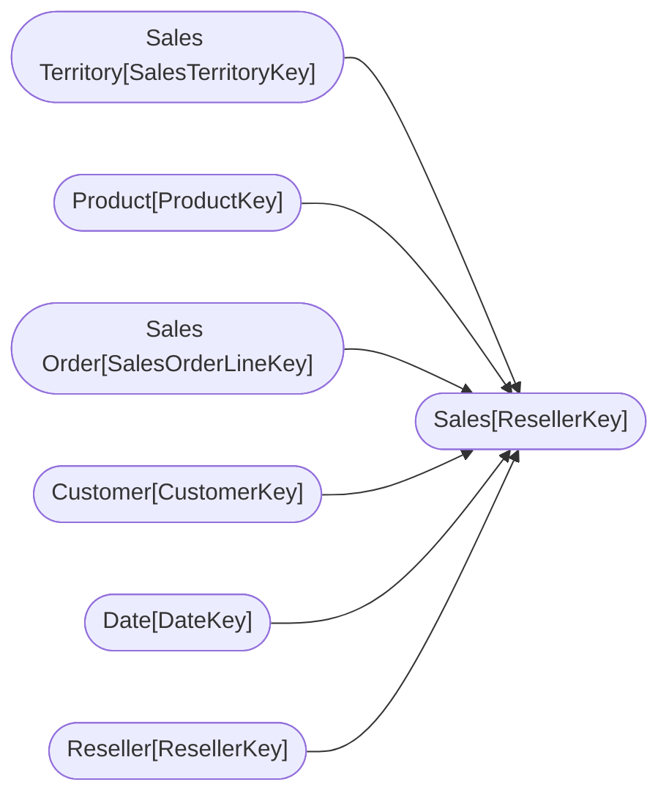

----

[Home](../home.md) > [AdventureWorks_DW_2020.pbix](AdventureWorks_DW_2020.pbix.md)

[Information](#information) | [Model information](#model-information) | [Model relationships](#model-relationships) | [Report sections](#report-sections) | [Business objects](#business-objects) | [Measures](#measures) | [Relationships](#relationships) | [Hierarchies](#hierarchies) | [Columns](#columns) | 

----

# Information

Documentation for file **AdventureWorks_DW_2020.pbix**.

# Model information

| Param  | Value  |
|---|---|
| **Analyzed pbix file name** | `AdventureWorks_DW_2020.pbix` | 
| **Catalog name** | `52eabfc4-f4f0-46fb-bb86-8e04b1380510` | 
| **Port** | `54191`|
| **Description** | `-NaN-` | 
| **Date modified** | `2023-11-29T21:27:52` | 
| **Compatibility level** | `1567` | 

[Up](#)
# Model relationships

[Up](#)

# Report sections

## Introduction

| Param  | Value  |
|---|---|
| **ID** | `0` |
| **Name** | `ReportSection` |
| **Display Name** | `Introduction` |
| **Filters** | `[]` |
| **Ordinal** | `0` |
| **Visual containers number** | `2` |

[Up](#)

### Container 8e32815c186232f25e33 

| Param  | Value  |
|---|---|
| **Name:** | `8e32815c186232f25e33` |
| **Type:** | `image` |
| **Business objects:**  | `n/a` | 
| **Attributes:**  | n/a | 

[Up](#)

### Container dbb7aa4447e4690db31e 

| Param  | Value  |
|---|---|
| **Name:** | `dbb7aa4447e4690db31e` |
| **Type:** | `textbox` |
| **Business objects:**  | `n/a` | 
| **Attributes:**  | n/a | 

[Up](#)

# Business objects

| ID | NAME | DESCRIPTION | 
|----|------|-------------|
| 12 | Customer | n/a |
| 183 | Date | Filters the Sales table using sales order date |
| 382 | Sales Territory | n/a |
| 458 | Product | n/a |
| 561 | Sales Order | n/a |
| 4380 | Sales | n/a |
| 5597 | Reseller | n/a |

[Up](#)
# Measures

| ID | TABLE | NAME | DESCRIPTION | EXPRESSION | IS_HIDDEN | STATE |
|----|-------|------|-------------|------------|-----------|-------|

[Up](#)
# Relationships 

| ID | FROM_TABLE | TO_TABLE | FROM:TO CARDINALITY | NAME | IS_ACTIVE  |
|----|------------|----------|---------------------|------|------------|
| 5049 | Sales[SalesTerritoryKey] | Sales Territory[SalesTerritoryKey] | 2:1 | c4007daa-09a5-455d-ac3b-d8338a0e4468 | True |
| 5052 | Sales[ProductKey] | Product[ProductKey] | 2:1 | fe440ad4-cbfb-4a8c-9b24-4d02f59a009f | True |
| 5055 | Sales[SalesOrderLineKey] | Sales Order[SalesOrderLineKey] | 1:1 | ddc90e12-74d0-451e-87b6-3bc8d773bf07 | True |
| 5098 | Sales[CustomerKey] | Customer[CustomerKey] | 2:1 | 3921d624-3ba4-40ca-b78d-61fe4ebc7659 | True |
| 5115 | Sales[OrderDateKey] | Date[DateKey] | 2:1 | ad03fb2c-8d99-47eb-bdab-0e52920c9d3f | True |
| 5132 | Sales[DueDateKey] | Date[DateKey] | 2:1 | a390c257-6a75-4c82-aab5-270f564d26b0 | False |
| 5149 | Sales[ShipDateKey] | Date[DateKey] | 2:1 | fcf11ed1-afec-495f-8897-4461f7a9d501 | False |
| 5863 | Sales[ResellerKey] | Reseller[ResellerKey] | 2:1 | f72f8f53-10b5-4d0a-82ea-19e584697a64 | True |

[Up](#)
# Hierarchies 

| ID | TABLE | NAME | DESCRIPTION  | IS_HIDDEN | 
|----|----------|------|--------------|-----------|
| 2700 |Customer | Geography | n/a | False | 
| 2657 |Date | Fiscal | n/a | False | 
| 6579 |Sales Territory | Sales Territories | n/a | False | 
| 2316 |Product | Products | n/a | False | 
| 2276 |Sales Order | Sales Orders | n/a | False | 
| 6116 |Reseller | Geography | n/a | False | 

[Up](#)
# Columns 

| ID | TABLE | EXPLICIT_NAME | DESCRIPTION | IS_HIDDEN | EXPRESSION |
|----|-------|---------------|-------------|-----------|------------|
| 114 | Customer | Customer ID | n/a | False | n/a |
| 115 | Customer | Customer | n/a | False | n/a |
| 116 | Customer | City | n/a | False | n/a |
| 117 | Customer | State-Province | n/a | False | n/a |
| 118 | Customer | Country-Region | n/a | False | n/a |
| 119 | Customer | Postal Code | n/a | False | n/a |
| 192 | Date | Date | n/a | False | n/a |
| 200 | Date | Fiscal Year | n/a | False | n/a |
| 201 | Date | Fiscal Quarter | n/a | False | n/a |
| 202 | Date | Month | n/a | False | n/a |
| 7091 | Date | Full Date | n/a | False | n/a |
| 387 | Sales Territory | Region | n/a | False | n/a |
| 388 | Sales Territory | Country | n/a | False | n/a |
| 389 | Sales Territory | Group | n/a | False | n/a |
| 463 | Product | Product | n/a | False | n/a |
| 464 | Product | Standard Cost | n/a | False | n/a |
| 465 | Product | Color | n/a | False | n/a |
| 466 | Product | List Price | n/a | False | n/a |
| 467 | Product | Model | n/a | False | n/a |
| 468 | Product | Subcategory | n/a | False | n/a |
| 469 | Product | Category | n/a | False | n/a |
| 2416 | Product | SKU | Stock-keeping unit | False | n/a |
| 566 | Sales Order | Sales Order | n/a | False | n/a |
| 567 | Sales Order | Sales Order Line | n/a | False | n/a |
| 4531 | Sales Order | Channel | n/a | False | n/a |
| 4393 | Sales | Order Quantity | n/a | False | n/a |
| 4394 | Sales | Unit Price | n/a | False | n/a |
| 4395 | Sales | Extended Amount | n/a | False | n/a |
| 4396 | Sales | Product Standard Cos..(21) | n/a | False | n/a |
| 4397 | Sales | Total Product Cost | n/a | False | n/a |
| 4398 | Sales | Sales Amount | n/a | False | n/a |
| 10222 | Sales | Unit Price Discount ..(23) | n/a | False | n/a |
| 5602 | Reseller | Business Type | n/a | False | n/a |
| 5603 | Reseller | Reseller | n/a | False | n/a |
| 5604 | Reseller | City | n/a | False | n/a |
| 5605 | Reseller | State-Province | n/a | False | n/a |
| 5606 | Reseller | Country-Region | n/a | False | n/a |
| 5607 | Reseller | Postal Code | n/a | False | n/a |
| 5883 | Reseller | Reseller ID | n/a | False | n/a |

----

Generated at 30.11.2023 01:03:10 by <a href='https://github.com/dop12/pbix_doc'>PBIX DOC PROJECT</a> Git version: 7244166

