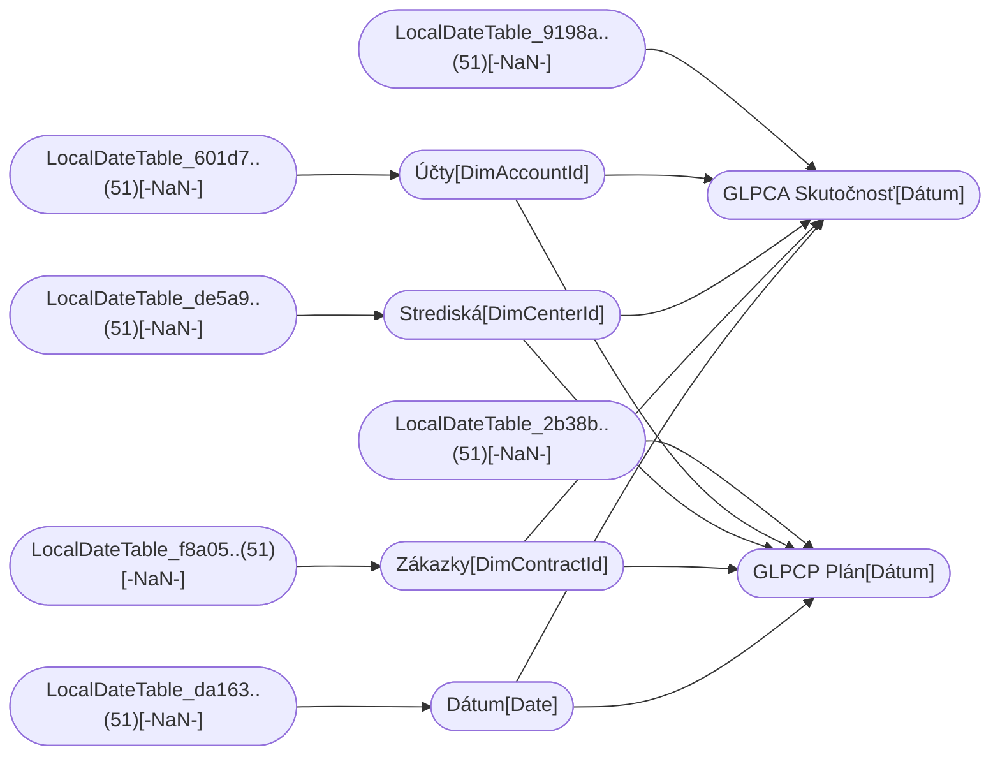

----

[Home](../home.md) > [UC5_IT_Naklady_Model.pbix](UC5_IT_Naklady_Model.pbix.md)

[Information](#information) | [Model information](#model-information) | [Model relationships](#model-relationships) | [Report sections](#report-sections) | [Business objects](#business-objects) | [Measures](#measures) | [Relationships](#relationships) | [Hierarchies](#hierarchies) | [Columns](#columns) | 

----

# Information

Documentation for file **UC5_IT_Naklady_Model.pbix**.

# Model information

| Param  | Value  |
|---|---|
| **Analyzed pbix file name** | `UC5_IT_Naklady_Model.pbix` | 
| **Catalog name** | `10fc7aaf-87b1-4154-b3af-029030cbc5a4` | 
| **Port** | `59898`|
| **Description** | `-NaN-` | 
| **Date modified** | `2023-12-14T22:02:24` | 
| **Compatibility level** | `1567` | 

[Up](#)
# Model relationships

[Up](#)

# Report sections

## Info

| Param  | Value  |
|---|---|
| **ID** | `168624009` |
| **Name** | `ReportSection` |
| **Display Name** | `Info` |
| **Filters** | `[]` |
| **Ordinal** | `` |
| **Visual containers number** | `1` |

[Up](#)

### Container 1e2eb5cb34ca8b4f4e23 

| Param  | Value  |
|---|---|
| **Name:** | `1e2eb5cb34ca8b4f4e23` |
| **Type:** | `textbox` |
| **Business objects:**  | `n/a` | 
| **Attributes:**  | n/a | 

[Up](#)

# Business objects

| ID | NAME | DESCRIPTION | 
|----|------|-------------|
| 12 | Účty | n/a |
| 15 | Strediská | n/a |
| 18 | Zákazky | n/a |
| 21 | Dátum | n/a |
| 24 | Čas | n/a |
| 27 | GLPCA Skutočnosť | n/a |
| 30 | GLPCP Plán | n/a |
| 8169 | Kalkulácia | n/a |

[Up](#)
# Measures

<table>
    <tr>
        <th> ID </th><th> TABLE </th><th> NAME </th><th> DESCRIPTION </th><th> EXPRESSION </th><th> IS_HIDDEN </th><th> STATE </th>
    </tr>
<tr>
        <td> 14247 </td><td> Účty </td><td>  </td><td> n/a </td><td> <code> 
SWITCH (
    TRUE,
    LEFT ( 'Účty'[Číslo účtu], 1 ) = "5", "Náklad",
    LEFT ( 'Účty'[Číslo účtu], 1 ) = "6", "Výnos",
    "N/A"
) </code></td><td> False </td><td>  1 </td> 
    </tr>
<tr>
        <td> 14690 </td><td> GLPCA Skutočnosť </td><td>  </td><td> n/a </td><td> <code> DATEVALUE ( "1/" & 'GLPCA Skutočnosť'[Mesiac] & "/" & 'GLPCA Skutočnosť'[Rok] ) </code></td><td> False </td><td>  1 </td> 
    </tr>
<tr>
        <td> 15189 </td><td> GLPCP Plán </td><td>  </td><td> n/a </td><td> <code> DATEVALUE ( "1/" & 'GLPCP Plán'[Mesiac] & "/" & 'GLPCP Plán'[Rok] ) </code></td><td> False </td><td>  1 </td> 
    </tr>
<tr>
        <td> 699 </td><td> DateTableTemplate_1b..(54) </td><td>  </td><td> n/a </td><td> <code> YEAR([Date]) </code></td><td> True </td><td>  1 </td> 
    </tr>
<tr>
        <td> 700 </td><td> DateTableTemplate_1b..(54) </td><td>  </td><td> n/a </td><td> <code> MONTH([Date]) </code></td><td> True </td><td>  1 </td> 
    </tr>
<tr>
        <td> 701 </td><td> DateTableTemplate_1b..(54) </td><td>  </td><td> n/a </td><td> <code> FORMAT([Date], "MMMM") </code></td><td> True </td><td>  1 </td> 
    </tr>
<tr>
        <td> 702 </td><td> DateTableTemplate_1b..(54) </td><td>  </td><td> n/a </td><td> <code> INT(([ČMesiaca] + 2) / 3) </code></td><td> True </td><td>  1 </td> 
    </tr>
<tr>
        <td> 703 </td><td> DateTableTemplate_1b..(54) </td><td>  </td><td> n/a </td><td> <code> "Štvrť " & [ČŠtvrťroka] </code></td><td> True </td><td>  1 </td> 
    </tr>
<tr>
        <td> 704 </td><td> DateTableTemplate_1b..(54) </td><td>  </td><td> n/a </td><td> <code> DAY([Date]) </code></td><td> True </td><td>  1 </td> 
    </tr>
<tr>
        <td> 785 </td><td> LocalDateTable_601d7..(51) </td><td>  </td><td> n/a </td><td> <code> YEAR([Date]) </code></td><td> True </td><td>  1 </td> 
    </tr>
<tr>
        <td> 786 </td><td> LocalDateTable_601d7..(51) </td><td>  </td><td> n/a </td><td> <code> MONTH([Date]) </code></td><td> True </td><td>  1 </td> 
    </tr>
<tr>
        <td> 787 </td><td> LocalDateTable_601d7..(51) </td><td>  </td><td> n/a </td><td> <code> FORMAT([Date], "MMMM") </code></td><td> True </td><td>  1 </td> 
    </tr>
<tr>
        <td> 788 </td><td> LocalDateTable_601d7..(51) </td><td>  </td><td> n/a </td><td> <code> INT(([ČMesiaca] + 2) / 3) </code></td><td> True </td><td>  1 </td> 
    </tr>
<tr>
        <td> 789 </td><td> LocalDateTable_601d7..(51) </td><td>  </td><td> n/a </td><td> <code> "Štvrť " & [ČŠtvrťroka] </code></td><td> True </td><td>  1 </td> 
    </tr>
<tr>
        <td> 790 </td><td> LocalDateTable_601d7..(51) </td><td>  </td><td> n/a </td><td> <code> DAY([Date]) </code></td><td> True </td><td>  1 </td> 
    </tr>
<tr>
        <td> 1380 </td><td> LocalDateTable_de5a9..(51) </td><td>  </td><td> n/a </td><td> <code> YEAR([Date]) </code></td><td> True </td><td>  1 </td> 
    </tr>
<tr>
        <td> 1381 </td><td> LocalDateTable_de5a9..(51) </td><td>  </td><td> n/a </td><td> <code> MONTH([Date]) </code></td><td> True </td><td>  1 </td> 
    </tr>
<tr>
        <td> 1382 </td><td> LocalDateTable_de5a9..(51) </td><td>  </td><td> n/a </td><td> <code> FORMAT([Date], "MMMM") </code></td><td> True </td><td>  1 </td> 
    </tr>
<tr>
        <td> 1383 </td><td> LocalDateTable_de5a9..(51) </td><td>  </td><td> n/a </td><td> <code> INT(([ČMesiaca] + 2) / 3) </code></td><td> True </td><td>  1 </td> 
    </tr>
<tr>
        <td> 1384 </td><td> LocalDateTable_de5a9..(51) </td><td>  </td><td> n/a </td><td> <code> "Štvrť " & [ČŠtvrťroka] </code></td><td> True </td><td>  1 </td> 
    </tr>
<tr>
        <td> 1385 </td><td> LocalDateTable_de5a9..(51) </td><td>  </td><td> n/a </td><td> <code> DAY([Date]) </code></td><td> True </td><td>  1 </td> 
    </tr>
<tr>
        <td> 1805 </td><td> LocalDateTable_f8a05..(51) </td><td>  </td><td> n/a </td><td> <code> YEAR([Date]) </code></td><td> True </td><td>  1 </td> 
    </tr>
<tr>
        <td> 1806 </td><td> LocalDateTable_f8a05..(51) </td><td>  </td><td> n/a </td><td> <code> MONTH([Date]) </code></td><td> True </td><td>  1 </td> 
    </tr>
<tr>
        <td> 1807 </td><td> LocalDateTable_f8a05..(51) </td><td>  </td><td> n/a </td><td> <code> FORMAT([Date], "MMMM") </code></td><td> True </td><td>  1 </td> 
    </tr>
<tr>
        <td> 1808 </td><td> LocalDateTable_f8a05..(51) </td><td>  </td><td> n/a </td><td> <code> INT(([ČMesiaca] + 2) / 3) </code></td><td> True </td><td>  1 </td> 
    </tr>
<tr>
        <td> 1809 </td><td> LocalDateTable_f8a05..(51) </td><td>  </td><td> n/a </td><td> <code> "Štvrť " & [ČŠtvrťroka] </code></td><td> True </td><td>  1 </td> 
    </tr>
<tr>
        <td> 1810 </td><td> LocalDateTable_f8a05..(51) </td><td>  </td><td> n/a </td><td> <code> DAY([Date]) </code></td><td> True </td><td>  1 </td> 
    </tr>
<tr>
        <td> 2208 </td><td> LocalDateTable_da163..(51) </td><td>  </td><td> n/a </td><td> <code> YEAR([Date]) </code></td><td> True </td><td>  1 </td> 
    </tr>
<tr>
        <td> 2209 </td><td> LocalDateTable_da163..(51) </td><td>  </td><td> n/a </td><td> <code> MONTH([Date]) </code></td><td> True </td><td>  1 </td> 
    </tr>
<tr>
        <td> 2210 </td><td> LocalDateTable_da163..(51) </td><td>  </td><td> n/a </td><td> <code> FORMAT([Date], "MMMM") </code></td><td> True </td><td>  1 </td> 
    </tr>
<tr>
        <td> 2211 </td><td> LocalDateTable_da163..(51) </td><td>  </td><td> n/a </td><td> <code> INT(([ČMesiaca] + 2) / 3) </code></td><td> True </td><td>  1 </td> 
    </tr>
<tr>
        <td> 2212 </td><td> LocalDateTable_da163..(51) </td><td>  </td><td> n/a </td><td> <code> "Štvrť " & [ČŠtvrťroka] </code></td><td> True </td><td>  1 </td> 
    </tr>
<tr>
        <td> 2213 </td><td> LocalDateTable_da163..(51) </td><td>  </td><td> n/a </td><td> <code> DAY([Date]) </code></td><td> True </td><td>  1 </td> 
    </tr>
<tr>
        <td> 2970 </td><td> LocalDateTable_9198a..(51) </td><td>  </td><td> n/a </td><td> <code> YEAR([Date]) </code></td><td> True </td><td>  1 </td> 
    </tr>
<tr>
        <td> 2971 </td><td> LocalDateTable_9198a..(51) </td><td>  </td><td> n/a </td><td> <code> MONTH([Date]) </code></td><td> True </td><td>  1 </td> 
    </tr>
<tr>
        <td> 2972 </td><td> LocalDateTable_9198a..(51) </td><td>  </td><td> n/a </td><td> <code> FORMAT([Date], "MMMM") </code></td><td> True </td><td>  1 </td> 
    </tr>
<tr>
        <td> 2973 </td><td> LocalDateTable_9198a..(51) </td><td>  </td><td> n/a </td><td> <code> INT(([ČMesiaca] + 2) / 3) </code></td><td> True </td><td>  1 </td> 
    </tr>
<tr>
        <td> 2974 </td><td> LocalDateTable_9198a..(51) </td><td>  </td><td> n/a </td><td> <code> "Štvrť " & [ČŠtvrťroka] </code></td><td> True </td><td>  1 </td> 
    </tr>
<tr>
        <td> 2975 </td><td> LocalDateTable_9198a..(51) </td><td>  </td><td> n/a </td><td> <code> DAY([Date]) </code></td><td> True </td><td>  1 </td> 
    </tr>
<tr>
        <td> 3468 </td><td> LocalDateTable_2b38b..(51) </td><td>  </td><td> n/a </td><td> <code> YEAR([Date]) </code></td><td> True </td><td>  1 </td> 
    </tr>
<tr>
        <td> 3469 </td><td> LocalDateTable_2b38b..(51) </td><td>  </td><td> n/a </td><td> <code> MONTH([Date]) </code></td><td> True </td><td>  1 </td> 
    </tr>
<tr>
        <td> 3470 </td><td> LocalDateTable_2b38b..(51) </td><td>  </td><td> n/a </td><td> <code> FORMAT([Date], "MMMM") </code></td><td> True </td><td>  1 </td> 
    </tr>
<tr>
        <td> 3471 </td><td> LocalDateTable_2b38b..(51) </td><td>  </td><td> n/a </td><td> <code> INT(([ČMesiaca] + 2) / 3) </code></td><td> True </td><td>  1 </td> 
    </tr>
<tr>
        <td> 3472 </td><td> LocalDateTable_2b38b..(51) </td><td>  </td><td> n/a </td><td> <code> "Štvrť " & [ČŠtvrťroka] </code></td><td> True </td><td>  1 </td> 
    </tr>
<tr>
        <td> 3473 </td><td> LocalDateTable_2b38b..(51) </td><td>  </td><td> n/a </td><td> <code> DAY([Date]) </code></td><td> True </td><td>  1 </td> 
    </tr>
</table>

[Up](#)
# Relationships 

| ID | FROM_TABLE | TO_TABLE | FROM:TO CARDINALITY | NAME | IS_ACTIVE  |
|----|------------|----------|---------------------|------|------------|
| 783 | Účty[EtlLoadTime] | LocalDateTable_601d7..(51)[-NaN-] | 2:1 | acdc2ff4-b747-4492-8859-9384d702c64a | True |
| 1378 | Strediská[EtlLoadTime] | LocalDateTable_de5a9..(51)[-NaN-] | 2:1 | 672b9fc5-1163-4194-ab75-62d2cd168868 | True |
| 1803 | Zákazky[EtlLoadTime] | LocalDateTable_f8a05..(51)[-NaN-] | 2:1 | c115dfbe-a6c7-4e57-aebd-bbc11b49b6d1 | True |
| 2206 | Dátum[Date] | LocalDateTable_da163..(51)[-NaN-] | 2:1 | 71ad4d58-3914-486b-bc14-b632cd7ec09d | True |
| 2968 | GLPCA Skutočnosť[EtlLoadTime] | LocalDateTable_9198a..(51)[-NaN-] | 2:1 | 95168930-5c7a-4fda-ab42-f2fd9b4261d5 | True |
| 3466 | GLPCP Plán[EtlLoadTime] | LocalDateTable_2b38b..(51)[-NaN-] | 2:1 | 11a09650-a371-4998-91ec-58e61ef2dec3 | True |
| 7982 | GLPCA Skutočnosť[DimAccountId] | Účty[DimAccountId] | 2:1 | c09263aa-f69f-4502-973b-0754342d9d6f | True |
| 7999 | GLPCP Plán[DimAccountId] | Účty[DimAccountId] | 2:1 | 8222ce8b-9b9d-427e-9228-33c0e9e6fba4 | True |
| 8016 | GLPCA Skutočnosť[DimCenterId] | Strediská[DimCenterId] | 2:1 | 52da7bce-7199-4346-ab6d-bb10e203eafb | True |
| 8033 | GLPCP Plán[DimCenterId] | Strediská[DimCenterId] | 2:1 | 4eff9349-fe74-4c46-ab28-6e529adf7c6b | True |
| 8050 | GLPCA Skutočnosť[DimContractId] | Zákazky[DimContractId] | 2:1 | b5f72491-c8b9-44b3-b8f1-dd96be76a309 | True |
| 8067 | GLPCP Plán[DimContractId] | Zákazky[DimContractId] | 2:1 | 4761789d-34ca-4d70-a15a-76239bf28f41 | True |
| 15555 | GLPCA Skutočnosť[Dátum] | Dátum[Date] | 2:1 | 8ef49162-4aa2-4cbf-aa16-fd7b3c6fbf3e | True |
| 15572 | GLPCP Plán[Dátum] | Dátum[Date] | 2:1 | ce9fc0ce-8816-4d2c-930e-bcb97dabc93e | True |

[Up](#)
# Hierarchies 

| ID | TABLE | NAME | DESCRIPTION  | IS_HIDDEN | 
|----|----------|------|--------------|-----------|
| 706 |DateTableTemplate_1b..(54) | Hierarchia dátumov | n/a | False | 
| 792 |LocalDateTable_601d7..(51) | Hierarchia dátumov | n/a | False | 
| 1387 |LocalDateTable_de5a9..(51) | Hierarchia dátumov | n/a | False | 
| 1812 |LocalDateTable_f8a05..(51) | Hierarchia dátumov | n/a | False | 
| 2215 |LocalDateTable_da163..(51) | Hierarchia dátumov | n/a | False | 
| 2977 |LocalDateTable_9198a..(51) | Hierarchia dátumov | n/a | False | 
| 3475 |LocalDateTable_2b38b..(51) | Hierarchia dátumov | n/a | False | 

[Up](#)
# Columns 

<table>
    <tr>
        <th> ID </th><th> TABLE </th><th> EXPLICIT_NAME </th><th> DESCRIPTION </th><th> IS_HIDDEN </th><th> EXPRESSION </th>
    </tr>
<tr>
        <td> 34 </td><td> Účty </td><td> Číslo účtu </td><td> n/a </td><td> False </td><td><code> n/a </code></td>
    </tr>

<tr>
        <td> 35 </td><td> Účty </td><td> Názov účtu </td><td> n/a </td><td> False </td><td><code> n/a </code></td>
    </tr>

<tr>
        <td> 36 </td><td> Účty </td><td> Hierarchia </td><td> n/a </td><td> False </td><td><code> n/a </code></td>
    </tr>

<tr>
        <td> 14247 </td><td> Účty </td><td> Trieda účtu </td><td> n/a </td><td> False </td><td><code> 
SWITCH (
    TRUE,
    LEFT ( 'Účty'[Číslo účtu], 1 ) = "5", "Náklad",
    LEFT ( 'Účty'[Číslo účtu], 1 ) = "6", "Výnos",
    "N/A"
) </code></td>
    </tr>

<tr>
        <td> 40 </td><td> Strediská </td><td> Číslo strediska </td><td> n/a </td><td> False </td><td><code> n/a </code></td>
    </tr>

<tr>
        <td> 41 </td><td> Strediská </td><td> Stredisko </td><td> n/a </td><td> False </td><td><code> n/a </code></td>
    </tr>

<tr>
        <td> 42 </td><td> Strediská </td><td> Hierarchia </td><td> n/a </td><td> False </td><td><code> n/a </code></td>
    </tr>

<tr>
        <td> 46 </td><td> Zákazky </td><td> Zákazka </td><td> n/a </td><td> False </td><td><code> n/a </code></td>
    </tr>

<tr>
        <td> 47 </td><td> Zákazky </td><td> Názov </td><td> n/a </td><td> False </td><td><code> n/a </code></td>
    </tr>

<tr>
        <td> 50 </td><td> Dátum </td><td> Date </td><td> n/a </td><td> False </td><td><code> n/a </code></td>
    </tr>

<tr>
        <td> 51 </td><td> Dátum </td><td> DimDateId </td><td> n/a </td><td> False </td><td><code> n/a </code></td>
    </tr>

<tr>
        <td> 52 </td><td> Dátum </td><td> Rok </td><td> n/a </td><td> False </td><td><code> n/a </code></td>
    </tr>

<tr>
        <td> 53 </td><td> Dátum </td><td> MonthId </td><td> n/a </td><td> False </td><td><code> n/a </code></td>
    </tr>

<tr>
        <td> 54 </td><td> Dátum </td><td> MonthYear </td><td> n/a </td><td> False </td><td><code> n/a </code></td>
    </tr>

<tr>
        <td> 55 </td><td> Dátum </td><td> MonthNameYear </td><td> n/a </td><td> False </td><td><code> n/a </code></td>
    </tr>

<tr>
        <td> 56 </td><td> Dátum </td><td> Číslo mesiaca </td><td> n/a </td><td> False </td><td><code> n/a </code></td>
    </tr>

<tr>
        <td> 57 </td><td> Dátum </td><td> Month </td><td> n/a </td><td> False </td><td><code> n/a </code></td>
    </tr>

<tr>
        <td> 58 </td><td> Dátum </td><td> MonthShort </td><td> n/a </td><td> False </td><td><code> n/a </code></td>
    </tr>

<tr>
        <td> 59 </td><td> Dátum </td><td> Day </td><td> n/a </td><td> False </td><td><code> n/a </code></td>
    </tr>

<tr>
        <td> 60 </td><td> Dátum </td><td> DayOfWeekName </td><td> n/a </td><td> False </td><td><code> n/a </code></td>
    </tr>

<tr>
        <td> 61 </td><td> Dátum </td><td> DayOfWeekNameShort </td><td> n/a </td><td> False </td><td><code> n/a </code></td>
    </tr>

<tr>
        <td> 62 </td><td> Dátum </td><td> DayOfWeek </td><td> n/a </td><td> False </td><td><code> n/a </code></td>
    </tr>

<tr>
        <td> 63 </td><td> Dátum </td><td> Quarter </td><td> n/a </td><td> False </td><td><code> n/a </code></td>
    </tr>

<tr>
        <td> 64 </td><td> Dátum </td><td> YearQuarter </td><td> n/a </td><td> False </td><td><code> n/a </code></td>
    </tr>

<tr>
        <td> 65 </td><td> Dátum </td><td> IsoWeek </td><td> n/a </td><td> False </td><td><code> n/a </code></td>
    </tr>

<tr>
        <td> 66 </td><td> Dátum </td><td> IsoWeekBusiness </td><td> n/a </td><td> False </td><td><code> n/a </code></td>
    </tr>

<tr>
        <td> 67 </td><td> Čas </td><td> DimTimeId </td><td> n/a </td><td> False </td><td><code> n/a </code></td>
    </tr>

<tr>
        <td> 68 </td><td> Čas </td><td> hours </td><td> n/a </td><td> False </td><td><code> n/a </code></td>
    </tr>

<tr>
        <td> 69 </td><td> Čas </td><td> minutes </td><td> n/a </td><td> False </td><td><code> n/a </code></td>
    </tr>

<tr>
        <td> 70 </td><td> Čas </td><td> seconds </td><td> n/a </td><td> False </td><td><code> n/a </code></td>
    </tr>

<tr>
        <td> 74 </td><td> GLPCA Skutočnosť </td><td> Mesiac </td><td> n/a </td><td> False </td><td><code> n/a </code></td>
    </tr>

<tr>
        <td> 75 </td><td> GLPCA Skutočnosť </td><td> Rok </td><td> n/a </td><td> False </td><td><code> n/a </code></td>
    </tr>

<tr>
        <td> 76 </td><td> GLPCA Skutočnosť </td><td> Suma </td><td> n/a </td><td> False </td><td><code> n/a </code></td>
    </tr>

<tr>
        <td> 77 </td><td> GLPCA Skutočnosť </td><td> Mena </td><td> n/a </td><td> False </td><td><code> n/a </code></td>
    </tr>

<tr>
        <td> 14690 </td><td> GLPCA Skutočnosť </td><td> Dátum </td><td> n/a </td><td> False </td><td><code> DATEVALUE ( "1/" & 'GLPCA Skutočnosť'[Mesiac] & "/" & 'GLPCA Skutočnosť'[Rok] ) </code></td>
    </tr>

<tr>
        <td> 83 </td><td> GLPCP Plán </td><td> Mesiac </td><td> n/a </td><td> False </td><td><code> n/a </code></td>
    </tr>

<tr>
        <td> 84 </td><td> GLPCP Plán </td><td> Rok </td><td> n/a </td><td> False </td><td><code> n/a </code></td>
    </tr>

<tr>
        <td> 85 </td><td> GLPCP Plán </td><td> Suma </td><td> n/a </td><td> False </td><td><code> n/a </code></td>
    </tr>

<tr>
        <td> 86 </td><td> GLPCP Plán </td><td> Mena </td><td> n/a </td><td> False </td><td><code> n/a </code></td>
    </tr>

<tr>
        <td> 15189 </td><td> GLPCP Plán </td><td> Dátum </td><td> n/a </td><td> False </td><td><code> DATEVALUE ( "1/" & 'GLPCP Plán'[Mesiac] & "/" & 'GLPCP Plán'[Rok] ) </code></td>
    </tr>

</table>

----

Generated at 15.12.2023 18:06:46 by <a href='https://github.com/dop12/pbix_doc'>PBIX DOC PROJECT</a> Git version: 40a3c4f

